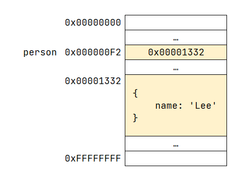
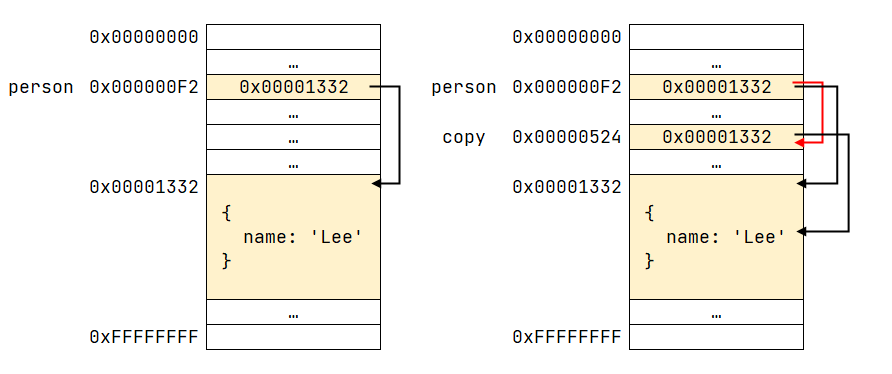

# chapter11 원시 값과 객체의 비교

| 특징 | 원시 타입 | 객체 타입 |
| - | - | - |
| 변경 가능성 | 변경 불가능 | 변경 가능 |
| 변수에 저장되는 값 | 실제 값이 저장 | 참조 값이 저장 |
| 다른 변수에 할당 | 원본의 원시 값이 복사되어 전달(pass by value) | 참조 값이 복사되어 전달(pass by reference) |

## 원시 값

한번 생성된 원시 값은 읽기 전용(read-only) 값으로써 변경할 수 없다. 변경 불가능하다는 것은 변수가 아니라 값에 대한 진술이다.

변수의 상대개념인 상수는 재할당이 금지된 변수를 말한다. 상수는 단 한 번만 할당이 허용되므로 변수 값을 변경할 수 없다.

```js
// 11-01

// const 키워드를 사용해 선언한 변수는 재할당이 금지된다. 상수는 재할당이 금지된 변수일 뿐이다.
const o = {};

// const 키워드를 사용해 선언한 변수에 할당한 원시 값(상수)은 변경할 수 없다.
// 하지만 const 키워드를 사용해 선언한 변수에 할당한 객체는 변경할 수 있다.
o.a = 1;
console.log(o); // { a: 1 }
```

원시 값을 할당한 변수에 새로운 원시 값을 재할당하면 새로운 메모리 공간을 확보하고 재할당한 원시 값을 저장한 후, 변수는 재할당한 원시 값을 가리킨다. 이때 변수가 참조한 메모리 공간의 주소가 바뀐다.

변수에 할당된 원시 값이 변경 불가능한 값이기 때문에 변수가 참조하던 메모리 공간의 주소가 변경된다. 이러한 특성을 불변성(immutability)이라 한다. 불변성을 갖는 원시 값을 할당한 변수는 재할당 이외에 변수 값을 변경할 수 있는 방법이 없다.

### 문자열과 불변성

원시 값을 저장하려면 먼저 확보해야 하는 메모리 공간의 크기를 결정해야 한다. 이를 위해 원시 타입별로 메모리 공간의 크기가 미리 정해져있다. ECMAScript 사양에 문자열 타입(2byte)와 숫자 타입(8byte) 외에는 명확히 규정하고 있지 않아 브라우저마다 크기가 다를 수 있다.

문자열은 다른 원시값과 달리 몇 개의 문자로 이뤄졌느냐에 따라 필요한 메모리 공간의 크기가 결정된다.

```js
// 11-03

var str = "Hello";
str = "World";
```

1. 문자열 `"Hello"` 생성
2. 식별자 `str`은 `"Hello"`가 저장된 메모리 공간의 첫 번째 메모리 셀 주소를 가리킴
3. 새로운 문자열 `"world"`를 메모리에 생성
4. 식별자 `str`은 `"world"`를 가리킴

**유사배열 객체** : 배열처럼 인덱스로 프로퍼티 값에 접근할 수 있고 `length` 프로퍼티를 갖는 객체.

```js
// 11-04

var str = "string";

// 문자열은 유사 배열이므로 배열과 유사하게 인덱스를 사용해 각 문자에 접근할 수 있다.
console.log(str[0]); // s

// 원시 값인 문자열이 객체처럼 동작한다.
console.log(str.length); // 6
console.log(str.toUpperCase()); // STRING
```

```js
// 11-05

var str = "string";

// 문자열은 유사 배열이므로 배열과 유사하게 인덱스를 사용해 각 문자에 접근할 수 있다.
// 하지만 문자열은 원시 값이므로 변경할 수 없다. 이때 에러가 발생하지 않는다.
str[0] = "S";

console.log(str); // string
```

### 값에 의한 전달

```js
// 11-06

var score = 80;
var copy = score;

console.log(score); // 80
console.log(copy); // 80

score = 100;

console.log(score); // 100
console.log(copy); // 80
```

변수에 원시 값을 갖는 변수를 할당하면 할당받는 변수에는 할당되는 변수의 원시 값이 복사되어 전달된다. 이를 값에 의한 전달이라 한다.

위에서 `score`과 `copy`는 다른 메모리 공간에 저장된 별개의 값이다.

엄격하게 표현하면 변수에는 값이 전달되는 것이 아니라 메모리 주소가 전달된다. 이는 변수와 같은 식별자는 값이 아니라 메모리 주소를 기억하고 있기 때문이다.

식별자로 값을 구별해서 식별한다는 것은 식별자가 기억하고 있는 메모리 주소를 통해 메모리 공간에 저장된 값에 접근할 수 있다는 것을 의미한다. 즉, 식별자는 메모리 주소에 붙인 이름이라고 할 수 있다.

```js
var copy = score;
```

위 예제의 `score`는 식별자 표현식으로서 숫자 값 80으로 평가된다. 이 때 두 가지 평가 방식이 가능하다.

1. 새로운 80을 생성(복사)해서 메모리 주소를 전달하는 방식, 이 방식은 할당 시점에 두 변수가 기억하는 메모리 주소가 다르다.
2. `score`의 변수값 80의 메모리 주소를 그대로 전달하는 방식, 이 방식은 할당 시점에 두 변수가 기억하는 메모리 주소가 같다.

이처럼 "값에 의한 전달"도 사실은 값을 전다랗는 것이 아니라 메모리 주소를 전달한다. 단, 전달된 메모리 주소를 통해 메모리 공간에 접근하면 값을 참조할 수 있다.

## 객체

객체는 프로퍼티 개수가 정해져 있지 않으며, 동적으로 추가되고 삭제할 수 있다.

### 자바스크립트 객체의 관리 방식

자바 스크립트 객체는 프로퍼티 키를 인덱스로 사용하는 해시 테이블이라고 생각할 수 있다. 자바, C++ 같은 클래스 기반 객체지향 프로그래밍 언어는 사전에 정의된 클래스를 기반으로 객체(인스턴스)를 생성한다. 객체가 생성된 이후에는 프로퍼티를 삭제하거나 추가할 수 없다. 하지만 자바스크립트는 클래스 없이 객체를 생성할 수 있으며 객체가 생성된 이후라도 동적으로 프로퍼티와 메서드를 추가할 수 있다. 이는 사용하기 편리하지만 프로퍼티 접근에 비용이 더 드는 비효율적인 방식이기도 하다. 따라서 자바스크립트 엔진에서는 동적 탐색 대신 히든 클래스라는 방식을 사용해 C++ 정도의 성능을 보장한다.

### 변경 가능한 값

객체(참조) 타입의 값, 즉 객체는 변경 가능한 값이다. 객체를 할당한 변수가 기억하는 메모리 주소를 통해 메모리 공간에 접근하면 참조 값에 접근할 수 있다. 참조 값은 생성된 객체가 저장된 메모리 공간의 주소, 그 자체다.



객체를 할당한 변수를 참조하면 메모리에 저장되어 있는 참조 값을 통해 실제 객체에 접근한다.

객체를 할당한 변수의 경우 "변수는 객체를 참조하고(가리키고)있다"라고 표현한다.

객체를 할당한 변수는 재할당 없이 객체를 직접 변경할 수 있다.

```js
// 11-13

var person = {
    name: 'Lee'
};

// 프로퍼티 값 갱신
person.name = 'Kim';

// 프로퍼티 동적 생성
person.address = 'Seoul';

console.log(person); // {name: "Kim", address: "Seoul"}
```

저장된 객체를 수정하더라도 객체를 할당한 변수의 참조 값은 변경되지 않는다.

* 얕은 복사 : 한 단계(참조 값)까지만 복사
* 깊은 복사 : 객체에 중첩되어 있는 객체까지 모두 복사

### 참조에 의한 전달

```js
// 11-16

var person = {
    name: 'Lee'
};

// 참조 값을 복사(얕은 복사)
var copy = person;
```



객체를 가리키는 변수(`person`)를 다른 변수(`copy`)에 할당하면 원본의 참조 값이 복사되어 전달된다. 이를 참조에 의한 전달이라 한다. 이것은 두 개의 식별자가 하나의 객체를 공유한다는 것을 의미한다.

```js
// 11-17

var person = {
    name: "Lee",
};

// 참조 값을 복사 (얕은 복사). copy와 person은 동일한 참조 값을 갖는다.
var copy = person;

// copy와 person은 동일한 객체를 가리킨다.
console.log(copy === person); // true

// copy를 통해 객체를 변경한다.
copy.name = "Kim";

// person을 통해 객체를 변경한다.
person.address = "Seoul";

// copy와 person은 동일한 객체를 가리킨다.
// 따라서 어느 한쪽에서 객체를 변경하면 서로 영향을 주고받는다.
console.log(person); // { name: 'Kim', address: 'Seoul' }
console.log(copy); // { name: 'Kim', address: 'Seoul' }
```

결국 "값에 의한 전달"과 "참조에 의한 전달"은 식별자가 기억하는 메모리 공간에 있는 값을 복사해서 전달한다는 면에서 동일하다. 다만 식별자가 기억하는 메모리 공간, 즉 변수에 저장되어 있는 값이 원시 값이냐 참조 값이냐의 차이만 있을 뿐이다. 따라서 자바스크립트에는 "참조에 의한 전달"은 존재하지 않고 "값에 의한 전달"만이 존재한다고 말할 수 있다.

```js
// 11-18

var person1 = {
    name: 'Lee',
};

var person2 = {
    name: 'Lee',
};

console.log(person1 === person2); // false
console.log(person1.name === person2.name); // true
```

`===` 일치 비교 연산자는 변수에 저장되어 있는 값을 타입 변환하지 않고 비교한다. `person1` 변수와 `person2` 변수의 참조 값은 전혀 다르므로 `false`를 출력한다.

프로퍼티 값을 참조하는 `person1.name`과 `person2.name`은 값으로 평가될 수 있는 표현식이다. 두 표현식 모두 원시 값 `"Lee"`로 평가된다 따라서 `true`를 출력한다.
