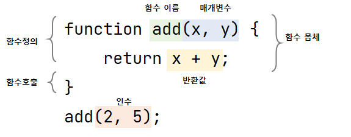

# chapter12 함수

## 함수란?

일련의 과정을 문(statement)으로 구현하고 코드 블록으로 감싸서 하나의 실행 단위로 정의한 것.

* 매개변수(parameter) : 함수 내부로 입력을 전달받는 변수
* 인수(argument) : 입력
* 반환값(return value) : 출력



## 함수 리터럴

함수는 객체 타입의 값이다. 함수 리터럴은 `function` 키워드, 함수 이름, 매개변수 목록, 함수 몸체로 구성된다.

```js
// 12-04

// 변수에 함수 리터럴을 할당
var f = function add(x, y) {
    return x + y;
}
```

* 함수 이름
  * 함수 이름은 식별자이므로 식별자 네이밍 규칙을 준수해야 한다.
  * 함수 이름은 몸체 내에서만 참조할 수 있는 식별자다.
  * 함수 이름은 생략할 수 있다.
    * 기명 함수 : 이름이 있는 함수
    * 무명/익명 함수 : 이름이 없는 함수
* 매개변수 목록
  * 각 매개변수에는 함수를 호출할 때 지정한 인수가 순서대로 할당된다.
  * 매개변수는 함수 몸체 내에서 변수와 동일하게 취급된다. 따라서 매개변수와 마찬가지로 식별자 네이밍 규칙을 준수해야 한다.

함수는 객체지만 일반 객체와는 다르다. 일반 객체는 호출할 수 없지만 함수는 호출할 수 있다. 그리고 일반 객체에는 없는 함수 객체만의 고유한 프로퍼티를 갖는다.

## 함수 정의

함수를 정의하는 방법에는 4가지가 있다.

### 함수 선언문

```js
// 12-05

// 함수 선언문
function add(x, y) {
    return x + y;
}

// 함수 참조
// console.dir은 console.log와는 달리 함수 객체의 프로퍼티까지 출력한다.
// 단, Node.js 환경에서는 console.log와 같은 결과를 출력한다.
console.dir(add); // ƒ add(x, y)

// 함수 호출
console.log(add(2, 5)); // 7
```

함수 리터럴은 함수 이름을 생략할 수 있으나 함수 선언문은 함수 이름을 생략할 수 없다.

```js
// 12-06

// 함수 선언문은 함수 이름을 생략할 수 없다.
function (x, y) {
    return x + y;
}

// SyntaxError: Function statements require a function name
```

함수 선언문은 표현식이 아닌 문이다. 따라서 함수 선언문도 표현식이 아닌 문이므로 변수에 할당할 수 없다.

```js
// 12-07

// 함수 선언문은 표현식이 아닌 문이므로 변수에 할당할 수 없다.
// 하지만 함수 선언문이 변수에 할당되는 것처럼 보인다.
var add = function add(x, y) {
    return x + y;
}

// 함수 호출
console.log(add(2, 5)); // 7
```

위와 같이 변수에 할당되는 것 처럼 보이게 동작하는 이유는 자바스크립트 엔진이 문맥에 따라 동일한 함수 리터럴을 표현식이 아닌 문인 함수 선언문으로 해석하는 경우와표현식인 문인 함수 리터럴 표현식으로 해석하는 경우가 있기 때문이다. 이는 함수 이름이 있는 기명 함수 리터럴은 함수 선언문 또는 함수 리터럴 표현식으로 해석될 가능성이 있다는 의미다.

`{ }` 처럼 중의적인 코드는 코드 문맥에 따라 해석이 달라진다.

`{ }`이 단독으로 존재하면 `{ }`을 블록문으로 해석한다. 하지만 `{ }`이 값으로 평가되어야 할 문맥(ex. 할당 연산자의 우변)에서 피연산자로 사용되면 `{ }`을 객체 리터럴로 해석한다.

기명 함수 리터럴을 단독으로 사용하면 함수 선언문으로 해석하고 값으로 평가되어야 하는 문맥(ex. 변수 할당, 피연산자로 사용)이면 리터럴 표현식으로 해석한다. 이때 함수 선언문과 함수 리터럴 표현식은 함수를 생성하는 내부 동작에 차이가 있다.

```js
// 12-08

// 기명 함수 리터럴을 단독으로 사용하면 함수 선언문으로 해석된다.
// 함수 선언문에서는 함수 이름을 생략할 수 없다.
function foo() { console.log('foo'); }
foo(); // foo

// 함수 리터럴을 피연산자로 사용하면 함수 선언문이 아니라 함수 리터럴 표현식으로 해석된다.
// 함수 리터럴에서는 함수 이름을 생략할 수 있다.
(function bar() { console.log('bar'); });
bar(); // ReferenceError: bar is not defined
```

단독으로 사용된 함수 리터럴(`foo`)은 함수 선언문으로 해석된다. 하지만 그룹 연산자 내에 있는 함수 리터럴(`bar`)은 함수 선언문으로 해석되지 않고 함수 리터럴 표현식으로 해석된다. 그룹 연산자의 피연산자는 값으로 평가될 수 있는 표현식이어야 한다. 따라서 표현식이 아닌 문인 함수 선언문은 피연산자로 사용할 수 없다.

함수 리터럴에서 "함수 이름은 함수 몸체 내에서만 참조할 수 있는 식별자다" 라고 했는데, 이는 함수 몸체 외부에서는 함수 이름으로 함수를 참조할 수 없으므로 함수 몸체 외부에서는 함수 이름으로 함수를 호출할 수 없다는 의미이다. 즉, 함수를 가리키는 식별자가 없다는 것과 마찬가지다. 따라서 위 예제의 `bar` 함수는 호출할 수 없다.

그런데 반해 `foo`는 호출할 수 있는 이유는 `foo`는 자바스크립트 엔진이 암묵적으로 생성한 식별자이기 때문이다. 자바스크립트 엔진은 생성된 함수를 호출하기 위해 함수 이름과 동일한 이름의 식별자를 암묵적으로 생성하고 거기에 함수 객체를 할당한다.

함수는 함수 이름을 호출하는 것이 아니라 함수 객체를 가리키는 식별자로 호출한다. 즉 함수 선언문으로 생성한 함수를 호출한 것은 함수 이름 `add`가 아니라 자바스크립트 엔진이 암묵적으로 생성한 식별자 `add`인 것이다.

결론적으로 함수 선언문을 함수 표현식으로 변환해 함수 객체를 생성한다고 생각할 수 있다.

```js
// 12-09

var add = function add(x, y) {
    return x + y;
};

console.log(add(2, 5)); // 7
```

```js
// 12-09-01

function add(x, y) {
  return x + y;
};

console.log(add);  // [Function: add]

add = 3

console.log(add);  // 3
```

### 함수 표현식

자바스크립트의 함수는 일급 객체다. 함수를 값처럼 자유롭게 사용할 수 있다는 의미이다.

```js
// 12-10

// 함수 표현식
var add = function (x, y) {
    return x + y;
}

console.log(add(2, 5)); // 7
```

함수 리터럴의 함수 이름을 생략할 수 있다. 이러한 함수를 익명 함수라 한다. 함수 표현식의 함수 리터럴은 함수 이름을 생략하는 것이 일반적이다.

```js
// 12-11

// 기명 함수 표현식
var add = function foo(x, y) {
    return x + y;
}

// 함수 객체를 가리키는 식별자로 호출
console.log(add(2, 5)); // 7

// 함수 이름으로 호출하면 ReferenceError가 발생한다.
// 함수 이름은 함수 몸체 내부에서만 유효한 식별자다.

// console.log(foo(2, 5)); // ReferenceError: foo is not defined
```

함수 선언문은 "표현식이 아닌 문"이고 함수 표현식은 "표현식인 문"이다.

### 함수 생성 시점과 함수 호이스팅

```js
// 12-12

// 함수 참조
console.dir(add); // ƒ add(x, y)
console.dir(sub); // undefined

// 함수 호출
console.log(add(2, 5)); // 7
console.log(sub(2, 5)); // TypeError: sub is not a function

// 함수 선언문
function add(x, y) {
    return x + y;
}

// 함수 표현식
var sub = function (x, y) {
    return x - y;
}
```

함수 선언문으로 정의한 함수와 함수 표현식으로 정의한 함수 생성 시점이 다르다. 함수 선언문으로 함수를 정의하면 런타임 이전에 함수 객체가 먼저 생성된다.

함수 선언문이 코드의 선두로 끌어 올려진 것처럼 동작하는 자바스크립트 고유의 특징을 함수 호이스팅이라 한다.

변수 할당문의 값은 할당문이 실행되는 시점, 즉 런타임에 평가되므로 함수 표현식의 함수 리터럴도 할당문이 실행되는 시점에 평가되어 함수 객체가 된다. 따라서 함수 표현식으로 함수를 정의하면 함수 호이스팅이 발생하는 것이 아니라 변수 호이스팅이 발생한다.

더글라스 크락포는 함수 표현식을 사용할 것을 권장한다.

### Function 생성자 함수

자바스크립트가 기본 제공하는 빌트인 함수인 `Function` 생성자 함수에 매개변수 목록과 함수 몸체를 문자열로 전달하면서 `new` 연산자와 함께 호출하면 함수 객체를 생성해서 반환한다. `new` 없이 호출해도 결과는 동일하다.

```js
// 12-13

var add = new Function('x', 'y', 'return x + y');

console.log(add(2, 5)); // 7
```

이 방법은 일반적이지 않으며 바람직하지도 않다. 클로저를 생성하지 않는 등 함수 선언문이나 함수 표현식으로 생성한 함수와 다르게 동작한다.

```js
// 12-14

var add1 = (function() {
    var a = 10;
    return function(x, y) {
        return x + y + a;
    };
}());

console.log(add1(1, 2)); // 13

var add2 = (function() {
    var a = 10;
    return new Function('x', 'y', 'return x + y + a;');
}());

console.log(add2(1, 2)); // ReferenceError: a is not defined
```

### 화살표 함수

ES6에서 도입된 화살표 함수는 `function` 키워드 대신 화살표 (`=>`)를 사용해 좀 더 간략한 방법으로 함수를 선언할 수 있다. 화살표 함수는 항상 익명 함수로 정의한다.

```js
// 12-15

// 화살표 함수
const add = (x, y) => x + y;
console.log(add(2, 5)); // 7
```

화살표 함수는 기존의 함수 선언문 또는 함수 표현식을 완전히 대체하기 위해 디자인 된 것은 아니다. 화살표 함수는 표현 뿐 아니라 내부 동작 또한 간략화되어 있다.

1. 생성자 함수로 사용 불가
2. 기존 함수와 `this` 바인딩 방식이 다르다.
3. prototype 프로퍼티가 없다.
4. arguments 객체를 생성하지 않는다.

## 함수 호출

함수는 함수를 가리키는 식별자와 한 쌍의 소괄호인 함수 호출 연산자로 호출한다. 함수 호출 연산자 내에는 0개 이상의 인수를 쉼표로 구분해서 나열한다.

### 매개변수와 인수

```js
// 12-16

// 함수 선언문
function add(x, y) {
    return x + y;
}

// 함수 호출
// 인수 1과 2가 매개변수 x와 y에 순서대로 할당되고 함수 몸체의 문들이 실행된다.
var result = add(1, 2);
```

1. 함수 호출
2. 함수 몸체 내에서 암묵적으로 매개변수 생성 및 `undefined` 초기화
3. 순서대로 인수 할당

```js
// 12-17

function add(x, y) {
    console.log(x, y);
    return x + y;
}

add(2, 5); // 2 5

// add 함수의 매개변수 x, y는 함수 몸체 내부에서만 참조할 수 있다.
console.log(x, y); // ReferenceError: x is not defined
```

함수는 매개변수의 개수와 인수의 개수가 일치하는지 체크하지 않는다. 인수가 부족해서 인수가 할당되지 않은 매개변수의 값은 `undefined`다. 초과된 인수는 무시된다.

```js
// 12-18-01

function add(x, y) {
    console.log(x, y);  // 2 undefined
    return x + y;
}

console.log(add(2)); // NaN
```

```js
// 12-19

function add(x, y) {
    return x + y;
}

console.log(add(2, 5, 10)); // 7
```

초과된 인수가 버려지는 것은 아니며, 모든 인수는 암묵적으로 `argument` 객체의 프로퍼티로 보관된다.

```js
// 12-20-01

function add(x, y) {
    console.log(arguments);
    // Arguments(3) [2, 5, 10, callee: ƒ, Symbol(Symbol.iterator): ƒ]
    console.log(arguments[2]); // 10
    return x + y;
}

add(2, 5, 10);
```

### 인수 확인

```js
// 12-23

function add(x, y) {
    if (typeof x != 'number' || typeof y != 'number') {
        // 매개변수를 통해 전달된 인수의 타입이 부적절한 경우 에러를 발생시킨다.
        throw new TypeError('인수는 모두 숫자 값이어야 합니다.');
    }

    return x + y;
}

console.log(add(2)); // TypeError: 인수는 모두 숫자 값이어야 합니다.
console.log(add('a', 'b')); // TypeError: 인수는 모두 숫자 값이어야 합니다.
```

단축 평가를 사용해 매개변수에 기본값 할당.

```js
// 12-24

function add(a, b, c) {
    a = a || 0;
    b = b || 0;
    c = c || 0;
    return a + b + c;
}

console.log(add(1, 2, 3)); // 6
console.log(add(1, 2)); // 3
console.log(add(1)); // 1
console.log(add()); // 0
```

### 매개변수의 최대 개수

이상적인 매개변수 개수는 0개이며 적을수록 좋다. 매개변수는 최대 3개 이상을 넘지 않는 것을 권장한다. 그 이상의 매개변수가 필요하다면 객체를 인수로 전달하는 것이 유리하다. 객체를 인수로 사용하는 경우 프로퍼티 키만 정확히 지정하면 매개변수 순서를 신경 쓰지 않아도 된다. 또한 매개변수의 의미를 명확히 할 수 있다.

### 반환문

함수는 `return` 키워드와 표현식으로 이뤄진 반환문을 사용해 실행 결과를 함수 외부로 반환할 수 있다.

```js
// 12-27

function multiply(x, y) {
    return x * y;  // 반환문
}

// 함수 호출은 반환값으로 평가된다.
var result = multiply(3, 5);
console.log(result); // 15
```

반환문은 두 가지 역할을 한다.

1. 함수의 실행을 중단하고 함수 몸체를 빠져나간다.
2. 반환문은 `return` 키워드 뒤에 오는 표현식을 평가해 반환한다. 명시적으로 지정하지 않으면 `undefined`를 반환한다.

반환문이 생략되면 암묵적으로 `undefined`를 반환한다.

`return` 키워드와 반환값으로 사용할 표현식 사이에 줄바꿈이 있으면 세미콜론 자동 삽입 기능에 의해 `return` 키워드 뒤에 세미콜론이 자동으로 추가되어 표현식이 무시된다.

```js
// 12-31

function multiply(x, y) {
    // return 키워드와 반환값 사이에 줄바꿈이 있으면
    return // 세미콜론 자동 삽입 기능에 의해 세미콜론이 추가된다.
    x * y; // 무시된다.
}

console.log(multiply(3, 5)); // undefined
```

반환문은 함수 몸체 내부에서만 사용할 수 있다.

## 참조에 의한 전달과 외부 상태의 변경

```js
// 12-33

// 매개변수 primitive는 원시 값을 전달받고, 매개변수 obj는 객체를 전달받는다.
function changeVal(primitive, obj) {
    primitive += 100;
    obj.name = 'Kim';
}

// 외부 상태
var num = 100;
var person = { name: 'Lee' };

console.log(num); // 100
console.log(person); // {name: "Lee"}

// 원시 값은 값 자체가 복사되어 전달되고 객체는 참조 값이 복사되어 전달된다.
changeVal(num, person);

// 원시 값은 원본이 훼손되지 않는다.
console.log(num); // 100

// 객체는 원본이 훼손된다.
console.log(person); // {name: "Kim"}
```

복잡한 코드에서 의도치 않은 객체의 변경을 추적하는 것은 어려운 일이다. 객체의 변경을 추적하려면 옵저버 패턴 등을 통해 객체를 참조를 공유하는 모든 이들에게 변경 사실을 통지하고 이에 대처하는 추가 대응이 필요하다.

또한 깊은 복사를 수행하거나 불변 객체로 만들어 사용하는 방법이 있다.

외부 상태를 변경하지 않고 외부 상태에 의존하지도 않는 함수를 순수 함수라 한다. 순수 함수를 통해 부수 효과를 최대한 억제하여 오류를 피하고 프로그램 안전성을 높이려는 프로그램 패러다임을 함수형 프로그래밍이라 한다.

## 다양한 함수의 형태

### 즉시 실행 함수

함수 정의와 동시에 즉시 호출되는 함수를 즉시 실행 함수(IIFE, Immediately Invoked Function Expression)라 한다. 즉시 실행 함수는 단 한 번만 호출되며 다시 호출할 수 없다.

```js
// 12-34-01

// 익명 즉시 실행 함수

(function () {
    var a = 3;
    var b = 5;
    console.log(a, b); // 3 5
    return a * b;
}());
```

기명 즉시 실행 함수도 사용할 수 있으나. 그룹 연산자 내의 기명 함수는 함수 리터럴로 평가되어 함수 이름은 함수 몸체에서만 참조할 수 있는 식별자이므로 즉시 실행 함수를 다시 호출할 수는 없다.

```js
// 12-35

// 기명 즉시 실행 함수
(function foo() {
    var a = 3;
    var b = 5;
    return a * b;
}());

foo(); // ReferenceError: foo is not defined
```

즉시 실행 함수는 반드시 그룹 연산자(`(...)`)로 감싸야 한다. 그렇지 않으면 함수 선언문의 형식에 맞지 않기 때문에 `SyntaxError`가 발생한다

```js
// 12-36

function () {
    // SyntaxError: Function statements require a function name
}();
```

기명 함수를 정의해 그룹 연산자 없이 즉시 호출하면 세미콜론 자동 삽입 기능에 의해 함수 선언문이 끝나는 위치(코드 블록의 중괄호 뒤)에 세미콜론이 암묵적으로 추가되고 뒤의 `()`는 피연산자가 없기 때문에 에러가 발생한다.

```js
// 12-37

function foo() {
    // ...
}(); // SyntaxError: Unexpected token ')'
```

그룹 연산자의 피연산자는 값으로 평가되므로 기명 또는 무명함수를 그룹 연산자로 감싸면 함수 리터럴로 평가되어 함수 객체가 된다.

```js
// 12-40

console.log(typeof (function foo() { })); // function
console.log(typeof (function () { })); // function
```

그룹 연산자로 함수를 묶은 이유는 함수 리터럴을 평가해서 함수 객체를 생성하기 위해서다. 따라서 함수 리터럴을 평가해서 함수 객체를 생성할 수 있다면 다른 연산자를 사용해도 좋다. 가장 일반적인 방법은 첫 번째 방식이다.

```js
// 12-41

(function() {
    // ...
}());

(function () {
    // ...
})();

!function () {
    // ...
}();

+function () {
    // ...
}();
```

```js
// 12-42

// 즉시 실행 함수도 일반 함수처럼 값을 변환할 수 있다.
var res = (function () {
    var a = 3;
    var b = 5;
    return a * b;
}());

console.log(res); // 15

// 즉시 실행 함수도 일반 함수처럼 인수를 전달할 수 있다.
res = (function (a, b) {
    return a * b;
}(3, 5));

console.log(res); // 15
```

## 재귀 함수

함수가 자기 자신을 호출하는 재귀 호출을 수행하는 함수

```js
// 12-45

function factorial(n) {
    if (n <= 1) return 1;
    return n * factorial(n - 1);
}

console.log(factorial(0)); // 0! = 1
console.log(factorial(1)); // 1! = 1
console.log(factorial(2)); // 2! = 2 * 1! = 2
console.log(factorial(3)); // 3! = 3 * 2! = 6
console.log(factorial(4)); // 4! = 4 * 3! = 24
console.log(factorial(5)); // 5! = 5 * 4! = 120
```

`factorial` 함수 내부에서 자기 자신을 호출할 때 사용한 식별자 `factorial`은 함수 이름이다. 함수 이름은 함수 몸체 내부에서만 유효하다. 따라서 함수 내부에서는 함수 이름을 사용해 자기 자신을 호출할 수 있다.

함수 이름은 물론 함수를 가리키는 식별자로도 자기 자신을 재귀호출 할 수 있다. 단, 함수 외부에서 함수를 호출할 때는 함수 이름이 아닌 함수 객체를 가리키는 식별자로 함수를 호출해야 한다.

```js
// 12-46

// 함수 표현식
var factorial = function foo(n) {
    if (n <= 1) return 1;
    return n * foo(n - 1);
};

console.log(factorial(5)); // 120
```

재귀함수 내에는 탈출 조건을 반드시 만들어야 한다. 대부분의 재귀 함수는 반복문으로 구현할 수 있다.

### 중첩함수

함수 내부에 정의된 함수를 중첩 함수 또는 내부 함수라 한다. 그리고 중첩 함수를 포함하는 함수는 외부함수라 부른다. 일반적으로 중첩 함수는 자신을 포함하는 외부 함수를 돕는 헬퍼 함수의 역할을 한다.

```js
// 12-48

function outer() {
    var x = 1;

    // 중첩 함수
    function inner() {
        var y = 2;
        // 외부 함수의 변수를 참조할 수 있다.
        console.log(x + y); // 3
    }

    inner();
}

outer();
```

ES6부터 함수의 정의는 문이 위치할 수 있는 문맥이라면 어디든지 가능하다. 함수 선언문의 경우 ES6 이전에는 코드의 최상위 또는 다른 함수 내부에서만 정의할 수 있었으나 ES6에서는 if문이나 for문과 같은 코드 블록 내(바람직하지는 않다)에서도 정의할 수 있다.

### 콜백 함수

함수의 매개변수를 통해 다른 함수의 내부로 전달되는 함수를 콜백 함수(callback function)라 한다. 매개변수를 통해 함수의 외부에서 콜백 함수를 전달받은 함수를 고차 함수(Higher-Order Function)라 한다.

콜백 함수는 함수 외부에서 고차 함수 내부로 주입하기 때문에 자유롭게 교체할 수 있는 장점이 있다. 즉, 고차 함수는 콜백 함수를 자신의 일부분으로 합성한다.

고차함수는 콜백 함수를 자신의 일부분으로 합성한다. 고차 함수는 매개변수를 통해 전달받은 콜백 함수의 호출 시점을 결정해서 호출한다. 다시 말해, 콜백 함수는 고차 함수에 의해 호출되며 이때 고차 함수는 필요에 따라 콜백 함수에 인수를 전달할 수 있다.

```js
// 12-51

// 외부에서 전달받은 f를 n만큼 반복 호출한다.
function repeat(n, f) {
    for (var i = 0; i < n; i++) {
        f(i); // i를 전달하면서 f를 호출
    }
}

var logAll = function (i) {
    console.log(i);
};

// 반복 호출할 함수를 인수로 전달한다.
repeat(5, logAll); // 0 1 2 3 4

var logOdds = function (i) {
    if (i % 2) console.log(i);
}

// 반복 호출할 함수를 인수로 전달한다.
repeat(5, logOdds); // 1 3
```

콜백 함수가 고차 내부에만 호출된다면 콜백 함수를 익명 함수 리터럴로 정의하면서 곧바로 고차 함수의 매개변수에 전달하는 것이 일반적이다.

콜백 함수를 다른 곳에서도 호출할 필요가 있거나 콜백 함수를 전달받는 함수가 자주 호출된다면 함수 외부에서 콜백 함수를 정의한 후 인수로 전달하는 것이 좋다.

```js
// 12-52

// 외부에서 전달받은 f를 n만큼 반복 호출한다.
function repeat(n, f) {
    for (var i = 0; i < n; i++) {
        f(i); // i를 전달하면서 f를 호출
    }
}

// 익명 함수 리터럴은 콜백 함수로 고차 함수에 전달한다.
// 익명 함수 리터럴은 repeat 함수를 호출할 때마다 평가되어 함수 객체를 생성한다.
repeat(5, function (i) {
    if (i % 2) console.log(i);
}); // 1 3
```

### 순수 함수와 비순수 함수

* **순수 함수** : 어떤 외부 상태에 의존하지도 않고 변경하지도 않는, 즉 부수 효과가 없는 함수, 오직 매개변수를 통해 함수 내부로 전달된 인수에게만 의존해 반환값을 만든다.
* **비순수 함수** : 외부 상태에 의존하거나 외부 상태를 변경하는, 즉 부수 효과가 있는 함수. 외부 상태에 따라 반환 값이 달라진다. 매개변수를 통해 객체를 전달받으면 비순수 함수가 된다.

```js
// 12-56

var count = 0; // 현재 카운트를 나타내는 상태

// 순수 함수 increase는 동일한 인수가 전달되면 언제나 동일한 값을 반환한다.
function increase(n) {
    return ++n;
}

// 순수 함수가 반환한 결과값을 변수에 재할당해서 상태를 변경한다.
count = increase(count);
console.log(count); // 1

count = increase(count);
console.log(count); // 2
```

```js
// 12-57

var count = 0; // 현재 카운트를 나타내는 상태: increase 함수에 의해 변화한다.

// 비순수 함수
function increase() {
    return ++count; // 외부 상태에 의존하며 외부 상태를 변경한다.
}

// 비순수 함수는 외부 상태(count)를 직접 변경하므로 상태 변화를 추적하기 어렵다.
increase();
console.log(count); // 1

increase();
console.log(count); // 2
```

## 문제

```js
console.log(typeof (function () { }())); // undefined
```

```js
var res = (function () {
    var a = 3;
    var b = 5;
    console.log(a, b)
    return a * b;
}());

console.log("before")

console.log(res);

// 3 5
// before
// 15
```

```js
var factorial = function foo(n) {
    if (n <= 1) {
        console.log(factorial === foo); // true
        return 1;
    }
    return n * foo(n - 1);
};

console.log(factorial(5)); // 120
console.log(factorial === foo); // ReferenceError: foo is not defined
```
