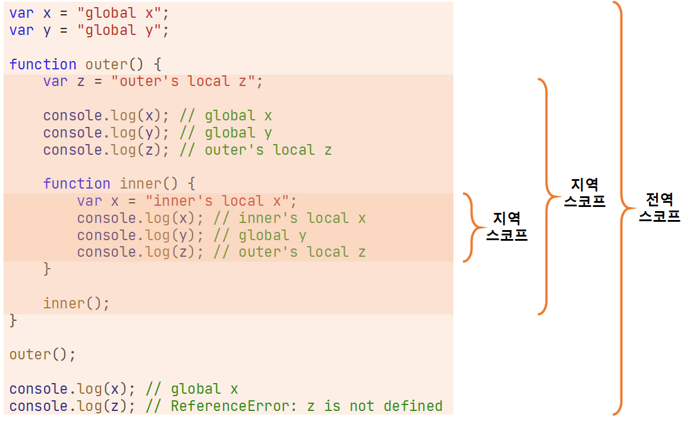
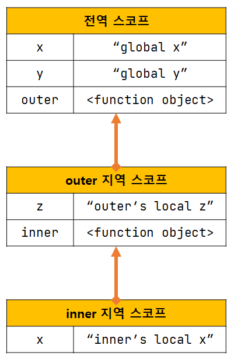

# chapter13 스코프

## 스코프란?

모든 식별자(변수 이름, 함수 이름, 클래스 이름 등)는 자신이 선언된 위치에 의해 달느 코드가 식별자 자신을 참조할 수 있는 유효 범위가 결정된다. 이를 스코프라 한다. 즉, 스코프는 식별자가 유효한 범위를 말한다.

```js
// 13-01

function add(x, y) {
    // 매개변수는 함수 몸체 내부에서만 참조할 수 있다.
    // 즉, 매개변수의 스코프(유효범위)는 함수 몸체 내부다.
    console.log(x, y); // 2 5
    return x + y;
}

add(2, 5);

// 매개변수는 함수 몸체 내부에서만 참조할 수 있다.
console.log(x, y); // ReferenceError: x is not defined
```

```js
// 13-02

var var1 = 1;

if (true) {
    var var2 = 2;
    if (true) {
        var var3 = 3;
    }
}

function foo() {
    var var4 = 4;
    function bar() {
        var var5 = 5;
    }
}

console.log(var1); // 1
console.log(var2); // 2
console.log(var3); // 3
console.log(var4); // ReferenceError: var4 is not defined
console.log(var5); // ReferenceError: var5 is not defined
```

```js
// 13-03

var x = 'global';

function foo() {
    var x = 'local';
    console.log(x); // local
}

foo();

console.log(x); // global
```

**식별자 결정** : 이름이 같은 변수 중에서 어떤 변수를 참조해야할지를 결정하는 것. 자바스크립트 엔진은 스코프를 통해 어떤 변수를 참조해야 할지 결정한다.

프로그래밍 언어에서는 스코프를 통해 식별자인 변수 이름의 충돌을 방지하여 같은 이름의 변수를 사용할 수 있게 한다. 스코프 내에서 식별자는 유일해야 하지만 다른 스코프에는 같은 이름의 식별자를 사용할 수 있다. 즉, 스코프는 네임 스페이스다.

### var 키워드로 선언한 변수의 중복 선언

```js
// 13-04

function foo() {
    var x = 1;
    // var 키워드로 선언된 변수는 같은 스코프 내에서 중복 선언이 허용된다.
    // 아래 변수 선언문은 자바스크립트 엔진에 의해 var 키워드가 없는 것처럼 동작한다.
    var x = 2;
    console.log(x); // 2
}
foo();
```

```js
// 13-05

function bar() {
    let x = 1;
    // let이나 const 키워드로 선언된 변수는 같은 스코프 내에서 중복 선언이 허용되지 않는다.
    let x = 2; // SyntaxError: Identifier 'x' has already been declared
}
bar();
```

## 스코프의 종류

| 구분 | 설명 | 스코프 | 변수 |
| --- | --- | --- | --- |
| 전역(global) | 코드의 가장 바깥 영역 | 전역 스코프 | 전역 변수 |
| 지역(local) | 함수 몸체 내부 | 지역 스코프 | 지역 변수 |

### 전역 / 지역 스코프



전역이란 코드의 가장 바깥 영역을 말한다. 전역은 전역 스코프를 만든다. 전역에 번수를 선언하면 스코프를 갖는 전역 변수가 된다. 전역 변수는 어디서든지 참조할 수 있다.

지역이란 함수 몸체 내부를 말한다. 지역은 지역 스코프를 만든다. 지역에 변수를 선언하면 지역 스코프를 갖는 지역 변수가 된다. 지역 변수는 자신의 지역과 하위 지역(중첩 함수)에서만 참조할 수 있다.

## 스코프 체인

중첩 함수의 지역 스코프는 중첩 함수를 포함하는 외부 함수의 지역 스코프와 계층적 구조를 갖는다. 이때 외부 함수의 지역 스코프를 중첩 함수의 상위 스코프라 한다.



이렇게 스코프가 계층적으로 연결된 것을 스코프 체인이라 한다.

변수를 참조할 때 자바스크립트 엔진은 스코프 체인을 통해 변수를 참조하는 코드의 스코프에서 시작하여 상위 스코프 방향으로 이동하여 선언된 변수를 검색한다.

스코프 체인은 물리적인 실체로 존재한다. 자바스크립트 엔진은 코드를 실행하기에 앞서 위 그림과 유사한 자료구조인 렉시컬 환경을 실제로 생성한다. 변수 선언이 실행되면 변수 식별자가 이 자료구조에 키로 등록되고. 변수 할당이 실행되면 변수 식별자에 해당하는 값을 이 자료구조의 값으로 설정한다.

### 스코프 체인에 의한 변수/함수 검색

자바스크립트 엔진은 스코프 체인을 따라 변수를 참조하는 코드의 스코프에서 시작해서 상위 스코프 방향으로 이동하며 선언된 변수를 검색한다. 하위 스코프로 내려가면서 식별자를 검색하지 않는다.

```js
// 13-06

// 전역 함수
function foo() {
    console.log("global function foo");
}

function bar() {
    // 중첩 함수
    function foo() {
        console.log("local function foo");
    }
    foo();  // local function foo
}

bar();
```

1. 함수 선언문으로 함수 정의
2. 런타임 이전에 함수 객체 생성
3. 함수 이름과 동일한 이름의 식별자를 암묵적으로 선언하고 생성된 함수 객체를 할당한다.

함수도 식별자에 해당하기 때문에 스코프를 갖는다.

## 함수 레벨 스코프

코드 블록이 아닌 함수에 의해서만 지역 스코프가 생성된다.

대부분의 프로그래밍 언어는 함수 몸체만이 아니라 모든 코드 블록(`if`, `for`, `while`, `try/catch` 등)이 지역 스코프를 만든다. 이러한 특성을 블록 레벨 스코프라 한다.

하지만 `var`로 선언된 변수는 오로지 함수의 코드 블록(함수 몸체)만을 지역 스코프로 인정한다. 이러한 특성을 함수 레벨 스코프라 한다.

```js
// 13-07

var x = 1;

if (true) {
    // var 키워드로 선언된 변수는 함수의 코드 블록(함수 몸체)만을 지역 스코프로 인정한다.
    // 함수 밖에서 var 키워드로 선언된 변수는 코드 블록 내에서 선언되었다 할지라도 모두 전역 변수다.
    // 따라서 x 변수는 전역 변수다. 이미 선언된 전역 변수 x 가 있으므로 x 변수는 중복 선언된다.
    // 이는 의도치 않게 변수 값이 변경되는 부작용을 발생시킨다.
    var x = 10;
}

console.log(x); // 10
```

```js
// 13-08

var i = 10;

// for 문에서 선언한 i는 전역 변수다. 이미 선언된 전역 변수 i가 있으므로 중복 선언된다.
for (var i = 0; i < 5; i++) {
    console.log(i); // 0 1 2 3 4
}

// 의도치 않게 변수의 값이 변경되었다.
console.log(i); // 5
```

ES6에서 도입된 `let`, `const` 키워드는 블록 레벨 스코프를 지원한다.

## 렉시컬 스코프

```js
// 13-09

var x = 1;

function foo() {
    var x = 10;
    bar();
}

function bar() {
    console.log(x);
}

foo(); // 1
bar(); // 1
```

1. 동적 스코프 : 함수를 어디서 호출했는지에 따라 함수의 상위 스코프를 결정한다.
2. 렉시컬/정적 스코프 : 함수를 어디서 정의했는지에 따라 함수의 상위 스코프를 결정한다.

자바 스크립트는 렉시컬 스코프를 따른다. 렉시컬 스코프는 함수를 어디서 호출했는지가 아니라 어디에 정의했는지에 따라 상위 스코프를 결정한다. 함수가 호출된 위치는 상위 스코프 결정에 어떠한 영향도 주지 않는다.

## 문제

```js
var x = "global x";
var y = "global y";

{
    var x = "local x";
    console.log(x); // local x
}

console.log(x); // local x
```

```js
let x = "global x";
let y = "global y";

{
    let x = "local x";
    console.log(x); // local x
}

console.log(x); // global x
```

```js
// 13-09-01

var x = 1;

function foo() {
    var x = 10;
    function bar() {
        console.log(x);
    }
    bar();
}

foo(); // 10

```
