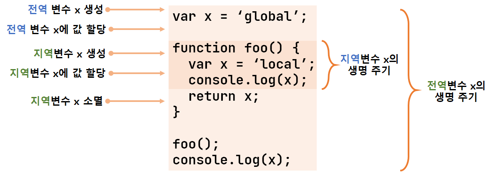

# chapter14 전역변수의 문제점

## 변수의 생명 주기

### 지역 변수의 생명 주기

변수는 자신이 선언된 위치에서 생성되고 소멸한다. 전역 변수의 생명 주기는 애플리케이션의 생명 주기와 같다. 함수 내부에서 선언된 지역 변수는 함수가 호출되면 생성되고 함수가 종료하면 소멸한다.

```js
// 14-01

function foo() {
    var x = 'local';
    console.log(x); // local
    return x;
}

foo();
console.log(x); // ReferenceError: x is not defined
```

전역 변수 선언은 선언문이 어디에 있든 상관없이 가장 먼저 실행된다. 함수 내부에서 선언한 변수는 함수가 호출된 직후에 함수 몸체의 코드가 한 줄씩 순차적으로 실행되기 이전에 자바스크립트 엔진에 의해 먼저 실행된다.

1. `foo` 함수 호출
2. `x` 변수의 선언문이 가장 먼저 실행
3. `x` 변수 선언, `undefined`로 초기화
4. 함수 몸체의 문들이 순차적으로 실행
5. 변수할당문이 실행되면 `x` 변수에 값이 할당
6. 함수가 종료하면 `x` 변수도 소멸

함수 몸체 내부에서 선언된 지역 변수의 생명 주기는 함수 생명의 주기와 대부분 일치하지만 지역 변수가 함수보다 오래 생존하는 경우도 있다.

변수의 생명 주기는 메모리 공간이 확보(allocate)된 시점부터 메모리 공간이 해제(release)되어 가용메모리 풀(memroy pool)에 반환되는 시점까지다.

함수 내부에서 선언된 지역 변수는 함수가 생성한 스코프에 등록된다. 함수가 생성한 스코프는 렉시컬 환경이라 부르는 물리적 실체가 있다. 따라서 변수는 스코프가 소멸(메모리 해제)될 때까지 유효하다. 할당된 메모리 공간은 더 이상 그 누구도 참조하지 않을 때 가비지 콜렉터에 의해 해제되어 가용 메모리 풀에 반환된다. 누군가 스코프를 참조하고 있으면 스코프는 소멸하지 않고 생존하게 된다.

```js
// 14-02

var x = 'global'

function foo() {
    console.log(x)  // undefined
    var x = 'local'
}

foo()
console.log(x);
```

호이스팅은 스코프를 단위로 동작한다. 따라서 지역 변수는 함수 전체에서 유효하다.

### 전역 변수의 생명 주기

`var` 키워드로 선언한 전역 변수는 전역 객체의 프로퍼티가 된다. 전역 변수와 전역 객체의 생명 주기와 같다는 것을 말한다.

전역 객체 : 코드 실행 이전에 자바스크립트 엔진에 의해 제일 먼저 생성되는 특수한 객체

브라우저 환경에서 전역 객체는 `widnow`이므로 브라우저 환경에서 `var` 키워드로 선언한 전역 변수는 전역 객체 `window`의 프로퍼티다. 이는 웹페이지를 닫을 때까지 유효하다.



## 전역 변수의 문제점

* 암묵적 결합 : 모든 코드가 전역 변수를 참조, 변경할 수 있는 암묵적 결합을 허용한다. 이는 가독성을 떨어뜨리고 상태 변경의 위험성을 높인다.
* 긴 생명 주기 : 메모리 리소스를 오랜 기간 소비한다.
* 스코프 체인 상에서 종점에 존재 : 검색 속도가 가장 느리다.
* 네임스페이스 오염 : 자바스크립트는 하나의 파일이 분리되어 있어도 전역 스코프를 공유하는 문제점이 있다. 다른 파일 내에서 동일한 이름의 전역 변수나 전역 함수가 같은 스코프 내에 존재하게 될 수 있다.

## 전역 변수 사용을 억제하는 방법

전역 변수를 반드시 사용해야 할 이유를 찾지 못한다면 지역 변수를 사용해야 한다. 변수 스코프는 좁을수록 좋다.

### 즉시 실행 함수

함수 정의와 동시에 호출되는 즉시 실행 함수는 단 한 번만 호출된다. 모든 코드를 즉시 실행 함수로 감싸면 모든 변수는 즉시 실행 함수의 지역 변수가 된다. 이러한 특성을 이용해 전역 변수의 사용을 제한하는 방법이다. 라이브러리 등에 자주 사용된다.

```js
// 14-04

(function() {
    var foo = 10; // 즉시 실행 함수의 지역 변수
    // ...
}());

console.log(foo); // ReferenceError: foo is not defined
```

### 네임스페이스 객체

전역에 네임스페이스 역할을 담당할 객체를 생성하고 전역 변수처럼 사용하고 싶은 변수를 프로퍼티로 추가하는 방법

```js
// 14-05

var MYAPP = {} // 전역 네임스페이스 객체

MYAPP.name = 'Lee';

console.log(MYAPP.name); // Lee
```

네임 스페이스 객체에 또 다른 네임 스페이스 객체를 프로퍼티로 추가해서 네임스페이스를 계층적으로 구성할 수도 있다.

```js
// 14-06

var MYAPP = {}; // 전역 네임스페이스 객체

MYAPP.person = {
    name: 'Lee',
    address: 'Seoul'
};

console.log(MYAPP.person.name); // Lee
```

네임스페이스 객체 자체가 전역 변수에 할당되므로 그다지 유용해 보이지는 않는다.

### 모듈 패턴

모듈 패턴은 클래스를 모방해서 관련이 있는 변수와 함수를 모아 즉시 실행 함수로 감싸 하나의 모듈을 만든다. 모듈 패턴의 특징은 전역 변수의 억제는 물론 캡슐화까지 구현할 수 있다는 것이다.

캡슐화는 객체의 상태를 나타내는 프로퍼티와 프로퍼티를 참조하고 조작할 수 있는 동작인 메서드를 하나로 묶는 것을 말한다. 캡슐화는 객체의 특정 프로퍼티나 메서드를 감출 목적으로 사용하기도 하는데 이를 정보 은닉이라 한다.

자바스크립트는 `public`, `private`, `protected` 등의 접근 제한자를 제공하지 않는다. 모듈 패턴은 전역 네임스페이스의 오염을 막는 기능은 물론 (한정적인) 정보 은닉을 구현하기 위해 사용한다.

```js
// 14-07

var Counter = (function() {
    // private 변수
    var num = 0;

    // 외부로 공개할 데이터나 메서드를 프로퍼티로 추가한 객체를 반환한다.
    return {
        increase() {
            return ++num;
        },
        decrease() {
            return --num;
        }
    };
}());

// private 변수는 외부로 노출되지 않는다.
console.log(Counter.num); // undefined

console.log(Counter.increase()); // 1
console.log(Counter.increase()); // 2
console.log(Counter.decrease()); // 1
console.log(Counter.decrease()); // 0
```

### ES6 모듈

ES6 모듈을 사용하면 더는 전역변수를 사용할 수 없다. ES6 모듈은 파일 자체의 독자적인 모듈 스코프를 제공한다. 따라서 모듈 내에서 `var` 키워드로 선언한 변수는 더는 전역 변수가 아니며 `window` 객체의 프로퍼티도 아니다.

모던 브라우저에서는 ES6 모듈을 사용할 수 있다. `script` 태그에 `type="module"` 어트리뷰트를 추가하면 로드된 자바스크립트 파일은 모듈로서 동작한다. 확장자는 `mjs`를 권장한다.

```js
<script type="module" src="lib.mjs"></script>
<script type="module" src="app.mjs"></script>
```
