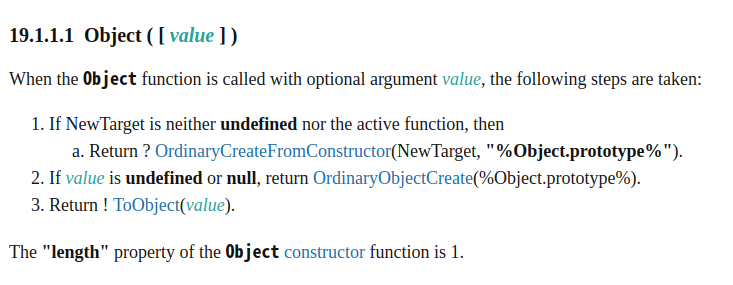

# chapter19 프로토타입

자바스크립트는 명령형, 함수형, 프로토타입 기반 객체지향 프로그래밍을 지원하는 멀티 패러다임 프로그래밍 언어다.

## 객체지향 프로그래밍

추상화 : 다양한 속성 중에서 프로그램에 필요한 속성만 간추려 내어 표현하는 것.

객체지향 프로그래밍은 객체를 상태를 나타내는 데이터와 상태 데이터를 조작할 수 있는 동작을 하나의 논리적인 단위로 묶어 생각한다. 객체는 상태 데이터와 동작을 하나의 논리적인 단위로 묶은 복합적인 자료구조라고 할 수 있다.

## 상속과 프로토타입

상속을 통해 불필요한 중복 인스턴스를 줄일 수 있다.

```js
// 19-04

// 생성자 함수
function Circle(radius) {
    this.radius = radius;
}

// Circle 생성자 함수가 생성한 모든 인스턴스가 getArea 메서드를
// 공유해서 사용할 수 있도록 프로토타입에 추가한다.
// 프로토타입은 Circle 생성자 함수의 prototype 프로퍼티에 바인딩되어 있다.
Circle.prototype.getArea = function () {
    return Math.PI * this.radius ** 2;
};

// 인스턴스 생성
const circle1 = new Circle(1);
const circle2 = new Circle(2);

// Circle 생성자 함수가 생성한 모든 인스턴스는 부모 객체의 역할을 하는
// 프로토타입 Circle.prototype으로부터 getArea 메서드를 상속받는다.
// 즉, Circle 생성자 함수가 생성하는 모든 인스턴스는 하나의 getArea 메서드를 공유한다.
console.log(circle1.getArea === circle2.getArea); // true

console.log(circle1.getArea()); // 3.141592653589793
console.log(circle2.getArea()); // 12.566370614359172
```

*[그림 19-01]*

*[그림 19-02]*

자바스크립트는 프로토타입을 기반으로 상속을 구현한다.

`getArea` 메서드는 단 하나만 생성되어 `Circle.prototype`의 메서드로 할당되어 있다. 따라서 `Cricle` 생성자 함수가 사용하는 모든 인스턴스는 `getArea` 메서드를 상속받아 사용할 수 있다.

## 프로토타입 객체

프로토타입 객체 : 어떤 객체의 상위 객체의 역할을 하는 객체로서 다른 객체에 공유 프로퍼티를 제공.

모든 객체는 하나의 프로토타입을 갖는다. 모든 프로토타입은 생성자 함수와 연결되어 있다. 즉, 객체와 프로토타입과 생성자 함수는 연결되어 있다.

*[그림 19-03]*

### `__proto__` 접근자 프로퍼티

모든 객체는 `__proto__` 접근자 프로퍼티를 통해 자신의 프로토타입, 즉 `[[Prototype]]` 내부 슬롯에 간접적으로 접근할 수 있다.

```text 
{name: 'Lee'} name :  "Lee" 
[[Prototype]] :  Object 
constructor :  ƒ Object() 
hasOwnProperty :  ƒ hasOwnProperty() 
isPrototypeOf :  ƒ isPrototypeOf() 
propertyIsEnumerable :  ƒ propertyIsEnumerable() 
toLocaleString :  ƒ toLocaleString() 
toString :  ƒ toString() 
valueOf :  ƒ valueOf() 
__defineGetter__ :  ƒ __defineGetter__() 
__defineSetter__ :  ƒ __defineSetter__() 
__lookupGetter__ :  ƒ __lookupGetter__() 
__lookupSetter__ :  ƒ __lookupSetter__() 
__proto__ :  Object constructor :  ƒ Object() 
    hasOwnProperty :  ƒ hasOwnProperty() 
    isPrototypeOf :  ƒ isPrototypeOf() 
    propertyIsEnumerable :  ƒ propertyIsEnumerable() 
    toLocaleString :  ƒ toLocaleString() 
    toString :  ƒ toString() 
    valueOf :  ƒ valueOf() 
    __defineGetter__ :  ƒ __defineGetter__() 
    __defineSetter__ :  ƒ __defineSetter__() 
    __lookupGetter__ :  ƒ __lookupGetter__() 
    __lookupSetter__ :  ƒ __lookupSetter__() 
    __proto__ :  (...) 
    get __proto__ :  ƒ __proto__() 
    set __proto__ :  ƒ __proto__() 
get __proto__ :  ƒ __proto__() 
set __proto__ :  ƒ __proto__()
```

들여쓰기 된 것이 `person` 객체의 프로토타입인 `Object.prototype`이다. 이처럼 모든 객체는 `__proto__` 접근자 프로퍼티를 통해 프로토타입을 가리키는 `[[Prototype]]` 내부 슬롯에 접근할 수 있다.

#### `__proto__`는 접근자 프로퍼티다.

`Object.prototype`의 접근자 프로퍼티인 `__proto__` 는 getter/setter 함수라고 부르는 접근자 함수(`[[Get]], [[Set]]` 프로퍼티 어트리뷰트에 할당된 함수)를 통해 `[[Prototype]]` 내부 슬롯의 값, 즉 프로토타입을 취득하거나 할당한다. 

```js
// 19-06

const obj = {};
const parent = { x: 1 };

// getter 함수인 get __proto__가 호출되어 obj 객체의 프로토타입을 취득
obj.__proto__;
// setter함수인 set __proto__가 호출되어 obj 객체의 프로토타입을 교체
obj.__proto__ = parent;

console.log(obj.x); // 1
```

#### `__proto__` 접근자 프로퍼티는 상속을 통해 사용된다.

`__proto__` 접근자 프로퍼티는 객체가 직접 소유하는 프로퍼티가 아니라 `Object.prototype`의 프로퍼티다. 모든 객체는 상속을 통해 `Object.prototype.__proto__` 접근자 프로퍼티를 사용할 수 있다.

```js
// 19-07

const person = { name: 'Lee' };

// person 객체는 __proto__ 프로퍼티를 소유하지 않는다.
console.log(person.hasOwnProperty('__proto__')); // false

// __proto__ 프로퍼티는 모든 객체의 프로토타입 객체인 Object.prototype의 접근자 프로퍼티다.
console.log(Object.getOwnPropertyDescriptor(Object.prototype, '__proto__'));
// {get: ƒ, set: ƒ, enumerable: false, configurable: true}

// 모든 객체는 Object.prototype의 접근자 프로퍼티 __proto__를 상속받아 사용할 수 있다.
console.log({}.__proto__ === Object.prototype); // true
```

#### `__proto__` 접근자 프로퍼티를 통해 프로토타입에 접근하는 이유

상호 참조에 의해 프로토타입 체인이 생성되는것을 방지하기 위해서다.

```js
// 19-08

const parent = {};
const child = {};

// child의 프로토타입을 parent로 설정
child.__proto__ = parent;
// parent의 프로토타입을 child로 설정
parent.__proto__ = child; // TypeError: Cyclic __proto__ value
```

프로토타입 체인은 단방향 연결 리스트로 구현되어야 한다. 따라서 아무 체크 없이 무조건적으로 프로토타입을 교체할 수 없도록 `__proto__` 접근자 프로퍼티를 통해 프로토타입에 접근하고 교체하도록 구현되어 있다.

#### `__proto__` 접근자 프로퍼티를 코드 내에서 직접 사용하는 것은 권장하지 않는다.

모든 객체가 `__proto__` 접근자 프로퍼티를 사용할 수 있는 것은 아니다. 직접 상속을 통해 `Object.prototype` 을 상속받지 않는 객체를 생성할 수도 있기 때문에 `__proto__` 접근자 프로퍼티를 사용할 수 없는 경우가 있다.

프로토타입의 참조를 취득하고 싶은 경우에는 `Object.getPrototypeOf` 메서드(ES5, IE9)를 사용하자.

```js
// 19-09

// obj는 프로토타입 체인의 종점이다. 따라서 Object.__proto__를 상속받을 수 없다.
const obj = Object.create(null);

// obj는 Object.__proto__를 상속받을 수 없다.
console.log(obj.__proto__); // undefined

// 따라서 __proto__보다 Object.getPrototypeOf 메서드를 사용하는 편이 좋다.
console.log(Object.getPrototypeOf(obj)); // null
```

프로토타입을 교체하고 싶은 경우에는 `Object.setPrototypeOf` 메서드(ES6, IE11)를 사용할 것을 권장한다.

```js
// 19-10

const obj = {};
const parent = { x: 1 };

// obj 객체의 프로토타입을 취득
Object.getPrototypeOf(obj); // obj.__proto__;
// obj 객체의 프로토타입을 교체
Object.setPrototypeOf(obj, parent); // obj.__proto__ = parent;

console.log(obj.x); // 1
```

### 함수 객체의 `prototype` 프로퍼티

함수 객체만이 소유하는 `prototype` 프로퍼티는 생성자 함수가 생성할 인스턴스의 프로토 타입을 가리킨다.

```js
// 19-11

// 함수 객체는 prototype 프로퍼티를 소유한다.
(function () { }).hasOwnProperty('prototype'); // -> true

// 일반 객체는 prototype 프로퍼티를 소유하지 않는다.
({}).hasOwnProperty('prototype'); // -> false
```

`prototype` 프로퍼티는 생성자 함수가 생성할 객체(인스턴스)의 프로토타입을 가리킨다. 따라서 생성자 함수로서 호출할 수 없는 함수. 즉 non-constructor 인 화살표 함수와 ES6 축약 표현으로 정의한 메서드는 `prototype` 프로퍼티를 소유하지 않으며 프로토타입도 생성하지 않는다.

생성자 함수로 호출하기 위해 정의하지 않은 일반 함수(함수 선언문, 함수 표현식)도 `prototype` 프로퍼티를 소유하지만 객체를 생성하지 않는 일반 함수의 `prototype` 프로퍼티는 아무런 의미가 없다.

모든 객체가 가지고 있는 (엄밀히 말하면 `Object.prototype`으로부터 상속받은) `__proto__` 접근자 프로퍼티와 함수 객체만이 가지고 있는 `prototype` 프로퍼티는 결국 동일한 프로토타입을 가리키지만. 이들 프로퍼티를 사용하는 주체가 다르다.

| 구분 | 소유 | 값 | 사용 주체 | 사용 목적 |
| - | - | - | - | - |
| `__proto__` 접근자 프로퍼티 | 모든 객체 | 프로토타입의 참조 | 모든 객체 | 객체가 자신의 프로토타입에 접근 또는 교체하기 위해 사용 |
| `prototype` 프로퍼티 | constructor | 프로토타입의 참조 | 생성자 함수 | 생성자 함수가 자신이 생성할 객체(인스턴스)의 프로토타입을 할당하기 위해 사용 |

*[그림 19-07]*

### 프로토타입의 constructor 프로퍼티와 생성자 함수

모든 프로토타입은 `constructor` 프로퍼티를 갖는다. `constructor` 프로퍼티는 `prototype` 프로퍼티로 자신을 참조하고 있는 생성자 함수를 가리킨다. 이 연결은 함수 객체가 생성될 때 이뤄진다. 

```js
// 19-14

// 생성자 함수
function Person(name) {
    this.name = name;
}

const me = new Person('Lee');

// me 객체의 생성자 함수는 Person이다.
console.log(me.constructor === Person);  // true
```

*[그림 19-08]*

위 예제에서 `Person` 생성자 함수는 `me` 객체를 생성했다. 이때 `me` 객체는 프로토타입의 `constructor` 프로퍼티를 통해 생성자 함수와 연결된다. `me` 객체에는 `constructor` 프로퍼티가 없지만 `me` 객체는 프로토타입인 `Person.prototype`의 `constructor` 프로퍼티를 상속받아 사용할 수 있다.

## 리터럴 표기법에 의해 생성된 객체의 생성자 함수와 프로토타입

생성자 함수에 의해 생성된 인스턴스는 프로토타입의 `constructor` 프로퍼티에 의해 생성자 함수와 연결된다. 이때 `constructor` 프로퍼티가 가리키는 생성자 함수는 인스턴스를 생성한 생성자 함수다.

하지만 리터럴 표기법에 의한 객체 생성 방식과 같이 명시적으로 `new` 연산자와 함께 생성자 함수를 호출하여 인스턴스를 생성하지 않는 객체 생성 방식도 있다.

```js
// 19-16

// 객체 리터럴
const obj = {};

// 함수 리터럴
const add = function (a, b) { return a + b; };

// 배열 리터럴
const arr = [1, 2, 3];

// 정규표현식 리터럴
const regexp = /is/ig;
```

리터럴 표기법에 의해 생성딘 객체의 경우 프로토타입의 `constructor` 프로퍼티가 가리키는 생성자 함수가 반드시 객체를 생성한 생성자 함수라고 단정할 수는 없다.

```js
// 19-17

// obj 객체는 Object 생성자 함수로 생성한 객체가 아니라 객체 리터럴로 생성했다.
const obj = {};

// 하지만 obj 객체의 생성자 함수는 Object 생성자 함수다.
console.log(obj.constructor === Object); // true
```

위 예제의 `obj` 객체는 객체 리터럴로 생성되었으나 `Object` 생성자 함수와 `constructor` 프로퍼티로 연결되어 있다.



`2.` 에서 `Object` 생성자 함수에 인수를 전달하지 않거나 `undefined` 또는 `null`을 인수로 전달하면서 호출하면 내부적으로는 추상 연산 `OrdinaryObjectCreate`를 호출하여 `Object.prototype`을 프로토타입으로 갖는 빈 객체를 생성한다.


이처럼 `Object` 생성자 함수 호출과 객체 리터럴 평가는 추상 연산 `OrdinaryObjectCreate`를 호출하여 빈객체를 생성하는 점에서 동일하나 `new.target`의 확인이나 프로퍼티를 추가하는 처리 등 세부 내용은 다르다. 따라서 객체 리터럴에 의해 생성된 객체는 `Object` 생성자 함수가 생성한 객체가 아니다.

함수 객체의 경우 `Function` 생성자 함수를 호출하여 생성한 함수는 렉시컬 스코프를 만들지 않고 전역 함수인 것처럼 스코프를 생성하여 클로저도 만들지 않는다. 따라서 함수 선언문과 함수 표현식을 평가하여 함수 객체를 생성한 것은 `Function` 생성자 함수가 아니다. 하지만 `constructor` 프로퍼티를 통해 확인해보면 `foo` 함수의 생성자 함수는 `Function` 생성자 함수다.

리터럴 표기법에 의해 생성된 객체도 상속을 위해 프로토타입이 필요하다. 따라서 리터럴 표기법에 의해 생성된 객체도 가상적인 생성자 함수를 갖는다. 프로토타입은 생성자 함수와 더불어 생성되며 `prototype`, `constructor` 프로퍼티에 의해 연결되어 있기 때문이다. 다시 말해, 프로토타입과 생성자 함수는 단독으로 존재할 수 없고 언제나 쌍으로 존재한다.

리터럴 표기법에 의해 생성된 객체는 생성자 함수에 의해 생성된 객체는 아니다. 하지만 큰 틀에서 생각해보면 리터럴 표기법으로 생성한 객체도 생성자 함수로 생성한 객체와 본질적인 면에서 큰 차이는 없다.

예를 들어 객체 리터럴에 의해 생성한 객체와 `Object` 생성자 함수에 의해 생성한 객체는 생성 과정에 미묘한 차이는 있지만 결국 객체로서 동일한 특성을 갖는다. 함수 리터럴에 의해 생성한 함수와 `Function` 생성자 함수에 의해 생성한 함수는 생성 과정과 스코프, 클로저 등의 차이가 있지만 결국 함수로서 동일한 특성을 갖는다.

따라서 프로토타입의 `constructor` 프로퍼티를 통해 연결되어 있는 생성자 함수를 리터럴 표기법으로 생성한 객체를 생성한 생성자 함수로 생각해도 크게 물니느 없다. 리터럴 표기법에 의해 생성된 객체의 생성자 함수와 프로토 타입은 다음과 같다.

| 리터럴 표기법 | 생성자 함수 | 프로토타입 |
| - | - | - |
| 객체 리터럴 | `Object` | `Object.prototype` |
| 함수 리터럴 | `Function` | `Function.prototype` |
| 배열 리터럴 | `Array` | `Array.prototype` |
| 정규표현식 리터럴 | `RegExp` | `RegExp.prototype` |

## 프로토타입의 생성 시점

프로토타입은 생성자 함수가 생성되는 시점에 더불어 생성된다. 프로토타입과 생성자 함수는 단독으로 존재할 수 없고 언제나 쌍으로 존재하기 때문이다.

### 사용자 정의 생성자 함수와 프로토타입 생성 시점

생성자 함수로서 호출할 수 있는 함수, 즉 constructor는 함수 정의가 평가되어 함수 객체를 생성하는 시점에 프로토타입도 더불어 생성된다. 생성자 함수로서 호출할수 없는 함수인 non-constructor는 프로토타입이 생성되지 않는다. 

```js
// 19-20

// 함수 정의(constructor)가 평가되어 함수 객체를 생성하는 시점에 프로토타입도 더불어 생성된다.
console.log(Person.prototype); // {constructor: ƒ}

// 생성자 함수
function Person(name) {
    this.name = name;
}
```

```js
// 19-21

// 화살표 함수는 non-constructor다.
const Person = name => {
    this.name = name;
};

// non-constructor는 프로토타입이 생성되지 않는다.
console.log(Person.prototype); // undefined
```
생성된 프로토타입은 `Person` 생성자 함수의 `prototype` 프로퍼티에 바인딩된다.

*[그림 19-12]*

빌트인 생성자 함수가 아닌 사용자 정의 생성자 함수는 자신이 평가되어 함수 객체로 생성되는 시점에 프로토타입도 더불어 생성되며, 생성된 프로토타입의 프로토타입은 언제나 `Ojbect.prototype` 이다.

### 빌트인 생성자 함수의 프로토타입 생성 시점

전역 객체가 생성되는 시점에 생성. 생성된 프로토타입은 빌트인 생성자 함수의 `prototype` 프로퍼티에 바인딩된다. 객체가 생성되기 이전에 생성자 함수와 프로토타입은 이미 객체화되어 존재한다. 이후 생성자 함수 또는 리터럴 표기법으로 객체를 생성하면 프로토타입은 생성된 객체의 `[[Prototype]]` 내부 슬로셍 할당된다. 이로써 생성된 객체는 프로토타입을 상속받는다.

## 객체 생성 방식과 프로토타입의 결정

각 방식마다 차이는 있으나 `OrdinaryObjectiveCreate`에 의해 생성된다는 공통점이 있다.

1. 자신이 생성할 객체의 프로토타입을 인수로 전달받음.
2. 자신이 생성할 객체에 추가할 프로퍼티 목록을 옵션으로 전달
3. 빈 객체를 생성 후 프로퍼티 목록을 객체에 추가
4. 전달받은 프로토타입을 자신이 생성한 객체의 `[[Prototype]]` 내부 슬롯에 할당
5. 생성한 객체 반환

즉 프로토타입은 추상 연산 `OrdinaryObjectCreate` 에 전달되는 인수에 의해 결정된다. 이 인수는 객체가 생성되는 시점에 객체 생성 방식에 의해 결정된다.

### 객체 리터럴에 의해 생성된 객체의 프로토타입

객체 리터럴에 의해 생성되는 객체의 프로토타입은 `Object.prototype` 이다.

객체 리터럴이 평가되면 추상 연산 `OrdinaryObjectCreate`에 의해 `Object` 생성자 함수와
`Object.prototype`과 관련된 객체 사이에 연결이 만들어진다.

이처럼 객체 리터럴에 의해 생성된 `obj` 객체는 `Object.prototype`을 프로토타입으로 갖게 되고 상속받는다.

*[그림 19-14]*

### Object 생성자 함수에 의해 생성된 객체의 프로토타입

*[그림 19-15]*

객체 리터럴과 `Object` 생성자 함수에 의한 객체 생성 방식의 차이는 프로퍼티를 추가하는 방식에 있다. 객체 리터럴 방식은 객체 리터럴 내부에 프로퍼티를 추가해야 하지만 `Ojbect` 생성자 함수는 일단 빈 객체를 생성한 후 이후 프로퍼티를 추가해야 한다.

### 생성자 함수에 의해 생성된 객체의 프로토타입

`new` 연산자와 함께 생성자 함수를 할 때 추상 연산 `OrdinaryObjectCreate`에 전달되는 프로토타입은 생성자 함수의 `prototype` 프로퍼티에 바인딩되어 있는 객체다. 

*[그림 19-16]*

바인딩된 객체의 프로토타입에 프로퍼티를 추가하여 하위 객체가 상속받을 수 있도록 할 수 있다. 이러헥 추가/ 삭제된 프로퍼티는 프로토타입 체인에 즉각 반영된다.

```js
// 19-28

function Person(name) {
    this.name = name;
}

// 프로토타입 메서드
Person.prototype.sayHello = function () {
    console.log(`Hi! My name is ${this.name}`);
};

const me = new Person('Lee');
const you = new Person('Kim');

me.sayHello();  // Hi! My name is Lee
you.sayHello(); // Hi! My name is Kim
```

*[그림 19-17]*

## 프로토타입 체인

```js
// 19-29

function Person(name) {
    this.name = name;
}

// 프로토타입 메서드
Person.prototype.sayHello = function () {
    console.log(`Hi! My name is ${this.name}`);
};

const me = new Person('Lee');

// hasOwnProperty는 Object.prototype의 메서드다.
console.log(me.hasOwnProperty('name')); // true
```

*[그림 19-18]*

자바스크립트 객체의 프로퍼티에 접근하려고 할 때 해당 객체에 접근하려는 프로퍼티가 없다면 `[[Prototype]]` 내부 슬롯의 참조를 따라 자신의 부모 역할을 하는 프로토타입의 프로퍼티를 순차적으로 검색한다. 이를 프로토타입 체인이라 한다.

`Object.prototype` 을 프로토타입 체인의 종점이라 한다. `Object.prototype`의 프로토타입은 `null` 이다. 

프로토타입 체인은 상속과 프로퍼티 검색을 위한 메커니즘이라 할 수 있다.

## 오버라이딩과 프로퍼티 섀도잉

```js
// 19-36

const Person = (function () {
    // 생성자 함수
    function Person(name) {
        this.name = name;
    }

    // 프로토타입 메서드
    Person.prototype.sayHello = function () {
        console.log(`Hi! My name is ${this.name}`);
    };

    // 생성자 함수를 반환
    return Person;
}());

const me = new Person('Lee');

// 인스턴스 메서드
me.sayHello = function () {
    console.log(`Hey! My name is ${this.name}`);
};

// 인스턴스 메서드가 호출된다. 프로토타입 메서드는 인스턴스 메서드에 의해 가려진다.
me.sayHello(); // Hey! My name is Lee
```

*[그림 19-19]*

프로토타입 프로퍼티와 같은 이름의 프로퍼티를 인스턴스에 추가하면 프로토타입 체인을 따라 프로토타입 프로퍼티를 검색하여 프로토타입 프로퍼티를 덮어쓰는 것이 아니라 인스턴스 프로퍼티로 추가한다. 

이때 인스턴스 메서드는 프로토타입 메서드를 오버라이딩했고 프로토타입 메서드는 가려진다. 이처럼 상속 관계에 의해 프로퍼티가 가려지는 현상을 프로퍼티 섀도잉이라 한다.

* **오버라이딩** : 상위 클래스가 가지고 있는 메서드를 하위 클래스가 재정의하여 사용하는 방식
* **오버로딩** : 함수 이름은 동일하지만 매개변수의 타입과 개수가 다른 여러 개의 함수를 정의하고, 매개변수에 의해 호출될 함수가 동적으로 결정되는 방식, `arguments` 객체를 사용하여 구현할 수 있다.

인스턴스 메서드를 삭제하면 프로토타입 메서드가 아니라 인스턴스 메서드가 삭제된다. 하위 객체를 통해 프로토타입의 프로퍼티를 변경, 삭제하는 것은 불가능하다. 하고 싶다면 프로토타입에 직접 접근해야 한다.

## 프로토타입의 교체

프로토타입은 임의의 다른 객체로 변경할 수 있다. 이것은 부모 객체인 프로토타입을 동적으로 변경할 수 있다는 것을 의미한다. 이러한 특징을 활용하여 객체 간의 상속 관계를 동적으로 변경할 수 있다. 프로토타입은 생성자 함수 또는 인스턴스에 의해 교체할 수 있다.

### 생성자 함수에 의한 프로토타입의 교체

```js
// 19-40-01

const Person = (function () {
    function Person(name) {
        this.name = name;
    }

    // ① 생성자 함수의 prototype 프로퍼티를 통해 프로토타입을 교체
    Person.prototype = {
        sayHello() {
            console.log(`Hi! My name is ${this.name}`);
        }
    };

    return Person;
}());

const me = new Person('Lee');

// 프로토타입을 교체하면 constructor 프로퍼티와 생성자 함수 간의 연결이 파괴된다.
console.log(me.constructor === Person); // false
// 프로토타입 체인을 따라 Object.prototype의 constructor 프로퍼티가 검색된다.
console.log(me.constructor === Object); // true
```

*[그림 19-20]*

`constructor` 프로퍼티는 자바스크립트 엔진이 프로토타입을 생성할 때 암묵적으로 추가한 프로퍼티다.

이처럼 프로토타입을 교체하면 `constructor` 프로퍼티와 생성자 함수 간의 연결이 파괴된다. 프로토타입으로 교체한 객체 리터럴에 `constructor` 프로퍼티를 추가하여 프로토타입의 `constructor` 프로퍼티를 되살린다.

```js
const Person = (function () {
  function Person(name) {
    this.name = name;
  }

  // 생성자 함수의 prototype 프로퍼티를 통해 프로토타입을 교체
  Person.prototype = {
    // constructor 프로퍼티와 생성자 함수 간의 연결을 설정
    constructor: Person,
    sayHello() {
      console.log(`Hi! My name is ${this.name}`);
    }
  };

  return Person;
}());

const me = new Person('Lee');

// constructor 프로퍼티가 생성자 함수를 가리킨다.
console.log(me.constructor === Person); // true
console.log(me.constructor === Object); // false
```
### 인스턴스에 의한 프로토타입의 교체

인스턴스의 `__proto__` 접근자 프로퍼티(또는 `Object.setPrototypeOf` 메서드)를 통해 프로토타입을 교체할 수 있다.

생성자 함수의 `prototype` 프로퍼티에 다른 임의의 객체를 바인딩 하는 것은 미래에 생성할 인스턴스의 프로토타입을 교체하는 것이다. `__proto__` 접근자 프로퍼티를 통해 프로토타입을 교체하는 것은 이미 생성된 객체의 프로토타입을 교체하는 것이다.

```js
// 19-43-01

function Person(name) {
    this.name = name;
}

const me = new Person('Lee');

// 프로토타입으로 교체할 객체
const parent = {
    sayHello() {
        console.log(`Hi! My name is ${this.name}`);
    }
};

// ① me 객체의 프로토타입을 parent 객체로 교체한다.
Object.setPrototypeOf(me, parent);
// 위 코드는 아래의 코드와 동일하게 동작한다.
// me.__proto__ = parent;

me.sayHello(); // Hi! My name is Lee

// 프로토타입을 교체하면 constructor 프로퍼티와 생성자 함수 간의 연결이 파괴된다.
console.log(me.constructor === Person); // false
// 프로토타입 체인을 따라 Object.prototype의 constructor 프로퍼티가 검색된다.
console.log(me.constructor === Object); // true
```

*[그림 19-21]*

프로토타입으로 교체한 객체에는 `constructor` 프로퍼티가 없으므로 `constructor` 프로퍼티와 생성자 함수 간의 연결이 파괴된다. 따라서 프로토타입 `constructor` 프로퍼티로 `me`  객체의 생성자 함수를 검색하면 `Person`이 아닌 `Object`가 나온다.

*[그림 19-22]*

프로토타입으로 교체한 리터럴에 `constructor` 프로퍼티를 추가하고 생성자 함수의 `prototype` 프로퍼티를 재설정하여 파괴된 생성자 함수와 프로토타입간의 연결을 되살릴 수 있다.

```js
// 19-45

function Person(name) {
    this.name = name;
}

const me = new Person('Lee');

// 프로토타입으로 교체할 객체
const parent = {
    // constructor 프로퍼티와 생성자 함수 간의 연결을 설정
    constructor: Person,
    sayHello() {
        console.log(`Hi! My name is ${this.name}`);
    }
};

// 생성자 함수의 prototype 프로퍼티와 프로토타입 간의 연결을 설정
Person.prototype = parent;

// me 객체의 프로토타입을 parent 객체로 교체한다.
Object.setPrototypeOf(me, parent);
// 위 코드는 아래의 코드와 동일하게 동작한다.
// me.__proto__ = parent;

me.sayHello(); // Hi! My name is Lee

// constructor 프로퍼티가 생성자 함수를 가리킨다.
console.log(me.constructor === Person); // true
console.log(me.constructor === Object); // false

// 생성자 함수의 prototype 프로퍼티가 교체된 프로토타입을 가리킨다.
console.log(Person.prototype === Object.getPrototypeOf(me)); // true
```

## `isinstanceof` 연산자

좌변에 객체를 가리는 식별자, 우변에 생성자 함수를 가리키는 식별자를 피연산자로 받는다. 만약 우변의 피연산자가 함수가 아닌 경우 `TypeError`가 발생한다.

```js
객체 instanceof 생성자 함수
```

우변의 생성자 함수의 `prototype`에 바인딩된 객체가 좌변의 객체의 프로토타입 체인 상에 존재하면 `true`로 평가되고 그렇지 않은 경우에는 `false`로 평가된다.

`instanceof` 연산자는 프로토타입의 `constructur` 프로퍼티가 가리키는 생성자 함수를 찾는 것이 아니라 생성자 함수의 `prototype`에 바인딩된 객체가 프로토타입 체인 상에 존재하는지 확인한다.

```js
// 19-48

// 생성자 함수
function Person(name) {
    this.name = name;
}

const me = new Person('Lee');

// 프로토타입으로 교체할 객체
const parent = {};

// 프로토타입의 교체
Object.setPrototypeOf(me, parent);

// Person 생성자 함수와 parent 객체는 연결되어 있지 않다.
console.log(Person.prototype === parent); // false
console.log(parent.constructor === Person); // false

// parent 객체를 Person 생성자 함수의 prototype 프로퍼티에 바인딩한다.
Person.prototype = parent;

// Person.prototype이 me 객체의 프로토타입 체인 상에 존재하므로 true로 평가된다.
console.log(me instanceof Person); // true

// Object.prototype이 me 객체의 프로토타입 체인 상에 존재하므로 true로 평가된다.
console.log(me instanceof Object); // true
```

## 직접 상속

### `Object.create`에 의한 직접 상속

`Object.create` 메서드는 명시적으로 프로토타입을 지정하여 새로운 객체를 생성한다.

* 첫 번째 매개변수 : 생서할 객체의 프로토타입으로 지정할 객체
* 두 번째 매개변수(생략 가능) : 생성할 객체의 프로퍼티 키와 프로퍼티 디스크립터 객체로 이뤄진 객체 전달

```js
/*
* 지정된 프로토타입 및 프로퍼티를 갖는 새로운 객체를 생성하여 반환한다.
* @param {Object} prototype - 생성할 객체의 프로토타입으로 지정할 객체
* @param {Object} [propertiesObject] - 생성할 객체의 프로퍼티를 갖는 객체
* @returns {Object} 지정된 프로토타입 및 프로퍼티를 갖는 새로운 객체
*/
Object.create(prototype[, propertiesObject])
```

장점
* `new` 연산자가 없이도 객체를 생성할 수 있다.
* 프로토타입을 지정하면서 객체를 생성할 수 있다.
* 객체 리터럴에 의해 생성된 객체도 상속받을 수 있다.

```js
// 19-51

// 프로토타입이 null인 객체를 생성한다. 생성된 객체는 프로토타입 체인의 종점에 위치한다.
// obj → null
let obj = Object.create(null);
console.log(Object.getPrototypeOf(obj) === null); // true
// Object.prototype을 상속받지 못한다.
console.log(obj.toString()); // TypeError: obj.toString is not a function

// obj → Object.prototype → null
// obj = {};와 동일하다.
obj = Object.create(Object.prototype);
console.log(Object.getPrototypeOf(obj) === Object.prototype); // true

// obj → Object.prototype → null
// obj = { x: 1 };와 동일하다.
obj = Object.create(Object.prototype, {
    x: { value: 1, writable: true, enumerable: true, configurable: true }
});
// 위 코드는 다음과 동일하다.
// obj = Object.create(Object.prototype);
// obj.x = 1;
console.log(obj.x); // 1
console.log(Object.getPrototypeOf(obj) === Object.prototype); // true

const myProto = { x: 10 };
// 임의의 객체를 직접 상속받는다.
// obj → myProto → Object.prototype → null
obj = Object.create(myProto);
console.log(obj.x); // 10
console.log(Object.getPrototypeOf(obj) === myProto); // true

// 생성자 함수
function Person(name) {
    this.name = name;
}

// obj → Person.prototype → Object.prototype → null
// obj = new Person('Lee')와 동일하다.
obj = Object.create(Person.prototype);
obj.name = 'Lee';
console.log(obj.name); // Lee
console.log(Object.getPrototypeOf(obj) === Person.prototype); // true
```

`Object.create` 메서드를 통해 프로토타입 체인의 종점에 위치하는 객체를 생성할 수 있기 때문에 `Object.prototype`의 빌트인 메서드를 객체가 직접 호출하는 것을 권장하지 않는다. 프로토타입의 체인의 종점에 위치하는 객체는 `Object.prototype`의 빌트인 메서드를 사용할 수 없다.

`Object.prototype`의 빌트인 메서드는 `hasOwnProperty.call`로 같이 간접적으로 호출하는 것이 좋다.

### 객체 리터럴 내부에서 `__proto__`에 의한 직접 상속

```js
const myProto = { x: 10 };

// 객체 리터럴에 의해 객체를 생성하면서 프로토타입을 지정하여 직접 상속받을 수 있다.
const obj = {
  y: 20,
  // 객체를 직접 상속받는다.
  // obj → myProto → Object.prototype → null
  __proto__: myProto
};
/* 위 코드는 아래와 동일하다.
const obj = Object.create(myProto, {
  y: { value: 20, writable: true, enumerable: true, configurable: true }
});
*/

console.log(obj.x, obj.y); // 10 20
console.log(Object.getPrototypeOf(obj) === myProto); // true
```

## 정적 프로퍼티/메서드

정적 프로퍼티/메서드는 생성자 함수로 인스턴스를 생성하지 않아도 참조/호출할 수 있는 프로퍼티/메서드를 말한다.

생성자 함수가 소유한 프로퍼티/메서드를 정적 프로퍼티/메서드라고 한다. 정적 프로퍼티/메서드는 생성자 함수가 생성한 인스턴스로 참조/호출할 수 없다.

*[그림 19-24]*

정적 프로퍼티/메서드는 인스턴스의 프로토타입 체인에 속한 객체의 프로퍼티/메서드가 아니므로 인스턴스로 접근할 수 없다.

`Object.prototype.<>` 메서드는 모든 객체의 프로토타입 체인의 종점이므로 모든 객체가 호출할 수 있다.

인스턴스/프로토타입 메서드 내에서 `this`를 사용하지 않는다면 그 메서드는 정적 메서드로 변경할 수 있다. 인스턴스가 호출한 인스턴스/프로토타입 메서드 내에서 `this`는 인스턴스를 가리킨다. 메서드 내에서 인스턴스를 참조할 필요가 없다면 정적 메서드로 변경하여도 동작한다. 프로토타입 메서드를 호출하려면 인스턴스를 생성해야 하지만 정적 메서드는 인스턴스를 생성하지 않아도 호출할 수 있다.

```js
// 19-58

function Foo() { }

// 프로토타입 메서드
// this를 참조하지 않는 프로토타입 메소드는 정적 메서드로 변경해도 동일한 효과를 얻을 수 있다.
Foo.prototype.x = function () {
    console.log('x');
};

const foo = new Foo();
// 프로토타입 메서드를 호출하려면 인스턴스를 생성해야 한다.
foo.x(); // x

// 정적 메서드
Foo.x = function () {
    console.log('x');
};

// 정적 메서드는 인스턴스를 생성하지 않아도 호출할 수 있다.
Foo.x(); // x
```

## 프로퍼티 존재 확인

### `in` 연산자

`in` 연산자는 객체 내에 특정 프로퍼티가 존재하는지 여부를 확인한다.

```js
/*
* key: 프로퍼티 키를 나타내는 문자열
* object: 객체로 평가되는 표현식
*/
key in object
```

`in` 연산자는 확인 대상 객체의 프로퍼티뿐만 아니라 확인 대상 객체가 상속받은 모든 프로토타입의 프로퍼티를 확인하므로 주의가 필요하다.

```js
// 19-59-01

const person = {
    name: 'Lee',
    address: 'Seoul'
};

// person 객체에 name 프로퍼티가 존재한다.
console.log('name' in person);    // true
// person 객체에 address 프로퍼티가 존재한다.
console.log('address' in person); // true
// person 객체에 age 프로퍼티가 존재하지 않는다.
console.log('age' in person);     // false

console.log('toString' in person); // true
```

`in` 연산자 대신 ES6에서 도입된 `Reflect.has` 메서드를 사용할 수 있다.

```js
// 19-61

const person = { name: 'Lee' };

console.log(Reflect.has(person, 'name'));     // true
console.log(Reflect.has(person, 'toString')); // true
```

### `Object.prototype.hasOwnProperty` 메서드

`Object.prototype.hasOwnProperty` 메서드는 인수로 전달받은 프로퍼티 키가 객체 고유의 프로퍼티 키인 경우에만 `true`를 반환한다. 상속받은 프로토타입의 프로퍼티 키인 경우 `false`를 반환한다.

```js
// 19-63-01

const person = { name: 'Lee' };

console.log(person.hasOwnProperty('name')); // true
console.log(person.hasOwnProperty('age'));  // false

console.log(person.hasOwnProperty('toString')); // false
```

## 프로퍼티 열거

### `for...in` 문

객체의 모든 프로퍼티를 순회하며 열거하려면 `for ... in` 문을 사용한다.

```js
for (변수선언문 in 객체) {...}
```

`for ... in` 문은 `in` 연산자처럼 순회 대상 객체의 프로퍼티 뿐만 아니라 상속받은 프로토타입의 프로퍼티까지 열거한다. 하지만 `toString` 메서드는 열거할 수 없도록 정의되어 있는 프로퍼티이기 때문에 열거하지 않는다. `[[Enumerable]]` 의 값이 `false` 이기 때문이다.

`for ... in` 문은 객체의 프로토타입 체인 상에 존재하는 모든 프로토타입 프로퍼티 중에서 프로퍼티 어트리뷰트 `[[Enumerable]]`의 값이 `true` 인 프로퍼티를 순회하며 열거한다. 프로퍼티가 심벌인 프로퍼티는 열거하지 않는다.

```js
// 19-67

const person = {
    name: 'Lee',
    address: 'Seoul',
    __proto__: { age: 20 }
};

for (const key in person) {
    console.log(key + ': ' + person[key]);
}
// name: Lee
// address: Seoul
// age: 20
```

`Object.prototype.hasOwnProperty` 메서드를 사용하여 객체 자신의 프로퍼티인지 확인하여 객체 자신의 프로퍼티만 열거할 수 있다.

`for ... in` 문은 프로퍼티를 열거할 때 순서를 보장하지 않으므로 주의하기 바란다. 하지만 대부분의 모던 브라우저는 순서를 보장하고 숫자인 프로퍼티 키에 대해서는 정렬을 실시한다.

배열에는 일반적인 `for` 문이나 `for ... of` 문 또는 `Array.prototype.forEach` 메서드를 사용하는 것이 좋다. 

```js
// 19-71

const arr = [1, 2, 3];
arr.x = 10; // 배열도 객체이므로 프로퍼티를 가질 수 있다.

for (const i in arr) {
    // 프로퍼티 x도 출력된다.
    console.log(arr[i]); // 1 2 3 10
};

// arr.length는 3이다.
for (let i = 0; i < arr.length; i++) {
    console.log(arr[i]); // 1 2 3
}

// forEach 메서드는 요소가 아닌 프로퍼티는 제외한다.
arr.forEach(v => console.log(v)); // 1 2 3

// for...of는 변수 선언문에서 선언한 변수에 키가 아닌 값을 할당한다.
for (const value of arr) {
    console.log(value); // 1 2 3
};
```

### `Object.keys/values/entries` 메서드

객체 자신의 고유 프로퍼티만 열거하기 위해서는 `for ... in` 문을 사용하는 것보다 `Object.keys/values/entries` 메서드를 사용하는 것이 좋다.

* `Object.keys` 메서드는 객체 자신의 열거 가능한 프로퍼티 키를 배열로 반환한다.
* `Object.values` 메서드는 객체 자신의 열거 가능한 프로퍼티 값들을 배열로 반환한다.
* `Object.entries` 메서드는 객체 자신의 열거 가능한 프로퍼티 키와 값의 쌍의 배열을 배열로 반환한다.
