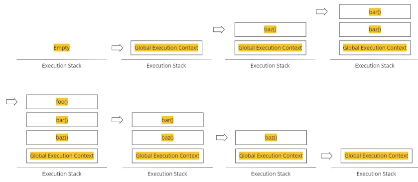
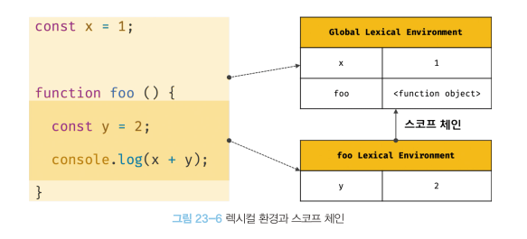
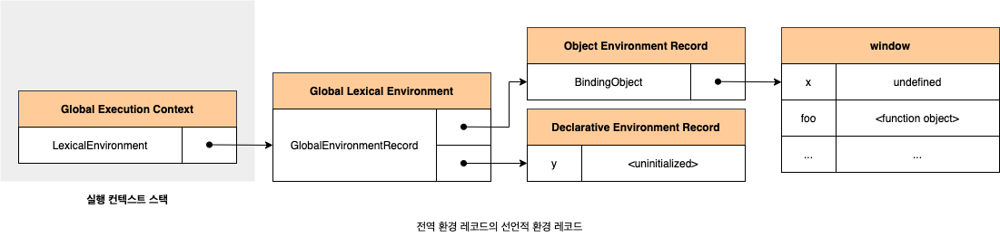
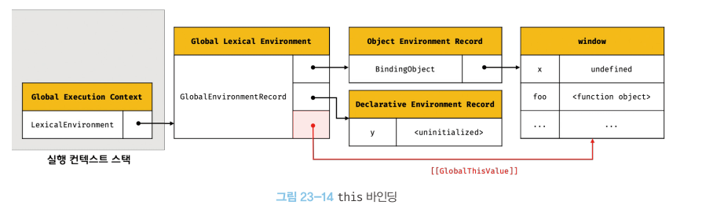
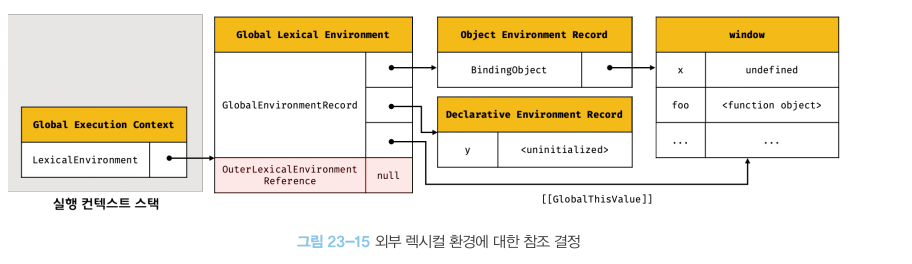
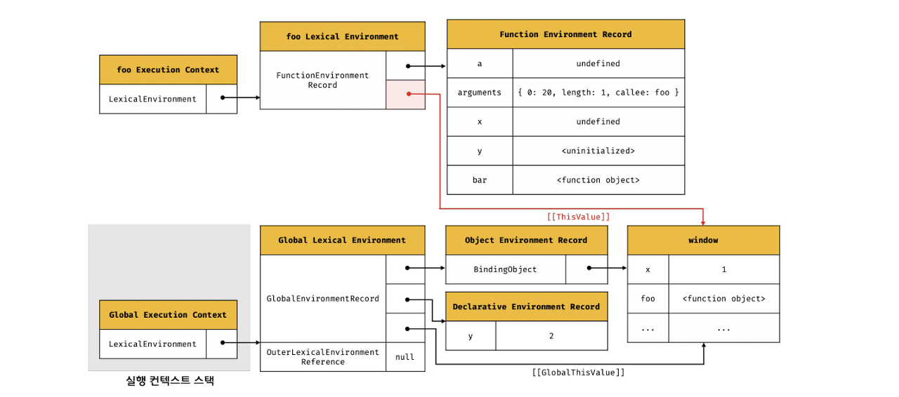
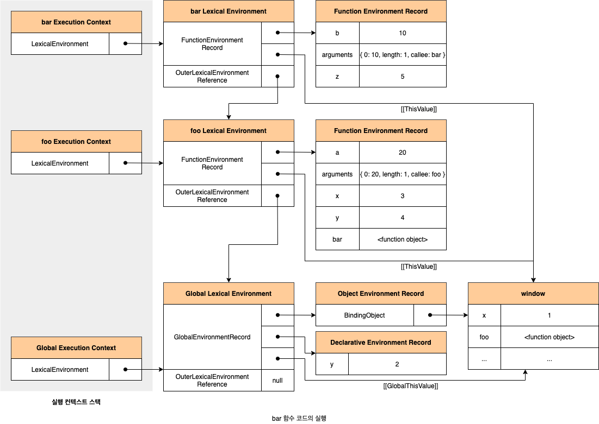
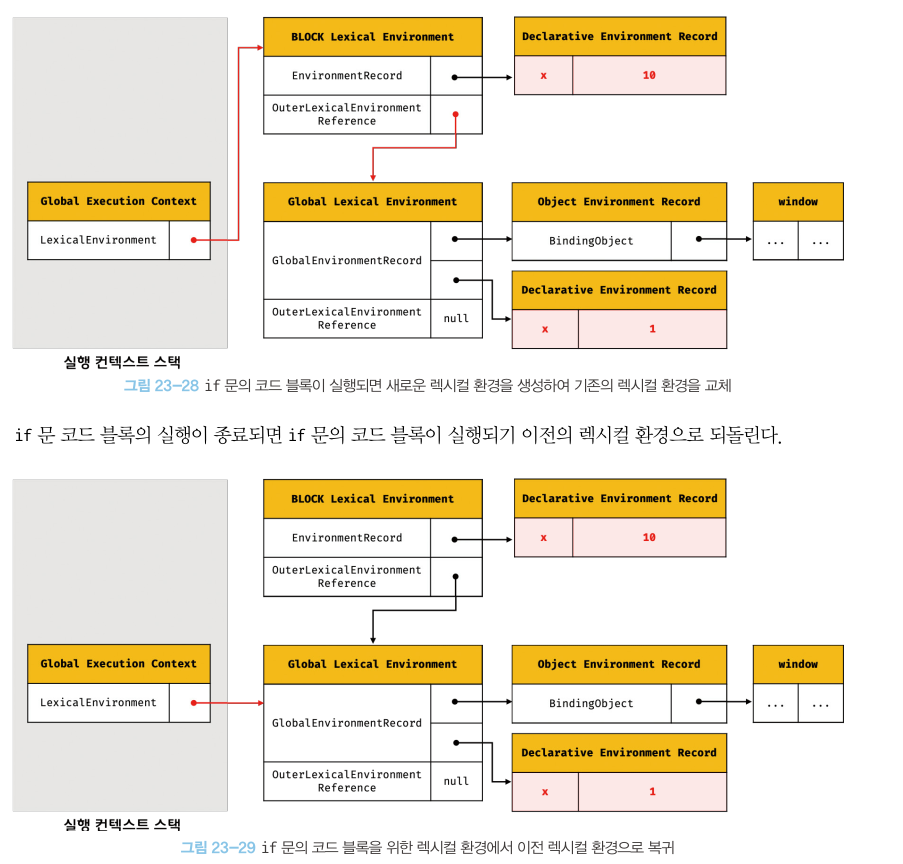

# chapter23 실행 컨텍스트

## 소스코드의 타입

| 소스코드 타입 | 설명 |
| --- | --- |
| 전역 코드 | 전역 영역에 존재하는 소스코드 |
| 함수 코드 | 함수 내부에 존재하는 소스코드 |
| eval 코드 | eval 함수에 인수로 전달되어 실행되는 소스코드 |
| 모듈 코드 | 모듈 내부에 존재하는 소스코드 |

* 전역 코드 : 전역 변수를 관리하기 위해 최상위 스코프인 전여 스코프를 생성해야 한다. 그리고 `var` 키워드로 선언된 전역 변수와 함수 선언문으로 정의된 전역 함수를 전역 객체의 프로퍼티와 메서드로 바인딩하고 참조하기 위해 전역 객체와 연결되어야 한다. 이를 위해 전역 코드가 평가되면 전역 실행 컨텍스트가 생성된다.
* 함수 코드 : 지역 스코프를 생성하고 지역 변수, 매개 변수, `arguments` 객체를 관리해야 한다. 그리고 생성한 지역 스코프를 전역 스코프에서 시작하는 스코프 체인의 일원으로 연결해야 한다. 이를 위해 함수 코드가 평가되면 함수 실행 컨텍스트가 생성된다.
* `eval` 코드 : `eval` 코드는 strict mode에서 자신만의 독자적인 스코프를 생성한다. 이를 위해 `eval` 코드가 평가되면 `eval` 실행 컨텍스트가 생성된다.
* 모듈 코드 : 모듈 코드는 모듈별로 독립적인 모듈 스코프를 생성한다. 이를 위해 모듈 코드가 평가되면 모듈 실행 컨텍스트가 생성된다.

## 소스코드의 평가와 실행

소스 코드 평가 과정에서는 실행 컨텍스트를 생성하고 변수, 함수 등의 선언문만 먼저 실행하여 생성된 변수나 함수 식별자를 키로 실행 컨텍스트가 관리하는 스코프에 등록한다. 이후 소스코드의 나머지 부분을 차례대로 실행한다(런타임 시작) 이때 소스코드 실행에 필요한 정보, 즉 변수나 함수의 참조를 실행 컨텍스트가 관리하는 스코프에서 검색해서 취득한다. 그리고 변수 값의 변경 등 소스코드의 실행 결과는 다시 실행 컨텍스트가 관리하는 스코프에 등록된다.

*[그림 23-02]*

```js
// 23-01

var x;
x = 1;
```

1. 소스코드 평가
   * `var x` 실행
   * 생성된 변수 식별자 `x`를 실행 컨텍스트가 관리하는 스코프에 등록하고 `undefined`로 초기화
2. 소스코드 실행
   * 실행 컨텍스트가 관리하는 스코프에 `x` 변수가 등록되어 있는지 확인한다.
   * 실행 컨텍스트의 스코프에 등록되어 있다면 변수 할당문 `x = 1;`만 실행된다.

코드가 실행되려면 스코프, 식별자, 코드 실행 순서 등의 관리가 필요하다. 이 모든 것을 관리하는 것이 바로 실행 컨텍스트이다.

실행 컨텍스트는 소스코드를 실행하는 데 필요한 환경을 제공하고 코드의 실행 결과를 실제로 관리하는 영역이다.

## 실행 컨텍스트 스택

실행 컨택스트 스택은 코드의 실행 순서를 관리한다. 소스코드가 평가되면 실행 컨텍스트가 생성되고 실행 컨텍스트 스택이 최상위에 쌓인다. 실행 컨텍스트 스택의 최상위에 존재하는 실행 컨텍스트는 언제나 현재 실행 중인 코드의 실행 컨텍스트다. 따라서 실행 컨텍스트 스택의 최상위에 존재하는 실행 컨텍스트를 실행중인 컨텍스트라 한다.



```js
const x = 1;

function foo () {
  const y = 2;

  function bar () {
    const z = 3;
    console.log(x + y + z);
  }
  bar();
}

foo(); // 6
```

## 렉시컬 환경

렉시컬 환경 : 식별자와 식별자에 바인딩된 값, 그리고 상위 스코프에 대한 참조를 기록하는 자료구조로 실행 컨텍스트를 구성하는 컴포넌트다.

실행 컨텍스트 스택이 코드의 실행 순서를 관리한다면 렉시컬 환경은 스코프와 식별자를 관리한다.



렉시컬 환경은 키와 값을 갖는 객체 형태의 스코프를 생성하여 식별자를 키로 등록하고 식별자에 바인딩된 값을 관리한다. 즉, 렉시컬 환경은 스코프를 구분하여 식별자를 등록하고 관리하는 저장소 역할을 하는 렉시컬 스코프의 실체다.

실행 컨텍스트는 `LexicalEnvrionment` 컴포넌트와 `VariableEnvironment` 컴포넌트로 구성된다. 생성 초기에 두 컴포넌트는 하나의 동일한 렉시컬 환경을 참조하고 이후 몇 가지 상황에 따라 다른 렉시컬 환경을 참조한다.

렉시컬 환경은 두 개의 컴포넌트로 구성된다.

1. 환경 레코드
   * 스코프에 포함된 식별자를 등록하고 관리하는 저장소다. 환경 레콛는 소스코드 타입에 따라 관리하는 내용에 차이가 있다.
2. 외부 렉시컬 환경에 대한 참조
   * 외부 렉시컬 환경에 대한 참조는 상위 스코프를 가리킨다. 이때 상위 스코프란 외부 렉시컬 환경, 즉 해당 실행 컨텍스트를 생성한 소스코드를 포함하는 상위 코드의 렉시컬 환경을 말한다. 외부 렉시컬 환경에 대한 참조를 통해 단방향 링크드 리스트인 스코프 체인을 구현한다.

## 실행 컨텍스트의 생성과 식별자 생성 과정

```js
// 23-04

var x = 1;
const y = 2;

function foo (a) {
  var x = 3;
  const y = 4;

  function bar (b) {
    const z = 5;
    console.log(a + b + x + y + z);
}
  bar(10);
}

foo(20); // 42
```

### 전역 객체 생성

* 전역 코드가 평가되기 이전에 생성
* 전역 객체
  * 빌트인 전역 프로퍼티
  * 빌트인 전역 함수
  * 표준 빌트인 객체
  * 동작 환경 또는 특정 환경을 위한 호스트 객체

전역 객체도 `Object.prototype`을 상속받음. 즉, 전역 객체도 프로토타입 체인의 일원이다.

### 전역 코드 평가

1. 전역 실행 컨텍스트 생성
2. 전역 렉시컬 환경 생성
   1. 전역 환경 레코드 생성
      1. 객체 환경 레코드 생성
      2. 선언적 환경 레코드 생성
   2. `this` 바인딩
   3. 외부 렉시컬 환경에 대한 참조 결정



* 객체 환경 레코드 생성
  * 기존의 전역 객체가 관리하던 `var` 키워드로 선언한 선언 변수와 함수 선언문으로 정의한 전역 함수, 빌트인 전역 프로퍼티와 빌트트인 전역 함수, 표준 빌트인 객체를 관리
  * 전역 코드 평가 과정에서 `var` 키워드로 선언한 전역 변수와 함수 선언문으로 정의된 전역 함수는 전역 환경 레코드의 `BindingObject`를 통해 전역 객체의 프로퍼티와 메서드가 된다, 암묵적으로 `undefined`를 바인딩한다.
    * 함수 선언문으로 정의한 함수가 평가되면 함수 이름과 동일한 이름의 식별자를 객체 환경 레코드에 바인딩된 `BindingObject`를 통해 전역 객체에 키로 등록하고 생성된 함수 객체를 즉시 할당한다. 즉 함수 선언문으로 정의한 함수는 함수 선언문 이전에 호출할 수 있다.
* 선언적 환경 레코드 생성 : `let`, `const` 키워드로 선언한 전역 변수를 관리한다.
  * 선언단계와 초기화 단계가 분리되어 진행한다. 따라서 초기화 단계, 즉 런타임에 실행 흐름이 변수 선언문에 도달하기 전까지 일시적 사각지대에 빠지게 된다.
  * 그림에서의 `uninitialized`는 바인딩 된 것이 아니다.



* `this` 바인딩
  * 전역 환경 레코드의 `thisValue`에 전역 객체를 바인딩한다.
  * 일반적으로 전역 코드에서 `this`는 전역 객체를 가리키므로 전역 환경 레코드의 `thisValue`에는 전역 객체가 바인딩된다.
  * 객체 환경 레코드와 선언적 환경 레코드에는 `this` 바인딩이 없다.
  * `this` 바인딩은 전역 환경 레코드와 함수 환경 레코드에만 존재한다.



* 외부 렉시컬 환경에 대한 참조 결정
  * 외부 렉시컬 환경에 대한 참조는 현재 평가 중인 소스코드를 포함하는 외부 소스코드의 렉시컬 환경, 즉 상위 스코프를 가리킨다. 이를 통해 스코프 체인을 구현한다.
  * 전역 렉시컬 환경의 외부 렉시컬 환경에 대한 참조에 `null`이 할당된다.

### 전역 코드 실행

변수 할당문이 실행되어 전역 변수 `x`와 `y`에 값이 할당된다. 그리고 `foo` 함수가 호출된다.

식별자 결정을 위해 식별자를 검색할 때는 실행 중인 실행 컨텍스트에서 식별자를 검색하기 시작한다. 선언된 식별자는 실행 컨텍스트의 렉시컬 환경의 환경 레코드에 등록되어 있다.

전역 렉시컬 환경에서 검색할 수 없는 식별자는 참조 에러를 발생시킨다.

### `foo` 함수 코드 평가

1. 함수 실행 컨텍스트 생성
2. 함수 렉시컬 환경 생성
   1. 함수 환경 레코드 생성
   2. `this` 바인딩
   3. 외부 렉시컬 환경에 대한 참조 결정



자바 스크립트 엔진은 함수 정의를 평가하여 함수 객체를 생성할 때 현재 실행 중인 실행 컨텍스트의 렉시컬 환경, 즉 함수의 상위 스코프를 함수 객체의 내부 슬롯 `[[Environment]]`에 저장한다.

### `foo` 함수 코드 실행

런타임이 시작되어 `foo` 함수의 소스코드가 순차적으로 실행되기 시작한다. 매개변수에 인수가 할당되고 변수 할당문이 실행되어 `x`, `y` 변수에 값이 할당된다. 그리고 `bar` 함수가 호출된다.

### `bar` 함수 코드 평가

`bar` 함수가 호출되면 `bar` 함수 내부로 코드의 제어권이 이동한다. 그리고 `bar` 함수 코드를 평가하기 시작한다.



### `bar` 함수 코드 실행

매개변수에 인수가 할당되고, 변수 할당문이 실행되어 지역 변수 `z`에 값이 할당된다.

그리고 필요한 식별자를 스코프 체인에서 검색한다. 식별자를 검색할 때는 언제나 현재 실행 중인 실행 컨텍스트의 렉시컬 환경에서 검색하기 시작한다.

### `bar` 함수 코드 실행 종료

실행 컨텍스트 스택에서 `bar` 함수 실행 컨텍스트가 팝되어 제거되고 `foo` 실행 컨텍스트가 실행 중인 실행 컨텍스트가 된다. `bar` 함수 실행 컨텍스트가 제거된다고 해서 `bar` 함수 렉시컬 환경까지 즉시 소멸하는 것은 아니다. 독립적인 객체인 `bar` 함수 렉시컬 환경을 누군가가 참조하고 있다면 `bar` 함수 렉시컬 환경은 소멸하지 않는다.

### `foo` 함수 코드 실행 종료

실행 컨텍스트 스택에서 `foo` 함수 실행 컨텍스트가 팝되어 제거되고 전역 실행 컨텍스트가 실행 중인 실행 컨텍스트가 된다.

### 전역 코드 실행 종료

전역 실행 컨텍스트도 실행 컨텍스트 스택에서 팝되어 제거되어 스택에 아무것도 남아있지 않게 된다.

### 실행 컨텍스트와 블록 레벨 스코프

`if` 문의 코드 블록이 실행되면 `if` 문의 코드 블록을 위한 블록 레벨 스코프를 생성해야 한다. 이를 위해 선언적 환경 레코드를 갖는 렉시컬 환경을 새롭게 생성하여 기존의 전역 렉시컬 환경을 교체한다. 이는 `if` 문이 실행되기 이전의 전역 렉시컬 환경을 가리킨다.

위 내용은 블록 레벨 스코프를 사용하는 모든 블록문에 적용된다.



`for` 문의 변수 선언문에 `let` 키워드를 사용한 `for` 문은 코드 블록이 반복 실행될 때마다 새로운 렉시컬 환경을 생성한다. 만약 `for` 문의 코드 블록 내에서 정의된 함수가 있다면 이 함수의 상위 스코프는 `for` 문의 코드 블록이 생성한 렉시컬 환경이다.
