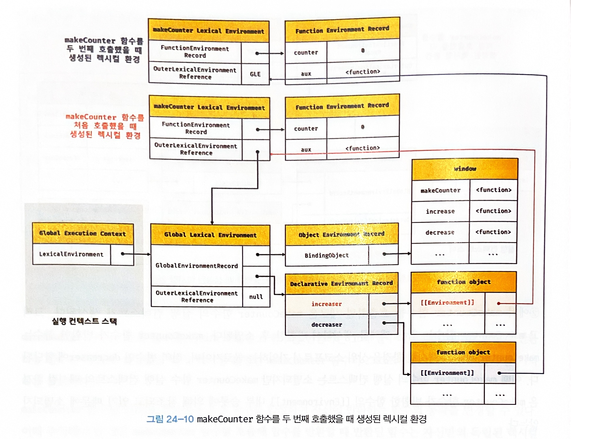

# chatper24 클로저

클로저는 함수와 그 함수가 선언된 렉시컬 환경과의 조합이다.

## 렉시컬 스코프

자바스크립트 엔진은 함수를 어디서 호출했는지가 아니라 함수를 어디에 정의했는지에 따라 상위 스코프를 결정한다. 이를 렉시컬 스코프(정적 스코프)라 한다.

함수의 상위 스코프는 함수를 정의한 위치에 의해 정적으로 결정되고 변하지 않는다.

"함수의 상위 스코프를 결정한다"는 것은 "렉시컬 환경의 외부 렉시켤 환경에 대한 참조에 저장할 참조값을 결정한다"는 것과 같다. 렉시컬 환경의 "외부 렉시컬 환경에 대한 참조"에 저장할 참조값이 바로 상위 렉시컬 환경에 대한 참조이며, 이것이 상위 스코프이기 때문이다.

렉시컬 환경의 "외부 렉시컬 환경에 대한 참조"에 저장할 참조값, 즉 상위 스코프에 댛나 참조는 함수 정의가 평가되는 시점에 함수가 정의된 환경(위치)에 의해 결정된다. 이것이 바로 렉시컬 스코프다.

## 함수 객체의 내부 슬롯 `[[Environment]]`

함수 정의가 평가되어 함수 객체를 생성할 때 자신이 정의된 환경(위치)에 의해 결정된 상위 스코프의 참조를 함수 객체 자신의 내부 슬롯`[[Environment]]`에 저장한다. 이때 자신의 내부 슬롯 `[[Environment]]`에 저장된 상위 스코프의 참조는 현재 실행중인 실행 컨텍스트의 렉시컬 환경을 가리킨다.

왜냐하면 함수 정의가 평가되어 함수 객체를 생성하는 시점은 함수가 정의된 환경, 즉 상위 함수(또는 전역 코드)가 평가 또는 실행되고 있는 시점이며, 이떄 현재 실행중인 실행 컨텍스트는 상위 함수(또는 전역 코드)의 실행 컨텍스트이기 때문이다.

따라서 함수 객체의 내부 슬롯 `[[Environment]]`에 저장된 현재 실행중인 실행 컨텍스트의 렉시컬 환경의 참조가 바로 상위 스코프다. 또한 자신이 호출되었을 때 생성될 함수 렉시컬 환경의 "외부 레시컬 환경에 대한 참조"에 저장할 참조값이다. 함수 객체는 내부 슬롯 `[[Envrionment]]`에 저장한 렉시컬 환경의 참조, 즉 상위 스코프를 자신이 존재하는 한 기억한다.

```js
// 24-04

const x = 1;

function foo() {
    const x = 10;

    // 상위 스코프는 함수 정의 환경(위치)에 따라 결정된다.
    // 함수 호출 위치와 상위 스코프는 아무런 관계가 없다.
    bar();
}

// 함수 bar는 자신의 상위 스코프, 즉 전역 렉시컬 환경을 [[Environment]]에 저장하여 기억한다.
function bar() {
    console.log(x);
}

foo(); // 1
bar(); // 1
```


1. `foo`, `bar` 함수는 전역에서 함수 선언문으로 정의된다.
2. 전역 코드가 평가되는 시점에 평가되어 함수 객체를 생성하고 전역 객체 `window`의 메서드가 된다.
3. 생성된 함수 객체의 내부 슬롯 `[[Environment]]`에는 함수 정의가 평가된 시점(전역 코드 평가 시점)에 실행중인 실행 컨텍스트의 렉시컬 환경, 즉 전역 렉시컬 환경의 참조가 저장된다(1).
4. 함수 호출
5. 함수 코드 평가
6. 함수 실행 컨텍스트 생성
7. 함수 렉시컬 환경 생성
   1. 함수 환경 레코드 생성
   2. `this` 바인딩
   3. 외부 렉시컬 환경에 대한 참조 결정
      1. 함수 객체의 내부 슬롯 `[[Environment]]`에 저장된 전역 렉시컬 환경의 참조가 할당된다(2, 3).

## 클로저와 렉시컬 환경

```js
// 24-05

const x = 1;

// ①
function outer() {
    const x = 10;
    const inner = function () { console.log(x); }; // ②
    return inner;
}

// outer 함수를 호출하면 중첩 함수 inner를 반환한다.
// 그리고 outer 함수의 실행 컨텍스트는 실행 컨텍스트 스택에서 팝되어 제거된다.
const innerFunc = outer(); // ③
innerFunc(); // ④ 10
```

`outer` 함수를 호출하면 중첩 함수 `inner`를 반환하고 생명주기를 마감하고 `outer` 함수의 실행 컨텍스트는 실행 컨텍스트 스택에서 제거된다. 이때 `outer`의 지역 변수 `x`는 생명 주기를 마감한다. 따라서 `x`는 더는 유효하지 않게 되어 접근 할 수 있는 방법이 없어보인다.

그러나 위 코드는 `outer` 함수의 지역 변수 `x`의 값인 10이다. 

이처럼 외부 함수보다 중첩 함수가 더 오래 유지되는 경우 중첩 함수는 이미 생명 주기가 종료한 외부 함수의 변수를 참조할 수 있다. 이러한 중첩 함수를 클로저(closure)라고 한다.

자바스크립트의 모든 함수는 자신의 상위 스코프를 기억한다. 모든 함수가 기억하는 상위 스코프는 함수를 어디서 호출하든 상관없이 유지된다. 따라서 함수를 어디서 호출하든 상관없이 함수는 언제나 자신이 기억하는 상위 스코프의 식별자를 참조할 수 있으며 식별자에 바인딩된 값을 변경할 수도 있다.

위 에제에서 `inner` 함수는 자신이 평가될 때 자신이 정의된 위치에 의해 결정된 상위 스코프를 `[[Environment]]` 내부 슬롯에 저장한다. 이때 저장된 상위 스코프는 함수가 존재하는 한 유지된다.

`outer` 함수가 평가되어 함수 객체를 생성할 때(1) 현재 실행중인 실행 컨텍스트의 렉시컬 환경, 즉 전역 렉시컬 환경을 `outer` 함수 객체의 `[[Environment]]` 내부 슬롯에 상위 스코프로서 저장한다.

`outer` 함수를 호출하면 `outer` 함수의 렉시컬 환경이 생성되고 앞서 `outer` 객체의 `[[Environment]]` 내부 슬롯에 저장된 전역 렉시컬 환경을 `outer` 함수 렉시컬 환경의 "외부 렉시컬 환경에 대한 참조"에 할당한다.


중첩 함수 `inner`가 평가된다.(2, `inner` 함수는 함수 표현식으로 정의했기 때문에 런타임에 평가된다) 이때 중첩 함수 `inner`는 자신의 `[[Environment]]` 내부 슬롯에 현재 실행중인 실행 컨텍스트의 렉시컬 환경, 즉 `outer` 함수의 렉시컬 환경을 상위 스코프로서 저장한다.


`inner` 함수의 실행이 종료하면 `inner` 함수를 반환하면서 `outer` 함수의 생명 주기가 종료된다(3). 즉 `outer` 함수의 실행 컨텍스트가 실행 컨텍스트 스택에서 제거된다. 이때 `outer` 함수의 실행 컨텍스트는 실행 컨텍스트 스택에서 제거되지만 `outer` 함수의 렉시컬 환경까지 소멸하는 것은 아니다.

`outer` 함수의 렉시컬 환경은 `inner` 함수의 `[[Environment]]` 내부 슬롯에 의해 참조되고 있고 `inner` 함수는 전역 변수 `innerFunc`에 의해 참조되고 있으므로 가비지 컬렉션의 대상이 되지 않기 때문이다. 


`outer` 함수가 반환한 `inner` 함수를 호출(4)하면 `inner` 함수의 실행 컨텍스트가 생성되고 실행 컨텍스트 스택에 푸시된다. 그리고 렉시컬 환경의 외부 렉시컬 환경에 대한 참조에는 `inner` 함수 객체의 `[[Environment]]` 내부 슬롯에 저장되어 있는 참조값이 할당된다.


중첩 함수 `inner`는 외부 함수 `outer`보다 오래 생존했다. 이때 외부 함수보다 더 오래 생존한 중첩 함수는 외부 함수의 실행여부(실행 컨텍스트의 생존 여부)와 상관없이 자신의 정의된 위치에 의해 결정된 상위 스코프를 기억한다. 이처럼 중첩 함수 `inner`의 내부에서는 상위 스코프를 참조할 수 있으므로 상위 스코프의 식별자를 참조할 수 있고 식별자의 값을 변경할 수도 있다.

---

자바스크립트의 모든 함수는 상위 스코프를 기억하므로 이론적으로 모든 함수는 클로저다. 하지만 일반적으로 모든 함수를 클로저라고 하지는 않는다.

상위 스코프의 어떤 식별자도 참조하지 않으면 대부분의 모던 브라우저는 최적화를 통해 상위 스코프를 기억하지 않는다.

```html
<!DOCTYPE html>
<html>

<body>
    <script>
        function foo() {
            const x = 1;
            const y = 2;

            // 일반적으로 클로저라고 하지 않는다.
            function bar() {
                const z = 3;

                debugger;
                // 상위 스코프의 식별자를 참조하지 않는다.
                console.log(z);
            }

            return bar;
        }

        const bar = foo();
        bar();
    </script>
</body>

</html>
```

중첩함수가 반환되지 않으면 외부함수보다 생명주기가 짧다. 이런 경우 외부 함수보다 일찍 소멸되기 때문에 생명 주기가 종료된 외부 함수의 식별자를 참조할 수 없다는 클로저의 본질에 부합하지 않는다.

```html
<!DOCTYPE html>
<html>

<body>
    <script>
        function foo() {
            const x = 1;

            // 일반적으로 클로저라고 하지 않는다.
            // bar 함수는 클로저였지만 곧바로 소멸한다.
            function bar() {
                debugger;
                // 상위 스코프의 식별자를 참조한다.
                console.log(x);
            }
            bar();
        }

        foo();
    </script>
</body>

</html>
```

클로저는 중첩 함수가 상위 스코프의 식별자를 참조하고 있고 중첩 함수가 외부 함수보다 더 오래 유지되는 경우에 한정하는 것이 일반적이다. 상위 스코프의 일부만 참조할 경우 최적화를 통해 클로저가 참조하고 있는 식별자만을 기억한다.

**클로저에 의해 참조되는 상위 스코프의 변수를 자유변수**라고 부른다. **클로저란 함수가 자유변수에 대해 닫혀있다** 라는 의미다.

## 클로저의 활용

클로저는 상태를 안전하게 은닉하고 특정 함수에게만 상태 변경을 허용하기 위해 사용한다.

함수가 호출될 때마다 호출된 횟수를 누적하여 출력하는 카운터

```js
// 24-09

// 카운트 상태 변수
let num = 0;

// 카운트 상태 변경 함수
const increase = function () {
    // 카운트 상태를 1만큼 증가 시킨다.
    return ++num;
};

console.log(increase()); // 1
console.log(increase()); // 2
console.log(increase()); // 3
```

위 코드는 아래 내용이 지켜져야 하기에 좋지 않은 코드다.

1. `num` 변수의 값은 `increase` 함수가 호출되기 전까지 변경되지 않아야 한다.
2. `num`은 `increase` 함수를 통해서만 변경되어야 한다.

하지만 `num`은 전역변수기에 언제든지 변경될 수 있다

```js
// 24-10

// 카운트 상태 변경 함수
const increase = function () {
    // 카운트 상태 변수
    let num = 0;

    // 카운트 상태를 1만큼 증가 시킨다.
    return ++num;
};

// 이전 상태를 유지하지 못한다.
console.log(increase()); // 1
console.log(increase()); // 1
console.log(increase()); // 1
```

`num`을 지역변수로 바꾸면 `increase` 함수가 호출될 때마다 `num` 변수가 선언되고 0으로 초기화되기 때문에 `num` 출력 결과는 항상 1이다. 이전 상태를 유지하지 못한다.

```js
// 24-11

// 카운트 상태 변경 함수
const increase = (function () {
    // 카운트 상태 변수
    let num = 0;

    // 클로저
    return function () {
        // 카운트 상태를 1만큼 증가 시킨다.
        return ++num;
    };
}());

console.log(increase()); // 1
console.log(increase()); // 2
console.log(increase()); // 3
```

위 코드가 실행되면 즉시 실행 함수가 호출되고 즉시 실행 함수가 반환한 함수가 `increase` 변수에 할당된다. `increase` 변수에 할당된 함수는 자신이 정의된 위치에 의해 결정된 상위 스코프인 즉시 실행 함수의 렉시컬 환경을 기억하는 클로저다.

즉시 실행 함수는 한 번만 실행되므로 `increase`가 호출될 때마다 `num` 변수가 재차 초기화될 일은 없다. 또한 `num` 변수는 직접 접근할 수 없는 은닉된 `private` 변수이므로 전역 변수를 사용했을 때와 같이 의도치 않게 변경될 위험도 없다.

이처럼 클로저는 상태가 의도치 않게 변경되지 않도록 안전하게 은닉하고 특정 함수에게만 상태 변경을 허용하여 상태를 안전하게 변경하고 유지하기 위해 사용한다.

```js
// 24-12

const counter = (function () {
    // 카운트 상태 변수
    let num = 0;

    // 클로저인 메서드를 갖는 객체를 반환한다.
    // 객체 리터럴은 스코프를 만들지 않는다.
    // 따라서 아래 메서드들의 상위 스코프는 즉시 실행 함수의 렉시컬 환경이다.
    return {
        // num: 0, // 프로퍼티는 public하므로 은닉되지 않는다.
        increase() {
            return ++num;
        },
        decrease() {
            return num > 0 ? --num : 0;
        }
    };
}());

console.log(counter.increase()); // 1
console.log(counter.increase()); // 2

console.log(counter.decrease()); // 1
console.log(counter.decrease()); // 0
```

위 에제에서 즉시 실행 함수가 반환하는 객체 리터럴은 즉시 실행 함수의 실행 단계에서 평가되어 객체가 된다. 이때 객체의 메서드도 함수 객체로 생성된다. 객체 리터럴의 중괄호는 코드 블록이 아니므로 별도의 스코프를 생성하지 않는다.

`increase`, `decrease` 메서드의 상위 스코프는 해당 메서드가 평가되는 시점에 실행중인 실행 컨텍스트인 즉시 실행 함수 실행 컨텍스트의 렉시컬 환경이다.

위 예제를 생성자 함수로 표현하면 다음과 같다.

```js
// 24-13

const Counter = (function () {
    // ① 카운트 상태 변수
    let num = 0;

    function Counter() {
        // this.num = 0; // ② 프로퍼티는 public하므로 은닉되지 않는다.
    }

    Counter.prototype.increase = function () {
        return ++num;
    };

    Counter.prototype.decrease = function () {
        return num > 0 ? --num : 0;
    };

    return Counter;
}());

const counter = new Counter();

console.log(counter.increase()); // 1
console.log(counter.increase()); // 2

console.log(counter.decrease()); // 1
console.log(counter.decrease()); // 0
```

생성자 함수 `Counter`는 프로토타입을 통해 `increase`, `decrease` 메서드를 상속받는 인스턴스를 생성한다. `increase`, `decrease` 메서드는 모두 자신의 함수 정의가 평가되어 함수 객체가 될 때 실행 중인 실행 컨텍스트인 즉시 실행 함수 실행 컨텍스트의 렉시컬 환경을 기억하는 클로저다. 따라서 프로토타입을 통해 상속되는 프로토타입 메서드일지라도 즉시 실행 함수는 자유 변수 `num`을 참조할 수 있다.

---

함수형 프로그래밍에서 클로저를 활용하는 예

```js
// 24-14

// 함수를 인수로 전달받고 함수를 반환하는 고차 함수
// 이 함수는 카운트 상태를 유지하기 위한 자유 변수 counter를 기억하는 클로저를 반환한다.
function makeCounter(aux) {
    // 카운트 상태를 유지하기 위한 자유 변수
    let counter = 0;

    // 클로저를 반환
    return function () {
        // 인수로 전달 받은 보조 함수에 상태 변경을 위임한다.
        counter = aux(counter);
        return counter;
    };
}

// 보조 함수
function increase(n) {
    return ++n;
}

// 보조 함수
function decrease(n) {
    return --n;
}

// 함수로 함수를 생성한다.
// makeCounter 함수는 보조 함수를 인수로 전달받아 함수를 반환한다
const increaser = makeCounter(increase); // ①
console.log(increaser()); // 1
console.log(increaser()); // 2

// increaser 함수와는 별개의 독립된 렉시컬 환경을 갖기 때문에 카운터 상태가 연동하지 않는다.
const decreaser = makeCounter(decrease); // ②
console.log(decreaser()); // -1
console.log(decreaser()); // -2
```

`makeCounter` 함수는 인자로 전달받은 보조 함수를 합성하여 자신이 반환하는 함수의 동작을 변경할 수 있다. 이때 주의해야할 것은 `makeCounter` 함수를 호출해 함수를 반환할 때 반환된 함수는 자신만의 독립된 렉시컬 환경을 갖는다는 것이다. 함수를 호출할 때마다 새로운 함수 실행 컨텍스트의 렉시컬 환경이 생성되기 때문이다.




자유 변수 `counter`를 공유하고 싶다면 렉시컬 환경을 공유하는 클로저를 만들어야 한다. 이를 위해서는 `makeCounter` 함수를 두 번 호출하지 말아야 한다.

```js
// 24-15

// 함수를 반환하는 고차 함수
// 이 함수는 카운트 상태를 유지하기 위한 자유 변수 counter를 기억하는 클로저를 반환한다.
const counter = (function () {
    // 카운트 상태를 유지하기 위한 자유 변수
    let counter = 0;

    // 함수를 인수로 전달받는 클로저를 반환
    return function (aux) {
        // 인수로 전달 받은 보조 함수에 상태 변경을 위임한다.
        counter = aux(counter);
        return counter;
    };
}());

// 보조 함수
function increase(n) {
    return ++n;
}

// 보조 함수
function decrease(n) {
    return --n;
}

// 보조 함수를 전달하여 호출
console.log(counter(increase)); // 1
console.log(counter(increase)); // 2

// 자유 변수를 공유한다.
console.log(counter(decrease)); // 1
console.log(counter(decrease)); // 0
```

## 캡슐화와 정보 은닉

캡슐화(encapsulation)는 객체의 상태를 나타내는 프로퍼티와 프로퍼티를 참조하고 조작할 수 있는 동작인 메서드를 하나로 묶는 것을 말한다. 캡슐화는 객체의 특정 프로퍼티나 메서드를 감출 목적으로 사용하기도 하는데 이를 정보 은닉(information hiding)이라 한다.

적절치 못한 접근으로부터 객체의 상태가 변경되는 것을 방지해 정보를 보호하고, 객체 간의 상호 의존성, 즉 결합도를 낮추는 효과가 있다.

```js
// 24-16

function Person(name, age) {
    this.name = name; // public
    let _age = age;   // private

    // 인스턴스 메서드
    this.sayHi = function () {
        console.log(`Hi! My name is ${this.name}. I am ${_age}.`);
    };
}

const me = new Person('Lee', 20);
me.sayHi(); // Hi! My name is Lee. I am 20.
console.log(me.name); // Lee
console.log(me._age); // undefined

const you = new Person('Kim', 30);
you.sayHi(); // Hi! My name is Kim. I am 30.
console.log(you.name); // Kim
console.log(you._age); // undefined
```

* `name` 프로퍼티 : `public`
* `_age` 변수 : `private`
* `sayHi` 메서드 : 인스턴스 메서드이므로 `Person` 객체가 생성될 때마다 중복 생성된다.

```js
// 24-17

function Person(name, age) {
    this.name = name; // public
    let _age = age;   // private
}

// 프로토타입 메서드
Person.prototype.sayHi = function () {
    // Person 생성자 함수의 지역 변수 _age를 참조할 수 없다
    console.log(`Hi! My name is ${this.name}. I am ${_age}.`);
};
```

`sayHi` 메서드를 프로토타입 메서드로 변경하여 `sayHi` 메서드의 중복 생성을 방지해보았다. 하지만 `Person.prototype.sayHi` 메서드 내에서 `Person` 생성자 함수의 지역 변수 `_age`를 참조할 수 없는 문제가 발생한다.

```js
// 24-18

const Person = (function () {
    let _age = 0; // private

    // 생성자 함수
    function Person(name, age) {
        this.name = name; // public
        _age = age;
    }

    // 프로토타입 메서드
    Person.prototype.sayHi = function () {
        console.log(`Hi! My name is ${this.name}. I am ${_age}.`);
    };

    // 생성자 함수를 반환
    return Person;
}());

const me = new Person('Lee', 20);
me.sayHi(); // Hi! My name is Lee. I am 20.
console.log(me.name); // Lee
console.log(me._age); // undefined

const you = new Person('Kim', 30);
you.sayHi(); // Hi! My name is Kim. I am 30.
console.log(you.name); // Kim
console.log(you._age); // undefined
```

즉시 실행 함수를 사용하여 `Person` 생성자 함수와 `Person.prototype.sayHi` 메서드를 하나의 함수 내에 모았다. 즉시 실행 함수가 반환하는 `Person` 생성자 함수와 `Person` 생성자 함수의 인스턴스가 상속받아 호출할 `Person.prototype.sayHi` 메서드는 즉시 실행 함수가 종료된 이후 호출된다. 하지만 `Person` 생성자 함수와 `sayHi` 메서드는 종료되어 소멸한 즉시 실행 함수의 지역 변수 `_age`를 참조할 수 있는 클로저다.

하지만 위 코드는 `Person` 생성자 함수가 여러 개의 인스턴스를 생성할 경우 `_age` 변수의 상태가 유지되지 않는다는 단점이 있다.

```js
// 24-19

const me = new Person('Lee', 20);
me.sayHi(); // Hi! My name is Lee. I am 20.

const you = new Person('Kim', 30);
you.sayHi(); // Hi! My name is Kim. I am 30.

// _age 변수 값이 변경된다!
me.sayHi(); // Hi! My name is Lee. I am 30.
```

이는 `Person.prototype.sayHi` 메서드가 단 한 번 생성되는 클로저이기 때문에 발생하는 현상이다.
1. `Person.prototype.sayHi` 메서드는 즉시 실행 함수가 호출될 때 생성.
2. `Person.prototype.sayHi` 메서드는 자신의 상위 스코프인 즉시 실행 함수의 실행 컨텍스트의 렉시컬 환경의 참조를 `[[Environment]]`에 저장하여 기억한다.
3. `Person` 생성자 함수의 모든 인스턴스가 상속을 통해 호출할 수 있는 `Person.prototype.sayHi` 메서드의 상위스코프는 어떤 인스턴스로 호출하더라도 하나의 동일한 상위 스코프를 사용하게 된다.
4. `Person` 생성자 함수가 여러 개의 인스턴스를 생성할 경우 `_age` 변수의 상태가 유지되지 않는다.

이처럼 자바스크립트는 정보 은닉을 완전하게 지원하지 않는다.

이에 대해서는 `private` 필드를 정의할 수 있는 새로운 표준 사양의 제안되어 있다.

## 자주 발생하는 실수

```js
// 24-20

var funcs = [];

for (var i = 0; i < 3; i++) {
    funcs[i] = function () { return i; }; // ①
}

for (var j = 0; j < funcs.length; j++) {
    console.log(funcs[j]()); // ②
}
```

`for` 문의 변수 선언문에서 `var` 키워드로 선언한 `i` 변수는 블록 레벨 스코프가 아닌 함수 레벨 스코프를 갖기 때문에 전역 변수다. 전역 변수 `i`에는 0, 1 ,2가 순차적으로 할당된다 따라서 `funcs` 배열의 요소로 추가한 함수를 호출하면 전역 변수 `i`를 참조하여 `i`의 값 3이 출력된다.

```js
// 24-21

var funcs = [];

for (var i = 0; i < 3; i++) {
    funcs[i] = (function (id) { // ①
        return function () {
            return id;
        };
    }(i));
}

for (var j = 0; j < funcs.length; j++) {
    console.log(funcs[j]());
}
```

①에서 즉시 실행 함수는 전역 변수 `i`에 현재 할당되어 있는 값을 인수로 전달받아 매개변수 `id`에 할당한 후 중첩 함수를 반환하고 종료된다. 즉시 실행 함수가 반환한 함수는 `funcs` 배열에 순차적으로 저장된다.

즉시 실행 함수의 매개변수 `id`는 즉시 실행 함수가 반환한 중첩 함수의 상위 스코프에 존재한다. 즉시 실행 함수가 반환한 중첩 함수는 자신의 상위 스코프(즉시 실행 함수의 렉시컬 환경)를 기억하는 클로저이고, 매개변수 `id`는 즉시 실행 함수가 반환한 중첩 함수에 묶여있는 자유 변수가 되어 그 값이 유지된다.

위 예제는 함수 레벨 스코프의 특성으로 인해 `for` 문의 변수 선언문에서 `var` 키워드로 선언한 변수가 전역 변수가 되기 때문에 발생하는 현상이다. 

```js
// 24-22

const funcs = [];

for (let i = 0; i < 3; i++) {
    funcs[i] = function () { return i; };
}

for (let i = 0; i < funcs.length; i++) {
    console.log(funcs[i]()); // 0 1 2
}
```

`let` 키워드를 사용하면 `for` 문의 코드 블록이 반복 실행될 때마다. `for` 문 코드 블록의 새로운 렉시컬 환경이 생성된다.

