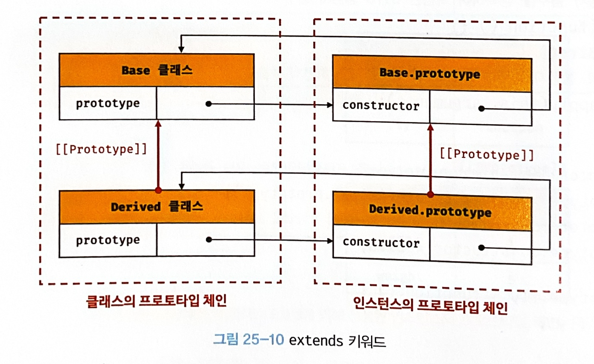

# chapter25 클래스

## 클래스는 프로토타입의 문법적 설탕인가?

ES6의 클래스가 기존의 프로토타입 기반 객체지향 모델을 폐지하고 새롭게 클래스 기반 객체지향 모델을 제공한느 것은 아니다. 사실 클래스는 함수이며 기존 프로토타입 기반 패턴을 클래스 기반 패턴처럼 사용할 수 있도록 하는 문법적 설탕이라고 볼 수도 있다.

클래스와 생성자 함수는 모두 프로토타입 기반의 인스턴스를 생성하지만 정확히 동일하게 동작하지는 않는다. 클래스는 생성자 함수보다 엄격하며 생성자 함수에서는 제공하지 않는 기능도 제공한다.

1. 클래스를 `new` 연산자 없이 호출하면 에러가 발생한다. 하지만 생성자 함수를 `new` 연산자 없이 호출하면 일반 함수로서 호추로딘다.
2. 클래스는 상속을 지원하는 `extends`와 `super` 키워드를 제공한다. 하지만 생성자 함수는 `extends`와 `super` 키워드를 지원하지 않는다.
3. 클래스는 호이스팅이 발생하지 않는 것처럼 동작한다. 하지만 함수 선언문으로 정의된 생성자 함수는 함수 호이스팅이, 함수 표현식으로 정의한 생성자 함수는 변수 호이스팅이 발생한다.
4. 클래스 내의 모든 코드에는 암묵적으로 `strict mode`가 적용된다. 하지만 생성자 함수는 `strict mode`가 적용되지 않는다.
5. 클래스의 constructor, 프로토타입 메서드, 정적 메서드는 모두 프로퍼티 어트리뷰트 `[[Enumerable]]`의 값이 `false`다.

클래스를 프로토타입 기반 생성 객체 패턴의 단순한 문법적 설탕으로 보기보다는 새로운 객체 생성 메커니즘으로 보는 것이 좀 더 합당하다.

## 클래스 정의

* `class` 키워드를 사용하여 정의한다.
* 클래스 이름은 파스칼 케이스를 사용하는 것이 일반적이다.

```js
// 25-02

// 클래스 선언문
class Person { }
```

표현식으로 클래스를 정의할 수도 있다. 클래스는 이름을 가질 수도 있고, 갖지 않을 수도 있다.

```js
// 25-03

// 익명 클래스 표현식
const Person = class { };

// 기명 클래스 표현식
const Person = class MyClass { };
```

클래스를 표현식으로 정의할 수 있다는 것은 클래스가 값으로 사용할 수 있는 일급 객체라는 것을 의미한다. 클래스는 일급 객체로서 다음과 같은 특징을 갖는다.

* 무명의 리터럴로 생성할 수 있다. 즉, 런타임에 생성이 가능하다.
* 변수나 자료구조(객체, 배열 등)에 저장할 수 있다.
* 함수의 매개변수에게 전달할 수 있다.
* 함수의 반환값으로 사용할 수 있다.

클래스 몸채에는 0개 이상의 메서드만 정의할 수 있다. 클래스 몸체에서 정의할 수 있는 메서드는 `constructor`(생성자), 프로토타입 메서드, 정적 메서드가 있다.

```js
// 25-04

// 클래스 선언문
class Person {
    // 생성자
    constructor(name) {
        // 인스턴스 생성 및 초기화
        this.name = name; // name 프로퍼티는 public하다.
    }

    // 프로토타입 메서드
    sayHi() {
        console.log(`Hi! My name is ${this.name}`);
    }

    // 정적 메서드
    static sayHello() {
        console.log('Hello!');
    }
}

// 인스턴스 생성
const me = new Person('Lee');

// 인스턴스의 프로퍼티 참조
console.log(me.name); // Lee
// 프로토타입 메서드 호출
me.sayHi(); // Hi! My name is Lee
// 정적 메서드 호출
Person.sayHello(); // Hello!
```

## 클래스 호이스팅

```js
// 25-05

// 클래스 선언문
class Person { }

console.log(typeof Person); // function
```

클래스는 함수로 평가된다. 클래스 선언문으로 정의한 클래스는 함수 선언문과 같이 소스코드 평가 과정, 즉 런타임 이전에 먼저 평가되어 함수 객체를 생성한다. 이때 클래스가 평가되어 생성된 함수 객체는 생성자 함수로서 호출될 수 있는 함수, 즉 constructor다. 생성자 함수로서 호출할 수 있는 함수는 함수 정의가 평가되어 함수 객체를 생성하는 시점에 프로토타입도 더불어 생성된다. 프로토타입과 생성자 함수는 단독으로 존재할 수 없고 언제나 쌍으로 존재하기 때문이다.

단 클래스는 클래스 정의 이전에 참조할 수 있다.

```js
// 25-06

console.log(Person);
// ReferenceError: Cannot access 'Person' before initialization

// 클래스 선언문
class Person { }
```

클래스 선언문은 마치 호이스팅이 발생하지 않는 것처럼 보이나 그렇지 않다. 다음 예제를 살펴보자

```js
// 25-07

const Person = '';

{
    // 호이스팅이 발생하지 않는다면 ''이 출력되어야 한다.
    console.log(Person);
    // ReferenceError: Cannot access 'Person' before initialization

    // 클래스 선언문
    class Person { }
}
```

클래스는 `let`, `const` 키워드로 선언한 변수처럼 호이스팅되어 클래스 선언문 이전에 일시적 사각지대에 빠지기 때문에 호이스팅이 발생하지 않는 것처럼 동작한다.

## 인스턴스 생성

클래스는 생성자 함수이며 `new` 연산자와 함께 호출되어 인스턴스를 생성한다.

함수는 `new` 연산자의 사용 여부에 따라 일반 함수로 호출되거나 생성자 함수로 호출되지만 클래스는 인스턴스를 생성하는 것이 유일한 존재 이유이므로 반드시 `new` 연산자와 함께 호출해야 한다.

```js
// 25-08

class Person { }

// 인스턴스 생성
const me = new Person();
console.log(me); // Person {}
```

```js
// 25-09

class Person { }

// 클래스를 new 연산자 없이 호출하면 타입 에러가 발생한다.
const me = Person();
// TypeError: Class constructor Person cannot be invoked without 'new'
```

클래스 표현식으로 정의된 클래스의 경우 클래스를 가리키는 식별자(`Person`)을 사용해 인스턴스를 생성하지 않고 기명 클래스 표현식의 클래스 이름(`MyClass`)를 사용해 인스턴스를 생성하면 에러가 발생한다. 클래스 표현식에서 사용한 이름은 외부 코드에서 접근 불가능하기 때문이다.

```js
// 25-10

const Person = class MyClass { };

// 함수 표현식과 마찬가지로 클래스를 가리키는 식별자로 인스턴스를 생성해야 한다.
const me = new Person();

// 클래스 이름 MyClass는 함수와 동일하게 클래스 몸체 내부에서만 유효한 식별자다.
console.log(MyClass); // ReferenceError: MyClass is not defined

const you = new MyClass(); // ReferenceError: MyClass is not defined
```

## 메서드

### `constructor`

`constructor`는 인스턴스를 생성하고 초기화하기 위한 특수한 메서드다. `constructor` 는 이름을 변경할 수 없다.

클래스는 평가되어 함수 객체가 된다. 함수와 동일하게 프로토타입과 연결되어 있으며 자신의 스코프 체인을 구성한다.

모든 함수 객체가 가지고 있는 `prototype` 프로피티가 가리키는 프로토타입 객체의 `constructor` 프로퍼티는 클래스 자신을 가리키고 있다. 이는 클래스가 인스턴스를 생성하는 생성자 함수라는 것을 의미한다.

```js
// 25-11-01

class Person {
    // 생성자
    constructor(name) {
        // 인스턴스 생성 및 초기화
        this.name = name;
    }
}

// 클래스는 함수다.
console.log(typeof Person); // function
console.dir(Person);
```


클래스가 생성한 인스턴스의 경우 `Person` 클래스의 `constructor` 내부에서 `this`에 추가한 `name` 프로퍼티가 클래스가 생성한 인스턴스의 프로퍼티로 추가된 것을 확인할 수 있다. `constructor` 내부의 `this`는 생성자 함수와 마찬가지로 클래스가 생성한 인스턴스를 가리킨다.

```js
// 25-13-01

class Person {
    // 생성자
    constructor(name) {
        // 인스턴스 생성 및 초기화
        this.name = name;
    }
}

// 인스턴스 생성
const me = new Person('Lee');
console.log(me);
```


`constructor`는 메서드로 해석되는 것이 아니라 클래스가 평가되어 생성한 함수 객체 코드의 일부가 된다. 다시 말해, 클래스 정의가 평가되면 `constructor`의 기술된 동작을 하는 함수 객체가 생성된다.

프로토타입의 `constructor` 프로퍼티는 모든 프로토타입이 가지고 있는 프로퍼티이며, 생성자 함수를 가리킨다.

`constructor`는 생성자 함수와 유사하지만 몇 가지 차이가 있다.

* 클래스 내에 최대 한 개만 존재할 수 있다. 2개 이상을 포함하면 문법 에러가 발생한다.
* `constructor`는 생략할 수 있다. 생략시 빈 `constructor`가 암묵적으로 정의된다.
  * `constructor() {}`
* 프로퍼티가 추가되어 초기화된 인스턴스를 사용하려면 `constructor` 내부에서 `this`에 인스턴스 프로퍼티를 추가한다.
* 인스턴스를 생성할 때 외부에서 인스턴스 프로퍼티의 초기값을 전달하려면 `constructor`에 매개변수를 선언하고 인스턴스를 생성할 때 초기값을 전달한다.
* `constructor` 는 별도의 반환문을 갖지 않아야 한다. `new` 연산자와 함께 클래스가 호출되면 생성자 함수와 동일하게 암묵적으로 `this`, 즉 인스턴스를 반환하기 때문이다. 
  * `this`가 아닌 다른 객체를 명시적으로 반환하면 `return` 문에 명시된 객체가 반환된다.

### 프로토타입 메서드

생성자 함수를 사용하여 인스턴스를 생성하는 경우 프로토타입 메서드를 생성하기 위해서는 명시적으로 프로토타입에 메서드를 추가해야 한다.

클래스 몸체에서 정의한 메서드는 생성자 함수에 의한 객체 생성 방식과는 다르게 클래스의 `prototype` 프로퍼티에 메서드를 추가하지 않아도 기본적으로 프로토타입 메서드가 된다.

```js
// 25-22

// 생성자 함수
function Person(name) {
    this.name = name;
}

// 프로토타입 메서드
Person.prototype.sayHi = function () {
    console.log(`Hi! My name is ${this.name}`);
};

const me = new Person('Lee');
me.sayHi(); // Hi! My name is Lee
```

```js
// 25-23

class Person {
    // 생성자
    constructor(name) {
        // 인스턴스 생성 및 초기화
        this.name = name;
    }

    // 프로토타입 메서드
    sayHi() {
        console.log(`Hi! My name is ${this.name}`);
    }
}

const me = new Person('Lee');
me.sayHi(); // Hi! My name is Lee
```


생성자 함수와 마찬가지로 클래스가 생성한 인스턴스는 프로토타입 체인의 일원이 된다. 인스턴스는 프로토타입 메서드를 상속받아 사용할 수 있다.

결국 클래스는 생성자 함수와 같이 인스턴스를 생성하는 생성자 함수라고 볼 수 있다.


### 정적 메서드

정적 메서드는 인스턴스를 생성하지 않아도 호출할 수 있는 메서드다.

생성자 함수의 경우 정적 메서드를 생성하기 위해 명시적으로 생성자 함수에 메서드를 추가해야 한다. 클래스에서는 메서드에 `static` 키워드를 붙이면 정적 메서드(클래스 메서드) 가 된다.

```js
// 25-25

// 생성자 함수
function Person(name) {
    this.name = name;
}

// 정적 메서드
Person.sayHi = function () {
    console.log('Hi!');
};

// 정적 메서드 호출
Person.sayHi(); // Hi!
```

```js
// 25-26

class Person {
    // 생성자
    constructor(name) {
        // 인스턴스 생성 및 초기화
        this.name = name;
    }

    // 정적 메서드
    static sayHi() {
        console.log('Hi!');
    }
}
```

정적 메서드는 프로토타입 메서드처럼 인스턴스로 호출하지 않고 클래스로 호출한다. 정적 메서드가 바인딩된 클래스에는 인스턴스의 프로토타입 체인상에 존재하지 않기 때문이다.


### 정적 메서드와 프로토타입 메서드의 차이

1. 정적 메서드와 프로토타입 메서드는 자신이 속해 있는 프로토타입 체인이 다르다.
2. 정적 메서드는 클래스로 호출하고 프로토타입 메서드는 인스턴스로 호출한다.
3. 정적 메서드는 인스턴스 프로퍼티를 참조할 수 없지만 프로토타입 메서드는 인스턴스 프로퍼티를 참조할 수 있다.

클래스 또는 생성자 함수를 하나의 네임스페이스로 사용하여 모아 놓으면 이름 충돌 가능성을 줄여 주고 관련 함수들을 구조화할 수 있는 효과가 있다.

```js
// 표준 빌트인 객체의 정적 메서드
Math.max(1, 2, 3);          // -> 3
Number.isNaN(NaN);          // -> true
JSON.stringify({ a: 1 });   // -> "{"a":1}"
Object.is({}, {});          // -> false
Reflect.has({ a: 1 }, 'a'); // -> true
```

### 클래스에서 정의한 메서드의 특징

1. `function` 키워드를 생략한 메서드 축약 표현을 사용한다.
2. 객체 리터럴과는 다르게 콤마(`,`)를 사용하지 않는다.
3. 암묵적으로 strict mode가 적용된다.
4. `for...in` 문이나 `Object.keys` 메서드 등으로 열거할 수 없다.
5. 내부 메서드 `[[Construct]]`를 갖지 않는 non-constructor다. 따라서 `new` 연산자와 함께 호출할 수 없다.

## 클래스의 인스턴스 생성 과정

`new` 연산자와 함께 클래스를 호출하면 생성자 함수와 마찬가지로 클래스 내부 메서드 `[[Constructor]]` 가 호출된다.

1. 클래스 생성과 `this` 바인딩
   1. 빈 객체 생성(인스턴스)
   2. 인스턴스의 프로토타입으로 클래스의 `prototype` 프로퍼티가 가리키는 객체가 설정된다.
   3. 인스턴스는 `this`에 바인딩된다.
   4. `constructor` 내부의 `this` 는 클래스가 생성한 인스턴스를 가리킨다.
2. 인스턴스 초기화
   1. `this`에 바인딩된 인스턴스에 프로퍼티를 추가한다.
   2. `constructor`가 인수로 전달받은 초기값으로 인스턴스의 프로퍼티값을 초기화한다.
   3. 위 과정은 `constructor`가 없다면 생략된다.
3. 인스턴스 반환

```js
// 25-32

class Person {
    // 생성자
    constructor(name) {
        // 1. 암묵적으로 인스턴스가 생성되고 this에 바인딩된다.
        console.log(this); // Person {}
        console.log(Object.getPrototypeOf(this) === Person.prototype); // true

        // 2. this에 바인딩되어 있는 인스턴스를 초기화한다.
        this.name = name;

        // 3. 완성된 인스턴스가 바인딩된 this가 암묵적으로 반환된다.
    }
}
```

## 프로퍼티

### 인스턴스 프로퍼티

인스턴스 프로퍼티는 `constructor` 내부에서 정의해야 한다. 인스턴스 프로퍼티는 언제나 `public`하다.

```js
// 25-34

class Person {
    constructor(name) {
        // 인스턴스 프로퍼티
        this.name = name; // name 프로퍼티는 public하다.
    }
}

const me = new Person('Lee');

// name은 public하다.
console.log(me.name); // Lee
```

### 접근자 프로퍼티

접근자 프로퍼티 : 자체적으로 값을 갖지 않고 다른 데이터 프로퍼티의 값을 읽거나 저장할 때 사용하는 접근자 함수로 구성된 프로퍼티다.

접근자 프로퍼티는 클래스에서도 사용할 수 있다.

접근자 프로퍼티는 자체적으로는 값을 갖지 않고 다른 데이터 프로퍼티의 값을 읽거나 저장할 때 사용하는 접근자 함수, 즉 `getter` 함수와 `setter` 함수로 구성되어 있다.

`getter` 는 메서드 이름 앞에 `get` 키워드를 사용해 정의한다. `setter`는 메서드 이름 앞에 `set` 키워드를 사용해 정의한다.

이때 `getter`와 `setter` 이름은 인스턴스 프로퍼티처럼 사용된다.
* `getter`
  * `getter`는 호출하는 것이 아니라 프로퍼티처럼 참조하는 형식으로 사용하며, 참조시에 내부적으로 `getter`가 호출된다.
  * 무언가를 취득할 때 사용하므로 반드시 무언가를 반환해야 한다.
* `setter`
  * `setter`도 호출하는 것이 아니라 프로퍼티처럼 값을 할당하는 형식으로 사용하며, 할당 시에 내부적으로 `setter`가 호출된다.
  * 무언가를 프로퍼티에 할당할 때 사용하므로 반드시 매개변수가 있어야 한다. 단 하나의 값만 할당받기 때문에 단 하나의 매개변수만 선언할 수 있다.


```js
// 25-35

const person = {
    // 데이터 프로퍼티
    firstName: 'Ungmo',
    lastName: 'Lee',

    // fullName은 접근자 함수로 구성된 접근자 프로퍼티다.
    // getter 함수
    get fullName() {
        return `${this.firstName} ${this.lastName}`;
    },
    // setter 함수
    set fullName(name) {
        // 배열 디스트럭처링 할당: "36.1. 배열 디스트럭처링 할당" 참고
        [this.firstName, this.lastName] = name.split(' ');
    }
};

// 데이터 프로퍼티를 통한 프로퍼티 값의 참조.
console.log(`${person.firstName} ${person.lastName}`); // Ungmo Lee

// 접근자 프로퍼티를 통한 프로퍼티 값의 저장
// 접근자 프로퍼티 fullName에 값을 저장하면 setter 함수가 호출된다.
person.fullName = 'Heegun Lee';
console.log(person); // {firstName: "Heegun", lastName: "Lee"}

// 접근자 프로퍼티를 통한 프로퍼티 값의 참조
// 접근자 프로퍼티 fullName에 접근하면 getter 함수가 호출된다.
console.log(person.fullName); // Heegun Lee

// fullName은 접근자 프로퍼티다.
// 접근자 프로퍼티는 get, set, enumerable, configurable 프로퍼티 어트리뷰트를 갖는다.
console.log(Object.getOwnPropertyDescriptor(person, 'fullName'));
// {get: ƒ, set: ƒ, enumerable: true, configurable: true}
```

```js
class Person {
    constructor(firstName, lastName) {
        this.firstName = firstName;
        this.lastName = lastName;
    }

    // fullName은 접근자 함수로 구성된 접근자 프로퍼티다.
    // getter 함수
    get fullName() {
        return `${this.firstName} ${this.lastName}`;
    }

    // setter 함수
    set fullName(name) {
        [this.firstName, this.lastName] = name.split(' ');
    }
}

const me = new Person('Ungmo', 'Lee');

// 데이터 프로퍼티를 통한 프로퍼티 값의 참조.
console.log(`${me.firstName} ${me.lastName}`); // Ungmo Lee

// 접근자 프로퍼티를 통한 프로퍼티 값의 저장
// 접근자 프로퍼티 fullName에 값을 저장하면 setter 함수가 호출된다.
me.fullName = 'Heegun Lee';
console.log(me); // {firstName: "Heegun", lastName: "Lee"}

// 접근자 프로퍼티를 통한 프로퍼티 값의 참조
// 접근자 프로퍼티 fullName에 접근하면 getter 함수가 호출된다.
console.log(me.fullName); // Heegun Lee

// fullName은 접근자 프로퍼티다.
// 접근자 프로퍼티는 get, set, enumerable, configurable 프로퍼티 어트리뷰트를 갖는다.
console.log(Object.getOwnPropertyDescriptor(Person.prototype, 'fullName'));
// {get: ƒ, set: ƒ, enumerable: false, configurable: true}
```

클래스의 메서드는 기본적으로 프로토타입 메서드가 된다. 따라서 클래스의 접근자 프로퍼티 또한 인스턴스 프로퍼티가 아닌 프로토타입의 프로퍼티가 된다.

```js
// 25-37

// Object.getOwnPropertyNames는 비열거형(non-enumerable)을 포함한 모든 프로퍼티의 이름을 반환한다.(상속 제외)
Object.getOwnPropertyNames(me); // -> ["firstName", "lastName"]
Object.getOwnPropertyNames(Object.getPrototypeOf(me)); // -> ["constructor", "fullName"]
```


클래스의 접근자 프로퍼티는 프로토타입 프로퍼티다.

### 클래스 필드 정의 제안

클래스 필드(또는 멤버) : 클래스 기반 객체지향 언어에서 클래스가 생성할 인스턴스의 프로퍼티를 가리키는 용어다.

```java
// 자바의 클래스 정의
public class Person {
  // ① 클래스 필드 정의
  // 클래스 필드는 클래스 몸체에 this 없이 선언해야 한다.
  private String firstName = "";
  private String lastName = "";

  // 생성자
  Person(String firstName, String lastName) {
    // ③ this는 언제나 클래스가 생성할 인스턴스를 가리킨다.
    this.firstName = firstName;
    this.lastName = lastName;
  }

  public String getFullName() {
    // ② 클래스 필드 참조
    // this 없이도 클래스 필드를 참조할 수 있다.
    return firstName + " " + lastName;
  }
}
```

* ①
  * Javascript : 클래스에서 인스턴스 프로퍼티를 선언하고 초기화하려면 반드시 `constructor` 내부에서 `this`에 프로퍼티를 추가해야 한다.
  * Java : 클래스 필드를 마치 변수처럼 클래스 몸체에 `this` 없이 선언한다.
* ②
  * Javascript : 인스턴스 프로퍼티를 참조하려면 반드시 `this`를 사용하여 참조해야 한다.
  * Java : 클래스 필드를 참조할 때 `this`를 생략할 수 있다.
* ③
  * Javascript : `constructor` 내부에서 `this`는 클래스가 생성할 인스턴스를 가리킨다.
  * Java : `this`는 언제나 클래스가 생성할 인스턴스를 가리킨다. `this`는 클래스 필드가 생성자 또는 메서드의 매개변수 이름과 동일할 때 클래스 필드임을 명확히 하기 위해 사용한다.

```js
// 25-40

class Person {
    // 클래스 필드 정의
    name = 'Lee';
}

const me = new Person();
console.log(me); // Person {name: "Lee"}
```

위 예제는 최신 브라우저, Node.js에서 정상동작한다. 인스턴스 프로퍼티를 마치 클래스 기반 객체지향 언어의 클래스 필드처럼 정의할 수 있는 새로운 표준 사양이 제안되었기 때문이다. 이를 클래스 필드 정의 제안이라 한다. 이는 정식 표준 사양으로 승급되지 않았으나 최신 브라우저, Node.js에서 지원하고 있다.

---

클래스 몸체에서 클래스 필드를 정의하는 경우 `this`에 클래스 필드를 바인딩해서는 안 된다. `this`는 클래스의 `constructor`와 메서드 내에서만 유효하다.

```js
// 25-41

class Person {
    // this에 클래스 필드를 바인딩해서는 안된다.
    this.name = ''; // SyntaxError: Unexpected token '.'
}
```

클래스 필드를 참조하는 경우 자바스크립트에서는 `this`를 반드시 사용해야 한다.

```js
// 25-42-01

class Person {
    // 클래스 필드
    name = 'Lee';

    constructor() {
        console.log(this.name); // Lee
        console.log(name); // ReferenceError: name is not defined
    }
}

new Person();
```

클래스 필드에 초기값을 할당하지 않으면 `undefined`를 갖는다.

```js
// 25-43

class Person {
    // 클래스 필드를 초기화하지 않으면 undefined를 갖는다.
    name;
}

const me = new Person();
console.log(me); // Person {name: undefined}
```

인스턴스를 생성할 때 외부의 초기값으로 클래스 필드를 초기화해야 할 필요가 있다면 `constructor`에서 클래스 필드를 초기화해야 한다.

```js
// 25-44

class Person {
    name;

    constructor(name) {
        // 클래스 필드 초기화.
        this.name = name;
    }
}

const me = new Person('Lee');
console.log(me); // Person {name: "Lee"}
```

인스턴스를 생성할 때  클래스 필드를 초기화할 필요가 없다면 `constructor` 밖에서 클래스 필드를 정의할 필요가 없다. 클래스 필드를 초기화할 필요가 있다면 `constructor` 내부에서 클래스 필드를 참조하여 초기값을 할당해야 한다. 이때 `this`, 즉 클래스가 생성한 인스턴스에 클래스 필드에 해당하는 프로퍼티가 없다면 자동 추가되기 때문이다.

```js
// 25-45

class Person {
    constructor(name) {
        this.name = name;
    }
}

const me = new Person('Lee');
console.log(me); // Person {name: "Lee"}
```

함수는 일급 객체이므로 함수를 클래스 필드에 할당할 수 있다. 따라서 클래스 필드를 통해 함수를 정의할 수도 있다.

이처럼 클래스 필드에 함수를 할당하는 경우, 이 함수는 프로토타입 메서드가 아닌 인스턴스 메서드가 된다. 모든 클래스 필드는 인스턴스 프로퍼티가 되기 때문이다. 따라서 클래스 필드에 함수를 할당하는 것은 권장하지 않는다.

```js
// 25-46

class Person {
    // 클래스 필드에 문자열을 할당
    name = 'Lee';

    // 클래스 필드에 함수를 할당
    getName = function () {
        return this.name;
    }
    // 화살표 함수로 정의할 수도 있다.
    // getName = () => this.name;
}

const me = new Person();
console.log(me); // Person {name: "Lee", getName: ƒ}
console.log(me.getName()); // Lee
```

인스턴스 프로퍼티를 정의하는 방식
* 외부 초기값으로 클래스 필드를 초기화할 필요가 있다면 `constructor`에서 인스턴스 프로퍼티를 정의하는 기존 방식을 사용한다.
* 외부 초기값으로 클래스 필드를 초기화할 필요가 없다면 기존의 `constructor`에서 인스턴스 프로퍼티를 정의하는 방식과 클래스 필드 정의 제안 모두 사용할 수 있다.

### `private` 필드 정의 제안

자바스크립트는 캡슐화를 완전하게 지원하지 않는다. 인스턴스 프로퍼티는 인스턴스를 통해 클래스 외부에서 언제나 참조할 수 있다. 클래스 필드 정의 제안을 사용하더라도 외부에 그대로 노출된다.

다행히도 `private`필드를 정의할 수 있는 새로운 표준 사양이 제안(TC39 프로세스: stage3)되어 있다. 

`private` 필드의 선두에는 `#`를 붙여준다. 참조할 때도 `#`를 붙여주어야 한다. `private` 필드는 클래스 내부에서만 참조할 수 있다.
```js
// 25-50

class Person {
    // private 필드 정의
    #name = '';

    constructor(name) {
        // private 필드 참조
        this.#name = name;
    }
}

const me = new Person('Lee');

// private 필드 #name은 클래스 외부에서 참조할 수 없다.
console.log(me.#name);
// SyntaxError: Private field '#name' must be declared in an enclosing class
```

클래스 외부에서 `private` 필드에 직접 접근할 수 있는 방법은 없으나 접근자 프로퍼티를 통해 간접적으로 접근하는 방법은 유효하다.

```js
// 25-51

class Person {
    // private 필드 정의
    #name = '';

    constructor(name) {
        this.#name = name;
    }

    // name은 접근자 프로퍼티다.
    get name() {
        // private 필드를 참조하여 trim한 다음 반환한다.
        return this.#name.trim();
    }
}

const me = new Person(' Lee ');
console.log(me.name); // Lee
```

`private` 필드는 반드시 클래스 몸체에 정의해야 한다. `private` 필드를 직접 `constructor`에 정의하면 에러가 발생한다.

```js
// 25-52

class Person {
    constructor(name) {
        // private 필드는 클래스 몸체에서 정의해야 한다.
        this.#name = name;
        // SyntaxError: Private field '#name' must be declared in an enclosing class
    }
}
```

### `static` 필드 정의 제안

클래스에는 `static` 키워드를 사용하여 정적 메서드를 정의할 수 있다. 하지만 `static` 키워드를 사용하여 정적 필드를 정의할 수는 없었다. 하지만 `static public/private` 필드, `static private` 메서드를 정의할 수 있는 새로운 표준 사양인 "Static class features"가 TC39 프로세스의 stage 3에 제안되어 있다.

```js
// 25-53

class MyMath {
    // static public 필드 정의
    static PI = 22 / 7;

    // static private 필드 정의
    static #num = 10;

    // static 메서드
    static increment() {
        return ++MyMath.#num;
    }
}

console.log(MyMath.PI); // 3.142857142857143
console.log(MyMath.increment()); // 11
```

## 상속에 의한 클래스 확장

* 프로토타입 기반 상속 : 프로토타입 체인을 통해 다른 객체의 자산을 상속받음
* 상속에 의한 클래스 확장 : 기존 클래스를 상속받아 새롱누 클래스를 확장하여 정의하는 것


**클래스와 생성자 함수**
* 공통점
  * 인스턴스를 생성할 수 있는 함수
* 차이점
  * 클래스는 상속을 통해 기존 클래스를 확장할 수 있는 문법이 제공되지만 생성자 함수는 그렇지 않다.
  * 클래스는 상속을 통해 다른 클래스를 확장할 수 있는 문법인 `extends` 키워드가 기본적으로 제공된다. 하지만 생성자 함수는 상속을 통해 다른 생성자 함수를 확장할 수 있는 문법이 제공되지 않는다.
---


`Bird`, `Lion` 클래스는 상속을 통해 `Animal` 클래스의 속성을 그대로 사용하면서 자신만의 고유한 속성만 추가하여 확장할 수 있다.

```js
// 25-54

class Animal {
    constructor(age, weight) {
        this.age = age;
        this.weight = weight;
    }

    eat() { return 'eat'; }

    move() { return 'move'; }
}

// 상속을 통해 Animal 클래스를 확장한 Bird 클래스
class Bird extends Animal {
    fly() { return 'fly'; }
}

const bird = new Bird(1, 5);

console.log(bird); // Bird {age: 1, weight: 5}
console.log(bird instanceof Bird); // true
console.log(bird instanceof Animal); // true

console.log(bird.eat());  // eat
console.log(bird.move()); // move
console.log(bird.fly());  // fly
```


### `extends` 키워드

상속을 통해 클래스를 확장하려면 `extends` 키워드를 사용하여 상속받을 클래스를 정의한다.

슈퍼클래스와 서브클래스는 인스턴스의 프로토타입 체인뿐 아니라 클래스 간의 프로토타입 체인도 생성한다. 이를 통해 프로토타입 메서드, 정적 메서드 모두 상속이 가능하다.

```js
// 25-56

// 수퍼(베이스/부모)클래스
class Base { }

// 서브(파생/자식)클래스
class Derived extends Base { }
```



### 동적 상속

`extends` 키워드는 클래스뿐만 아니라 생성자 함수를 상속받아 클래스를 확장할 수도 있다. 단, `extends` 키워드 앞에는 반드시 클래스가 와야 한다.

```js
// 25-57

// 생성자 함수
function Base(a) {
    this.a = a;
}

// 생성자 함수를 상속받는 서브클래스
class Derived extends Base { }

const derived = new Derived(1);
console.log(derived); // Derived {a: 1}
```

`extends` 키워드 다음에는 클래스 뿐만이 아니라 `[[Construct]]` 내부 메서드를 갖는 함수 객체로 평가될 수 있는 모든 표현식을 사용할 수 있다. 이를 통해 동적으로 상속받을 대상을 결정할 수 있다.

```js
// 25-58

function Base1() { }

class Base2 { }

let condition = true;

// 조건에 따라 동적으로 상속 대상을 결정하는 서브클래스
class Derived extends (condition ? Base1 : Base2) { }

const derived = new Derived();
console.log(derived); // Derived {}

console.log(derived instanceof Base1); // true
console.log(derived instanceof Base2); // false
```

### 서브클래스의 `constructor`

서브클래스에서 `constructor`를 생략하면 클래스에 다음과 같은 `constructor`가 암묵적으로 정의된다.

* `args`는 `new` 연산자와 함께 클래스를 호출할 때 전달한 인수의 리스트다.
* `super()`는 수퍼클래스의 `constructor`를 호출하여 인스턴스를 생성한다.

```js
constructor(...args) { super(...args); }
```

### `super` 키워드

* `super`를 호출하면 수퍼클래스의 `constructor`를 호출한다.
* `super`를 참조하면 수퍼클래스의 메서드를 호출할 수 있다.

#### `super` 호출

수퍼클래스의 `constructor` 내부에서 추가한 프로퍼티를 그대로 갖는 인스턴스를 생성한다면 서브클래스의 `constructor`를 생략할 수 있다. 이때 `new` 연산자와 함께 서브클래스를 호출하면서 전달한 인수는 모두 서브클래스에 암묵적으로 정의된 `constructor`의 `super` 호출을 통해 수퍼클래스의 `constructor`에 전달된다.

```js
// 25-63

// 수퍼클래스
class Base {
    constructor(a, b) {
        this.a = a;
        this.b = b;
    }
}

// 서브클래스
class Derived extends Base {
    // 다음과 같이 암묵적으로 constructor가 정의된다.
    // constructor(...args) { super(...args); }
}

const derived = new Derived(1, 2);
console.log(derived); // Derived {a: 1, b: 2}
```

수퍼클래스에서 추가한 프로퍼티와 서브클래스에서 추가한 프로퍼티를 갖는 인스턴스를 생성한다면 서브클래스의 `constructor`를 생략할 수 없다. 이때 `new` 연산자와 함꼐 서브클래스를 호출하면서 전달한 인수 중에서 수퍼 클래스의 `constructor`에 전달할 필요가 있는 인수는 서브클래스의 `constructor`에서 호출하는 `super`를 통해 전달한다.

```js
// 25-64

// 수퍼클래스
class Base {
    constructor(a, b) { // ④
        this.a = a;
        this.b = b;
    }
}

// 서브클래스
class Derived extends Base {
    constructor(a, b, c) { // ②
        super(a, b); // ③
        this.c = c;
    }
}

const derived = new Derived(1, 2, 3); // ①
console.log(derived); // Derived {a: 1, b: 2, c: 3}
```

`super`  호출할 때 주의사항

1. 서브클래스에서 `constructor`를 생략하지 않는 경우, 서브클래스의 `constructor`에서는 반드시 `super`를 호출해야 한다.
2. 서브클래스의 `constructor`에서 `super`를 호출하기 전에는 `this`를 참조할 수 없다.
3. `super`는 반드시 서브클래스의 `constructor`에서만 호출해야 한다. 서브클래스가 아닌 클래스 또는 함수에서 `super`를 호출하면 에러가 발생한다.

#### `super` 참조

메서드 내에서 `super`를 참조하면 수퍼클래스의 메서드를 호출할 수 있다.

```js
// 25-68

// 수퍼클래스
class Base {
    constructor(name) {
        this.name = name;
    }

    sayHi() {
        return `Hi! ${this.name}`;
    }
}

// 서브클래스
class Derived extends Base {
    sayHi() {
        // super.sayHi는 수퍼클래스의 프로토타입 메서드를 가리킨다.
        return `${super.sayHi()}. how are you doing?`;
    }
}

const derived = new Derived('Lee');
console.log(derived.sayHi()); // Hi! Lee. how are you doing?
```

`super` 참조를 통해 수퍼클래스의 메서드를 참조하려면 `super`가 수퍼클래스의 메서드가 바인딩된 객체, 즉 수퍼클래스의 `prototype` 프로퍼티에 바인딩된 프로토타입을 참조할 수 있어야 한다.

```js
// 25-69

// 수퍼클래스
class Base {
    constructor(name) {
        this.name = name;
    }

    sayHi() {
        return `Hi! ${this.name}`;
    }
}

class Derived extends Base {
    sayHi() {
        // __super는 Base.prototype을 가리킨다.
        const __super = Object.getPrototypeOf(Derived.prototype);
        return `${__super.sayHi.call(this)} how are you doing?`;
    }
}
```

1. `super`는 자신을 참조하고 있는 메서드(`Derived-sayHi`)가 바인딩 되어 있는 객체(`Derived.prototype`)의 프로토타입(`Base.prototype`)을 가리킨다.
2. `super.sayHi`는 `Base.prototype.sayHi`를 가리킨다.
3. `super.sayHi` == `Base.prototype.sayHi`를 호출할 때 `call` 메서드를 사용해 `this`를 전달해야 한다.
   1. `Base.prototype.sayHi`를 그대로 호출하면 `this`는 메서드 내부의 `this`는 `Base.prototype`을 가리킨다.
   2. `Base.prototype.sayHi` 메서드는 프로토타입 메서드이기 때문에 내부의 `this`는 `Base.prototype`이 아닌 인스턴스를 가리켜야 한다. `name` 프로퍼티는 인스턴스에 존재하기 때문이다.

`super` 참조가 동작하기 위해서는 `super`를 참조하고 있는 메서드(`Derived-sayHi`)가 바인딩되어 있는 객체(`Derived.prototype`)의 프로토타입(`Base.prototype`)을 찾을 수 있어야 한다. 이를 위해 메서드 내부 슬롯 `[[HomeObject]]`를 가지며 자신이 바인딩하고 있는 객체를 가리킨다.

`super` 참조를 의사 코드로 표현하면 다음과 같다.

```js
// 25-70

/*
[[HomeObject]]는 메서드 자신을 바인딩하고 있는 객체를 가리킨다.
[[HomeObject]]를 통해 메서드 자신을 바인딩하고 있는 객체의 프로토타입을 찾을 수 있다.
예를 들어, Derived 클래스의 sayHi 메서드는 Derived.prototype에 바인딩되어 있다.
따라서 Derived 클래스의 sayHi 메서드의 [[HomeObject]]는 Derived.prototype이고
이를 통해 Derived 클래스의 sayHi 메서드 내부의 super 참조가 Base.prototype으로 결정된다.
따라서 super.sayHi는 Base.prototype.sayHi를 가리키게 된다.
*/
super = Object.getPrototypeOf([[HomeObject]])
```

---

주의할 것은 ES6의 메서드 축약 표현으로 정의된 함수만이 `[[HomeObject]]`를 갖는다는 것이다.

```js
// 25-71

const obj = {
    // foo는 ES6의 메서드 축약 표현으로 정의한 메서드다. 따라서 [[HomeObject]]를 갖는다.
    foo() { },
    // bar는 ES6의 메서드 축약 표현으로 정의한 메서드가 아니라 일반 함수다.
    // 따라서 [[HomeObject]]를 갖지 않는다.
    bar: function () { }
};
```

`[[HomeObject]]`를 가지는 함수만이 `super` 참조를 할 수 있다. 따라서 `[[HomeObject]]`를 가지는 ES6의 메서드 축약 표현으로 정의한 메서드만이 `super` 참조를 할 수 있다. 

객체 리터럴에서도 `super` 참조를 사용할 수 있다. 단, ES6의 메서드 축약 표현으로 정의된 함수만 가능하다.

```js
// 25-72

const base = {
    name: 'Lee',
    sayHi() {
        return `Hi! ${this.name}`;
    }
};

const derived = {
    __proto__: base,
    // ES6 메서드 축약 표현으로 정의한 메서드다. 따라서 [[HomeObject]]를 갖는다.
    sayHi() {
        return `${super.sayHi()}. how are you doing?`;
    }
};

console.log(derived.sayHi()); // Hi! Lee. how are you doing?
```

서브클래스의 정적 메서드 내에서 `super.sayHi`는 수퍼클래스의 정적 메서드 `sayHi`를 가리킨다.

```js
// 25-73

// 수퍼클래스
class Base {
    static sayHi() {
        return 'Hi!';
    }
}

// 서브클래스
class Derived extends Base {
    static sayHi() {
        // super.sayHi는 수퍼클래스의 정적 메서드를 가리킨다.
        return `${super.sayHi()} how are you doing?`;
    }
}

console.log(Derived.sayHi()); // Hi! how are you doing?
```

### 상속 클래스의 인스턴스 생성 과정

```js
// 25-74

// 수퍼클래스
class Rectangle {
    constructor(width, height) {
        this.width = width;
        this.height = height;
    }

    getArea() {
        return this.width * this.height;
    }

    toString() {
        return `width = ${this.width}, height = ${this.height}`;
    }
}

// 서브클래스
class ColorRectangle extends Rectangle {
    constructor(width, height, color) {
        super(width, height);
        this.color = color;
    }

    // 메서드 오버라이딩
    toString() {
        return super.toString() + `, color = ${this.color}`;
    }
}

const colorRectangle = new ColorRectangle(2, 4, 'red');
console.log(colorRectangle); // ColorRectangle {width: 2, height: 4, color: "red"}

// 상속을 통해 getArea 메서드를 호출
console.log(colorRectangle.getArea()); // 8
// 오버라이딩된 toString 메서드를 호출
console.log(colorRectangle.toString()); // width = 2, height = 4, color = red
```


#### 서브클래스의 `super` 호출

* `[[ConstructorKind]]`
  * `base` : 다른 클래스를 상속받지 않는 클래스
    * `new` 연산자와 함께 호출되었을 때 암묵적으로 빈 객체, 즉 인스턴스를 생성하고 이를 `this`에 바인딩한다.
  * `derived` : 다른 클래스를 상속받는 서브클래스
    * 자신이 직접 인스턴스를 생성하지 않고 수퍼클래스에게 인스턴스 생성을 위임한다. 이것이 서브 클래스의 `constructor`에서 반드시 `super`를 호출해야 하는 이유다.

### 수퍼클래스의 인스턴스 생성과 `this` 바인딩

수퍼클래스의 `constructor` 내부의 코드가 실행되기 이전에 암묵적으로 빈 객체를 생성한다. 이 빈 객체가 클래스가 생성한 인스턴스다. 그리고 인스턴스는 `this`에 바인딩된다. 

```js
// 25-75

// 수퍼클래스
class Rectangle {
    constructor(width, height) {
        // 암묵적으로 빈 객체, 즉 인스턴스가 생성되고 this에 바인딩된다.
        console.log(this); // ColorRectangle {}
        // new 연산자와 함께 호출된 함수, 즉 new.target은 ColorRectangle이다.
        console.log(new.target); // ColorRectangle
  ...
```

이때 인스턴스는 수퍼클래스가 생성한 것이다. 하지만 `new` 연산자와 함께 호출된 클래스가 서브클래스라는 것이 중요하다. 즉, `new` 연산자와 함께 호출된 함수를 가리키는 `new.target`은 서브클래스를 가리킨다. 따라서 인스턴스는 `new.target`이 가리키는 서브클래스가 생성한 것으로 처리된다.

따라서 생성된 인스턴스의 프로토타입은 수퍼클래스의 `prototype` 프로퍼티가 기리키는 객체(`Rectangle.prototype`)가 아니라 `new.target`, 즉 서브클래스의 `prototype` 프로퍼티가 가리키는 객체(`ColorRectangle.prototype`)다.

```js
// 25-76

// 수퍼클래스
class Rectangle {
    constructor(width, height) {
        // 암묵적으로 빈 객체, 즉 인스턴스가 생성되고 this에 바인딩된다.
        console.log(this); // ColorRectangle {}
        // new 연산자와 함께 호출된 함수, 즉 new.target은 ColorRectangle이다.
        console.log(new.target); // ColorRectangle

        // 생성된 인스턴스의 프로토타입으로 ColorRectangle.prototype이 설정된다.
        console.log(Object.getPrototypeOf(this) === ColorRectangle.prototype); // true
        console.log(this instanceof ColorRectangle); // true
        console.log(this instanceof Rectangle); // true
  ...
```

#### 수퍼클래스의 인스턴스 초기화

수퍼클래스의 `constructor`가 실행되어 `this`에 바인딩되어 있는 인스턴스를 초기화한다. 즉, `this`에 바인딩 되어 있는 인스턴스에 프로퍼티를 추가하고 `constructor`가 인수로 전달받은 초기값으로 인스턴스의 프로퍼티를 초기화한다.

#### 서브클래스 `constructor`로의 복귀와 `this` 바인딩

`super` 호출이 종료되고 제어 흐름이 서브클래스 `constructor`로 돌아온다. 이때 `super`가 반환한 인스턴스가 `this`에 바인딩된다. 서브클래스는 별도의 인스턴스를 생성하지 않고 `super`가 반환한 인스턴스를 `this`에 바인딩하여 그대로 사용한다.

#### 서브클래스의 인스턴스 초기화

`super` 호출 이후, 서브클래스의 `constructor`에 기술되어 있는 인스턴스 초기화가 진행된다. 즉, `this`에 바인딩되어 있는 인스턴스에 프로퍼티를 추가하고 `constructor`가 인수로 전달받은 초기값으로 인스턴스의 프로퍼티를 초기화한다.

#### 인스턴스 반환

클래스의 모든 처리가 끝나면 완성된 인스턴스가 바인딩된 `this`가 암묵적으로 반환된다.

### 표준 빌트인 생성자 함수 확장

`extends` 키워드 다음에는 클래스 뿐만 아니라 `[[Construct]]` 내부 메서드를 갖는 함수 객체로 평가될 수 있는 모든 표현식을 사용할 수 있다.  표준 빌트인 객체도 `extends` 키워드를 사용하여 확장할 수 있다.

```js
// 25-80

// Array 생성자 함수를 상속받아 확장한 MyArray
class MyArray extends Array {
    // 중복된 배열 요소를 제거하고 반환한다: [1, 1, 2, 3] => [1, 2, 3]
    uniq() {
        return this.filter((v, i, self) => self.indexOf(v) === i);
    }

    // 모든 배열 요소의 평균을 구한다: [1, 2, 3] => 2
    average() {
        return this.reduce((pre, cur) => pre + cur, 0) / this.length;
    }
}

const myArray = new MyArray(1, 1, 2, 3);
console.log(myArray); // MyArray(4) [1, 1, 2, 3]

// MyArray.prototype.uniq 호출
console.log(myArray.uniq()); // MyArray(3) [1, 2, 3]
// MyArray.prototype.average 호출
console.log(myArray.average()); // 1.75
```

이때 주의할 것은 `Array.prototype` 메서드 중에서 `map`, `filter`와 같이 새로운 배열을 반환하는 메서드가 `myArray` 클래스의 인스턴스를 반환한다는 것이다.

만약 새로운 배열을 반환하는 메서드가 `Array`의 인스턴스를 반환하면 `MyArray` 클래스의 메서드와 메서드 체이닝이 불가능하다.

```js
// 25-81

console.log(myArray.filter(v => v % 2) instanceof MyArray); // true
```

```js
// 25-82

// 메서드 체이닝
// [1, 1, 2, 3] => [ 1, 1, 3 ] => [ 1, 3 ] => 2
console.log(myArray.filter(v => v % 2).uniq().average()); // 2
```

만약 `MyArray` 클래스의 `uniq` 메서드가 `MyArray` 클래스가 생성한 인스턴스가 아닌 `Array`가 생성한 인스턴스를 반환하게 하려면 `Symbol.species`를 사용하여 정적 접근자 프로퍼티를 추가한다.

```js
// 25-83

// Array 생성자 함수를 상속받아 확장한 MyArray
class MyArray extends Array {
    // 모든 메서드가 Array 타입의 인스턴스를 반환하도록 한다.
    static get [Symbol.species]() { return Array; }

    // 중복된 배열 요소를 제거하고 반환한다: [1, 1, 2, 3] => [1, 2, 3]
    uniq() {
        return this.filter((v, i, self) => self.indexOf(v) === i);
    }

    // 모든 배열 요소의 평균을 구한다: [1, 2, 3] => 2
    average() {
        return this.reduce((pre, cur) => pre + cur, 0) / this.length;
    }
}

const myArray = new MyArray(1, 1, 2, 3);

console.log(myArray.uniq() instanceof MyArray); // false
console.log(myArray.uniq() instanceof Array); // true

// 메서드 체이닝
// uniq 메서드는 Array 인스턴스를 반환하므로 average 메서드를 호출할 수 없다.
console.log(myArray.uniq().average());
// TypeError: myArray.uniq(...).average is not a function
```