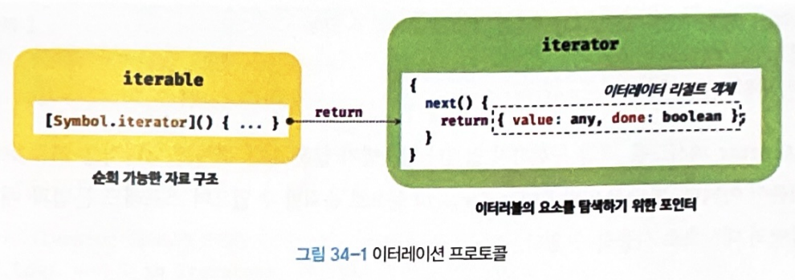
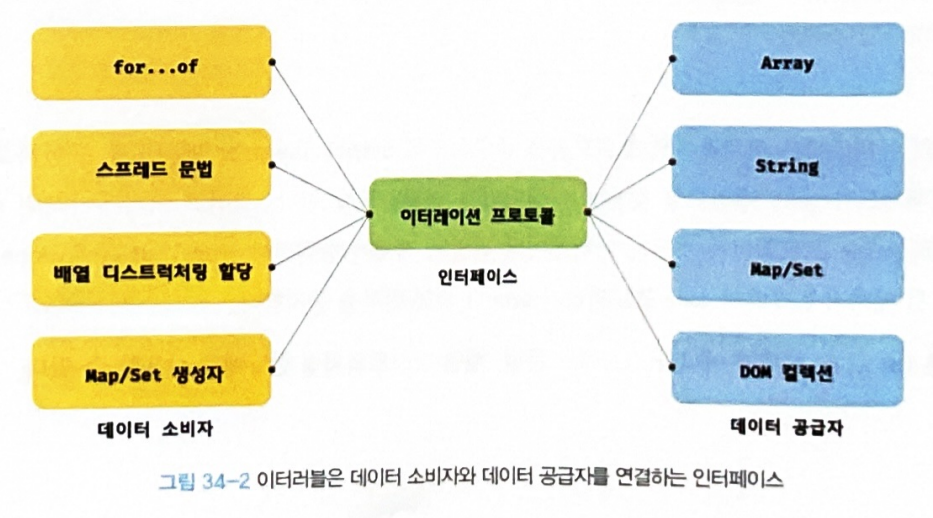

# chapter34 이터러블

## 이터러블 프로토콜

ES6에서 도입된 이터레이션 프로토콜은 순회 가능한 데이터 컬렉션(자료구조)을 만들기 위해 ECMAScript 사양에 정의하여 미리 약속한 규칙이다.

ES6 이전의 순회 가능한 데이터 컬렉션, 즉 배열, 문자열 유사 배열 객체, DOM 컬렉션 등은 통일된 규악 없이 각자 나름의 구조를 가지고 `for ... in` 문, `forEach` 메서드 등 다양한 방법으로 순회할 수 있었다.

ES6에서는 순회 가능한 데이터 컬렉션을 이터레이션 프로토콜을 준수하는 이터러블로 통일하여 `for ... of` 문, 스프레드 문법, 배열 디스트럭처링 할당의 대상으로 사용할 수 있도록 일원화했다.

이터레이션 프로토콜에는 이터러블 프로토콜과 이터레이터 프로토콜이 있다.

* **이터러블 프로토콜(iteralbe protocol)** : Well-known Symbol인 `Symbol.iteraotr`를 프로퍼티 키로 사용한 메서드를 직접 구현하거나 프로토타입 체인을 통해 상속받은 `Symbol.iterator` 메서드를 호출하면 이터레이터 프로토콜을 준수한 이터레이터를 반환한다. 이러한 규악을 이터러블 프로토콜이라 하며, 이터러블 프로토콜을 준수한 객체를 이터러블이라 한다. 이터러블은 `for ... of` 문으로 순회할 수 있으며 스프레드 문법과 배열 디스트럭처링 할당의 대상으로 사용할 수 있다.
* **이터레이터 프로토콜(iterator protocol)** : 이터러블의 `Symbol.iterator` 메서드를 호출하면 이터레이터 프로토콜을 준수한 이터레이터를 반환한다. 이터레이터는 `next` 메서드를 소유하며 `next` 메서드를 호출하면 이터러블을 순회하며 `value`와 `done` 프로퍼티를 갖는 이터레이터 리절트 객체를 반환한다. 이러한 규약을 이터레이터 프로토콜이라 하며, 이터레이터 프로토콜을 준수한 객체를 이터레이터라 한다. 이터레이터는 이터러블의 요소를 탐색하기 위한 포인터 역할을 한다.



### 이터러블

이터러블 프로토콜을 준수한 객체를 이터러블이라 한다. 즉 `Symbol.iterator`를 프로퍼티 키로 사용한 메서드를 직접 구현하거나 프로토타입 체인을 통해 상속받은 객체를 말한다.

이터러블 여부는 다음과 같이 확인할 수 있다.

```js
// 34-01

const isIterable = v => v !== null && typeof v[Symbol.iterator] === 'function';

// 배열, 문자열, Map, Set 등은 이터러블이다.
isIterable([]);        // -> true
isIterable('');        // -> true
isIterable(new Map()); // -> true
isIterable(new Set()); // -> true
isIterable({});        // -> false
```

이터러블은 `for ... of` 문으로 순회할 수 있으며, 스프레드 문법과 배열 디스터럭처링 할당의 대상으로 사용할 수 있다.

```js
// 34-02

const array = [1, 2, 3];

// 배열은 Array.prototype의 Symbol.iterator 메서드를 상속받는 이터러블이다.
console.log(Symbol.iterator in array); // true

// 이터러블인 배열은 for...of 문으로 순회 가능하다.
for (const item of array) {
    console.log(item); // 1 2 3
}

// 이터러블인 배열은 스프레드 문법의 대상으로 사용할 수 있다.
console.log([...array]); // [1, 2, 3]

// 이터러블인 배열은 배열 디스트럭처링 할당의 대상으로 사용할 수 있다.
const [a, ...rest] = array;
console.log(a, rest); // 1, [2, 3]
```

일반 객체는 `for ... of` 문으로 순회할 수 없으며 스프레드 문법과 배열 디스트럭처링 할당의 대상으로 사용할 수 없으나 TC39 프로세스의 stage 4(Finished) 단계에 제안되어 있는 스프레드 프로퍼티 제안은 일반 객체에 스프레드 문법의 사용을 허용한다.

### 이터레이터

이터러블의 `Symbol.iterator` 메서드를 호출하면 이터레이터는 프로토콜을 준수한 이터레이터를 반환한다. 이터러블의 `Symbol.iterator` 메서드가 반환한 이터레이터는 `next` 메서드를 갖는다.

```js
// 34-05

// 배열은 이터러블 프로토콜을 준수한 이터러블이다.
const array = [1, 2, 3];

// Symbol.iterator 메서드는 이터레이터를 반환한다.
const iterator = array[Symbol.iterator]();

// Symbol.iterator 메서드가 반환한 이터레이터는 next 메서드를 갖는다.
console.log('next' in iterator); // true
```

이터레이터의 `next` 메서드는 이터러블의 각 요소를 순회하기 위한 포인터의 역할을 한다. 즉, `next` 메서드를 호출하면 이터러블을 순차적으로 한 단계씩 순회하며 순회 결과를 나타내는 이터레이터 리절트 객체를 반환한다.

이터레이터의 `next` 메서드가 반환하는 이터레이터 리절트 객체의 `value` 프로퍼티는 현재 순회 중인 이터러블의 값을 나타내며 `done` 프로퍼티는 이터러블의 순회 완료 여부를 나타낸다.

```js
// 34-06

// 배열은 이터러블 프로토콜을 준수한 이터러블이다.
const array = [1, 2, 3];

// Symbol.iterator 메서드는 이터레이터를 반환한다. 이터레이터는 next 메서드를 갖는다.
const iterator = array[Symbol.iterator]();

// next 메서드를 호출하면 이터러블을 순회하며 순회 결과를 나타내는 이터레이터 리절트 객체를
// 반환한다. 이터레이터 리절트 객체는 value와 done 프로퍼티를 갖는 객체다.
console.log(iterator.next()); // { value: 1, done: false }
console.log(iterator.next()); // { value: 2, done: false }
console.log(iterator.next()); // { value: 3, done: false }
console.log(iterator.next()); // { value: undefined, done: true }
```

## 빌트인 이터러블

| 빌트인 이터러블 | `Symbol.iterator` 메서드 |
| --- | --- |
| `Array` | `Array.prototype[Symbol.iterator]` |
| `String` | `String.prototype[Symbol.iterator]` |
| `Map` | `Map.prototype[Symbol.iterator]` |
| `Set` | `Set.prototype[Symbol.iterator]` |
| `TypedArray` | `TypedArray.prototype[Symbol.iterator]` |
| `arguments` | `arguments[Symbol.iterator]` |
| DOM 컬렉션 | `Node.List.prototype[Symbol.iterator]`<br />`HTMLCollectipn.prototype[Symbol.iterator]`|

## `for ... of` 문

`for ... of` 문은 이터러블을 순회하면서 이터러블의 요소를 변수에 할당한다.

`for ... of` : 내부적으로 이터레이터의 `next` 메서드를 호출하여 이터러블을 순회하며 `next` 메서드가 반환한 이터레이터 리절트 객체의 `value` 프로퍼티 값을 변수에 할당한다. 그리고 이터레이터 리절트 객체의 `done` 프로퍼티 값이 `true`이면 순회를 중단한다.

```js
// for ... of
for (변수선언문 of 이터러블) { ... }
```

`for ... in` : 객체의 프로토타입 체인 상에 존재하는 모든 프로토타입의 프로퍼티 중에서 프로퍼티 어트리뷰트 `[[Enumerable]]`의 값이 `true`인 프로퍼티를 순회하며 열거한다. 이때 프로퍼티가 심벌인 프로퍼티는 열거하지 않는다.

```js
// for ... in
for (변수선언문 in 객체) { ... }
```

```js
// 34-07

for (const item of [1, 2, 3]) {
    // item 변수에 순차적으로 1, 2, 3이 할당된다.
    console.log(item); // 1 2 3
}
```

```js
// 34-08

// 이터러블
const iterable = [1, 2, 3];

// 이터러블의 Symbol.iterator 메서드를 호출하여 이터레이터를 생성한다.
const iterator = iterable[Symbol.iterator]();

for (; ;) {
    // 이터레이터의 next 메서드를 호출하여 이터러블을 순회한다. 이때 next 메서드는 이터레이터 리절트 객체를 반환한다.
    const res = iterator.next();

    // next 메서드가 반환한 이터레이터 리절트 객체의 done 프로퍼티 값이 true이면 이터러블의 순회를 중단한다.
    if (res.done) break;

    // 이터레이터 리절트 객체의 value 프로퍼티 값을 item 변수에 할당한다.
    const item = res.value;
    console.log(item); // 1 2 3
}
```

## 이터러블과 유사 배열 객체

유사 배열 객체는 마치 배열처럼 인덱스로 프로퍼티 값에 접근할 수 있고 `length` 프로퍼티를 갖는 객체를 말한다. 유사 배열 객체는 `length` 프로퍼티를 갖기 때문에 `for` 문으로 순회할 수 있고, 인덱스를 나타내는 숫자 형식의 문자열을 프로퍼티 키로 가지므로 마치 배열처럼 인덱스로 프로퍼티 값에 접근할 수 있다.

```js
// 34-09

// 유사 배열 객체
const arrayLike = {
    0: 1,
    1: 2,
    2: 3,
    length: 3
};

// 유사 배열 객체는 length 프로퍼티를 갖기 때문에 for 문으로 순회할 수 있다.
for (let i = 0; i < arrayLike.length; i++) {
    // 유사 배열 객체는 마치 배열처럼 인덱스로 프로퍼티 값에 접근할 수 있다.
    console.log(arrayLike[i]); // 1 2 3
}
```

유사 배열 객체는 이터러블이 아닌 일반 객체이므로 `Symbol.iterator` 메서드가 없기 때문에 `for ... of`문으로 순회할 수 없다.

단, `arguments`, `NodeList`, `HTMLCollection`은 ES6에서 `Symbol.iterator` 메서드를 구현하여 이터러블이 되었다. 

배열도 마찬가지로 ES6에서 이터러블이 도입되면서 `Symbol.iterator` 메서드를 구현하여 이터러블이 되었다.

위 예제의 `arrayLike` 객체는 유사 배열 객체지만 이터러블이 아니다. 다만 ES6에서 도입된 `Array.from` 메서드를 사용하여 배열로 간단히 변환할 수 있다.

```js
// 34-11

// 유사 배열 객체
const arrayLike = {
    0: 1,
    1: 2,
    2: 3,
    length: 3
};

// Array.from은 유사 배열 객체 또는 이터러블을 배열로 변환한다
const arr = Array.from(arrayLike);
console.log(arr); // [1, 2, 3]
```

## 이터레이션 프로토콜의 필요성

ES6에서는 순회 가능한 데이터 컬렉션을 이터레이션 프로토콜을 준수하는 이터러블로 통일하여 `for ... of` 문, 스프레드 문법, 배열디스터럭처링 할당의 대상으로 사용할 수 있도록 일원화했다.

다양한 데이터 공급자가 이터레이션 프로토콜을 준수하도록 규정하면 데이터 소비자는 이터레이션 프로토콜만 지원하도록 구현하면 된다.

이터러블을 지원하는 데이터 소비자는 내부에서 `Symbol.iteraotr` 메서드를 호출해 이터레이터를 생성하고 이터레이터의 `next` 메서드를 호출하여 이터러블을 순회하며 이터레이터 리절트 객체를 반환한다. 그리고 이터레이터 리절트 객체의 `value/done` 프로퍼티 값을 취득한다.

이처럼 이터레이션 프로토콜은 데이터 소비자와 데이터 공급자를 연결하는 인터페이스의 역할을 한다.



## 사용자 정의 이터러블

### 사용자 정의 이터러블 구현

이터레이션 프로토콜을 준수하지 않는 일반 객체도 이터레이션 프로토콜을 준수하도록 구현하면 사용자 정의 이터러블이 된다.

* `Symbol.iterator` 메서드 구현
  * `Symbol.iterator` 메서드가 `next` 메서드를 갖는 이터레이터를 반환하도록 한다.
  * 이터레이터의 `next` 메서드는 `value` 프로퍼티를 가지는 이터레이터 리절트 객체를 반환한다.
* `for ... of` 문은 `done` 프로퍼티가 `true`가 될 때까지 반복하며 `done` 프로퍼티가 `true`가 되면 반복을 중지한다.

```js
// 34-12

// 피보나치 수열을 구현한 사용자 정의 이터러블
const fibonacci = {
    // Symbol.iterator 메서드를 구현하여 이터러블 프로토콜을 준수한다.
    [Symbol.iterator]() {
        let [pre, cur] = [0, 1]; // "36.1. 배열 디스트럭처링 할당" 참고
        const max = 10; // 수열의 최대값

        // Symbol.iterator 메서드는 next 메서드를 소유한 이터레이터를 반환해야 하고
        // next 메서드는 이터레이터 리절트 객체를 반환해야 한다.
        return {
            next() {
                [pre, cur] = [cur, pre + cur]; // "36.1. 배열 디스트럭처링 할당" 참고
                // 이터레이터 리절트 객체를 반환한다.
                return { value: cur, done: cur >= max };
            }
        };
    }
};

// 이터러블인 fibonacci 객체를 순회할 때마다 next 메서드가 호출된다.
for (const num of fibonacci) {
    console.log(num); // 1 2 3 5 8
}
```

이터럽르은 `for ... of` 문 뿐만 아니라 스프레드 문법, 배열 디스트럭처링 할당에도 사용할 수 있다.

```js
// 34-13

// 이터러블은 스프레드 문법의 대상이 될 수 있다.
const arr = [...fibonacci];
console.log(arr); // [ 1, 2, 3, 5, 8 ]

// 이터러블은 배열 디스트럭처링 할당의 대상이 될 수 있다.
const [first, second, ...rest] = fibonacci;
console.log(first, second, rest); // 1 2 [ 3, 5, 8 ]
```

### 이터러블을 생성하는 함수

수열의 최대값을 외부에서 전달할 수 있도록 수정해보자. 수열의 최대값을 인수로 전달받아 이터러블을 반환하는 함수를 만들면 된다.

```js
// 34-14

// 피보나치 수열을 구현한 사용자 정의 이터러블을 반환하는 함수. 수열의 최대값을 인수로 전달받는다.
const fibonacciFunc = function (max) {
    let [pre, cur] = [0, 1];

    // Symbol.iterator 메서드를 구현한 이터러블을 반환한다.
    return {
        [Symbol.iterator]() {
            return {
                next() {
                    [pre, cur] = [cur, pre + cur];
                    return { value: cur, done: cur >= max };
                }
            };
        }
    };
};

// 이터러블을 반환하는 함수에 수열의 최대값을 인수로 전달하면서 호출한다.
for (const num of fibonacciFunc(10)) {
    console.log(num); // 1 2 3 5 8
}
```

### 이터러블이면서 이터레이터인 객체를 생성하는 함수

이터레이터를 생성하려면 이터러블의 `Symbol.iterator` 메서드를 호출해야 한다.

```js
// 34-15

// fibonacciFunc 함수는 이터러블을 반환한다.
const iterable = fibonacciFunc(5);
// 이터러블의 Symbol.iterator 메서드는 이터레이터를 반환한다.
const iterator = iterable[Symbol.iterator]();

console.log(iterator.next()); // { value: 1, done: false }
console.log(iterator.next()); // { value: 2, done: false }
console.log(iterator.next()); // { value: 3, done: false }
console.log(iterator.next()); // { value: 5, done: true }
```

이터러블이면서 이터레이터인 객체를 생성하면 `Symbol.iterator` 메서드를 호출하지 않아도 된다. 다음 객체는 `Symbol.iterator` 메서드와 `next` 메서드를 소유한 이터러블이면서 이터레이터다. `Symbo.iterator` 메서드는 `this`를 반환하므로 `next` 메서드를 갖는 이터레이터를 반환한다.

```js
// 34-16

// 이터러블이면서 이터레이터인 객체. 이터레이터를 반환하는 Symbol.iterator 메서드와
// 이터레이션 리절트 객체를 반환하는 next 메서드를 소유한다.
{
    [Symbol.iterator]() { return this; },
    next() {
        return { value: any, done: boolean };
    }
}
```

앞에서 살펴본 `fibonacci` 함수를 이터러블이면서 이터레이터인 객체를 생성하여 반환하는 함수로 변경해보자

```js
// 34-17

// 이터러블이면서 이터레이터인 객체를 반환하는 함수
const fibonacciFunc = function (max) {
    let [pre, cur] = [0, 1];

    // Symbol.iterator 메서드와 next 메서드를 소유한 이터러블이면서 이터레이터인 객체를 반환
    return {
        [Symbol.iterator]() { return this; },
        // next 메서드는 이터레이터 리절트 객체를 반환
        next() {
            [pre, cur] = [cur, pre + cur];
            return { value: cur, done: cur >= max };
        }
    };
};

// iter는 이터러블이면서 이터레이터다.
let iter = fibonacciFunc(10);

// iter는 이터러블이므로 for...of 문으로 순회할 수 있다.
for (const num of iter) {
    console.log(num); // 1 2 3 5 8
}

// iter는 이터러블이면서 이터레이터다
iter = fibonacciFunc(10);

// iter는 이터레이터이므로 이터레이션 리절트 객체를 반환하는 next 메서드를 소유한다.
console.log(iter.next()); // { value: 1, done: false }
console.log(iter.next()); // { value: 2, done: false }
console.log(iter.next()); // { value: 3, done: false }
console.log(iter.next()); // { value: 5, done: false }
console.log(iter.next()); // { value: 8, done: false }
console.log(iter.next()); // { value: 13, done: true }
```

이터러블은 데이터 공급자의 역할을 한다. 배열이나 문자열 등은 모든 데이터의 메모리를 미리 확보한 다음 데이터를 공급하지만 위 예제의 이터러블은 지연 평가를 통해 데이터를 생성한다. 이는 데이터가 필요한 시점이 되면 그때야 비로소 데이터를 생성하는 기법이다.

`for ... of` 문의 경우 이터러블을 순회할 때 내부에서 이터레이터의 `next` 메서드를 호출하는데 바로 이때 데이터가 생성된다.

이는 불필요한 데이터를 미리 생성하지 않고 필요한 데이터를 필요한 순간에 생성하므로 빠른 속도를 기대할 수 있고 불필요한 메모리를 소비하지 않으며 무한도 표현할 수 있다는 장점이 있다.