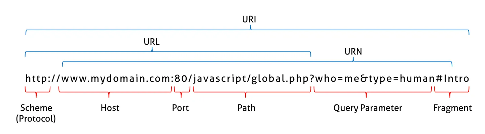
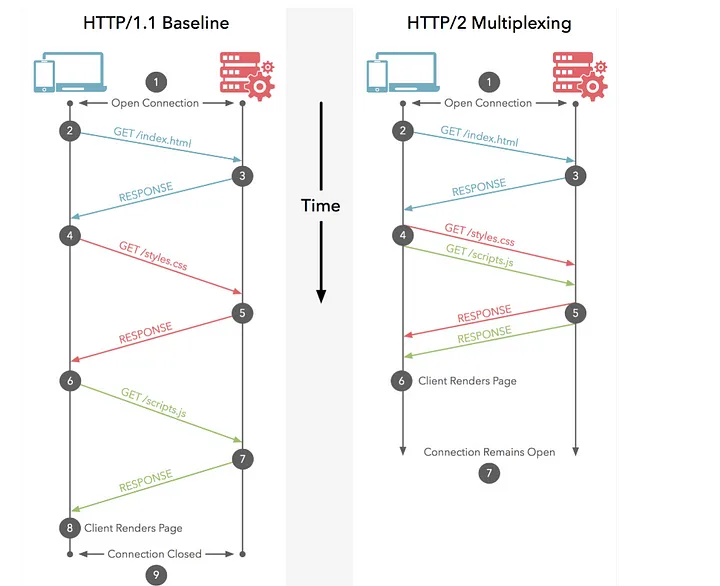

브라우저의 렌더링 과정

1. HTML, CSS 이미지 등 렌더링에 필요한 리소스를 요청하고 서버로부터 응답을 받음.
2. 브라우저의 렌더링 엔진은 서버로부터 응답된 HTML과 CSS를 파싱하여 DOM과 CSDOMㅇ르 생성하고 이들을 결합하여 렌더 트리를 생성.
3. 브라우저의 자바스크립트 엔진은 서버로부터 응답된 자바스크립트를 파싱하여 AST(Abstract Syntax Tree)를 생성하고 바이트코드로 변환하여 실행한다. 이때 자바스크립트는 DOM API를 통해 DOM이나 CSSOM을 변경할 수 있다. 변경된 DOM과 CSSOM은 다시 렌더 트리로 결합된다.
4. 렌더 트리를 기반으로 HTML 요소의 레이아웃(위치와 크기)을 계산하고 브라우저 화면에 HTML 요소를 페인팅

## 요청과 응답

브라우저의 핵심 기능은 필요한 리소스를 서버에 요청(request)하고 서버로부터 응답(response) 받아 브라우저에 시각적으로 렌더링 하는 것이다.

서버에 요청을 전송하기 위해 브라우저는 주소창을 제공한다. 브라우저의 주소창에 URL을 입력하면, URL의 호스트 이름이 DNS를 통해 IP주소로 변환되고 이 IP 주소를 갖는 서버에게 요청을 전송한다.

리소스를 요청하는 내용이 없으면 암묵적으로 `index.html`을 응답한다.

## HTTP 1.1과 HTTP 2.0

(Image source : https://medium.com/@ashutoshfvt/http-1-0-1-1-1-2-2-0-7481d2e6448b)

HTTP(HyperText Transfer Protocol) : 웹에서 브라우저와 서버가 통신하기 위한 프로토콜

**HTTP/1.1**

* 커넥션당 하나의 요청과 응답만 처리
* HTML 문서내 포함된 여러 개의 리소스 요청이 개별적으로 전송되고 응답 또한 개별적으로 전송된다.
* 리소소스의 동시 전송이 불가하므로 요청할 리소스의 개수에 비례하여 응답 시간도 증가한다.

**HTTP/2**

* 커넥션당 여러 개의 요청과 응답, 즉 다중 요청/응답이 가능.
* 여러 리소스의 동시 전송이 가능하므로 HTTP/1.1에 비해 페이지 로드 속도가 50%정도 빠르다고 알려짐

## HTML 파싱과 DOM 생성

1. 서버에 존재하던 HTML 파일이 브라우저의 요청에 의해 응답된다. 이떄 서버는 브라우저가 요청한 HTML 파일을 읽어 들여 메모리에 저장한 다음 메모리에 저장된 바이트(2진수)를 인터넷을 경유하여 응답한다.
2. 브라우저는 서버가 응답한 HTML 문서를 바이트(2진수) 형태로 응답받는다. 그리고 응답된 바이트 형태의 HTML 문서는 `meta` 태그의 `charset` 어트리뷰트에 의해 지정된 인코딩 방식(ex. UTF-8)을 기준으로 문자열로 변환된다. 참고로 `meta` 태그의 `charset` 어트리뷰트에 선언된 인코딩 방식(ex. UTF-8)은 `content-type: text/html; charset=utf-8`과 같이 응답헤더(response header)에 담겨 응답된다. 브라우저는 이를 확인하고 문자열로 변환한다.
3. 문자열로 변환된 HTML 문서를 읽어 들여 문법적 의미를 갖는 코드의 최소 단위인 **토큰(token)**들로 분해한다.
4. 각 토큰들을 객체로 변환하여 **노드(node)**들을 생성한다. 토큰의 내용에 따라 문서, 요소, 어트리뷰트, 텍스트 노드가 생성된다. 노드는 이후 DOM을 구성하는 기본 요소가 된다.
5. HTML 문서는 HTML 요소들의 집합으로 이루어지며 **HTML 요소는 중첩 관계를 갖는다**. 즉, HTML 요소의 콘텐츠 영역(시작 태그와 종료 태그 사이)에는 텍스트뿐만 아니라 다른 HTML 요소도 포함될 수 있다. 이때 HTML 요소 간에는 중첩 관계에 의해 부자 관계가 형성된다. 이러한 HTML요소 간의 부자 관계를 반영하여 모든 노드들을 트리 자료구조로 구성한다. 이 노드들로 구성된 트리 자료구조를 DOM(Document Object Model)이라 부른다.

## CSS 파싱과 CSSOM 생성

렌더링 엔진은 HTML을 처음부터 한 줄씩 순차적으로 파싱하여 DOM을 생성해 나가다 CSS를 로드하는 `link`, `style` 태그를 만나면 DOM 새엇ㅇ을 일시 중단한다.

그리고 `link` 태그의 `href` 어트리뷰트에 지정된 CSS 파일을 서버에 요청하여 로드한 CSS 파일이나 `style` 태그 내의 CSS를 HTML과 동일한 파싱 과정 (바이트 → 문자 → 토큰 → 노드 → CSSOM)을 거치며 해석하여 CSSOM(CSS Object Model)을 생성한다. 이후 CSS 파싱을 완료하면 HTML 파싱이 중단된 지점으로부터 다시 HTML을 파싱하기 시작하여 DOM 생성을 재개한다.

## 렌더 트리 생성

렌더링 엔진은 서버로부터 응답된 HTML과 CSS를 파싱하여 각각 DOM과 CSSOM을 생성한다. 그리고 DOM과 CSSOM은 렌덜링을 위한 렌더 트리(render tree)로 결합된다.

렌더 트리는 렌더링을 위한 트리 구조의 자료구조다. 따라서 브라우저 화면에 렌더링되지 않는 노드(ex. `meta`, `script`)와 CSS에 의해 비표시(ex. `display: none`)되는 노드들은 포함하지 않는다. 다시 말해, 렌더 트리는 브라우저 화면에 렌더링되는 노드만으로 구성된다.

이후 완성된 렌더 트리는 각 HTML 요소의 레이아웃(위치와 크기)을 계산하는 데 사용되며 브라우저 화면에 픽셀을 렌더링하는 페인팅(painting)처리에 입력된다.

다음과 같은 경우 반복해서 렌더링 과정(레이아웃 계산, 페인팅)이 재차 실행된다.
* 자바스크립트에 의한 노드 추가 또는 삭제
* 브라우저 창의 리사이징에 의한 뷰포트 크기 변경
* HTML 요소의 레이아웃(위치, 크기)에 변경을 발생시키는 `width/height`, `margin`, `padding`, `border`, `display`, `position`, `top/right/bottom/left`등의 스타일 변경

리렌더링이 빈번하게 발생하지 않도록 주의할 필요가 있다.

## 자바스크립트 파싱과 실행

HTML 문서를 파싱한 결과물로서 생성된 DOM은 HTML문서의 구조와 정보뿐만 아니라 HTML 요소와 스타일 등을 변경할 수 있는 프로그래밍 인터페이스로서 DOM API를 제공한다. 즉, 자바스크립트 코드에서 DOM API를 사용하면 이미 생성된 DOM을 동적으로 조작할 수 있다.

CSS 파싱 과정과 마찬가지로 렌더링 엔진은 HTML을 한 줄씩 순차적으로 파싱하며 DOM을 생성해나가다가 자바스크립트 파일을 로드하는 `script` 태그나 자바스크립트 코드를 콘텐츠로 담은 `script` 태그를 만나면 DOM 생성을 일시 중단한다.

그리고 `script` 태그의 `src` 어트리뷰트에 정의된 자바스크립트 파일을 서버에 요청하여 로드한 자바스크립트 파일이나 `script` 태그 내의 자바스크립트 코드를 파싱하기 위해 자바스크립트 엔진에 제어권을 넘긴다. 이후 자바스크립트 파싱과 실행이 종료되면 렌더링 엔진으로 다시 제어권을 넘겨 HTML 파싱이 중단된 지점부터 다시 HTML 파싱을 시작하여 DOM 생성을 재개한다.

자바스크립트 파싱과 실행은 브라우저의 렌더링 엔진이 아닌 자바스크립트 엔진이 처리한다. 자바스크립트 엔진은 자바스크립트 코드를 파싱하여 CPU가 이해할 수 있는 저수준언어로 변환하고 실행하는 역할을 한다. 자바스크립트 엔진은 구글 크롬과 Node.js의 V8, 파이어폭스의 SpiderMonkey, 사파리의 JavaScriptCore 등 다양한 종류가 있으며, 모든 자바스크립트 엔진은 ECMAScript 사양을 준수한다.

렌더링 엔진으로부터 제어권을 넘겨받은 자바스크립트 엔진은 자바스크립트 코드를 파싱하기 시작한다. 렌더링 엔진이 HTML과 CSS를 파싱하여 DOM과 CSSOM을 생성하듯이 자바스크립트 엔진은 자바스크립트를 해석하여 AST(Abstract Syntax Tree, 추상적 구문 트리)를 생성한다. 그리고 AST를 기반으로 인터프리터가 실행할 수 있는 중간 코드(intermediate code)인 바이트코드를 생성하여 실행한다.

**토크나이징(tokenizing)**

단순한 문자열인 자바스크리븥 소스코드를 어휘 분석(lexical analysis)하여 문법적 의미를 갖는 코드의 최소 단위인 토큰(token)들로 분해한다. 이 과정을 렉싱(lexing)이라고 부르기도 하지만 토크나이징과 미묘한 차이가 있다.

**파싱**

토큰들의 집합을 구문분석(syntactic)하여 AST(Abstract Syntax Tree, 추상적 구문 트리)를 생성한다. AST는 토큰에 문법적 의미와 구조를 반영한 트리 구조의 자료 구조다 AST는 인터프리터나 컴파일러마닝 사용하는 것은 아니다. AST를 사용하면 TypeScript, Babel, Prettier 같은 트랜스파일러(transpiler)를 구현할 수도 있다.