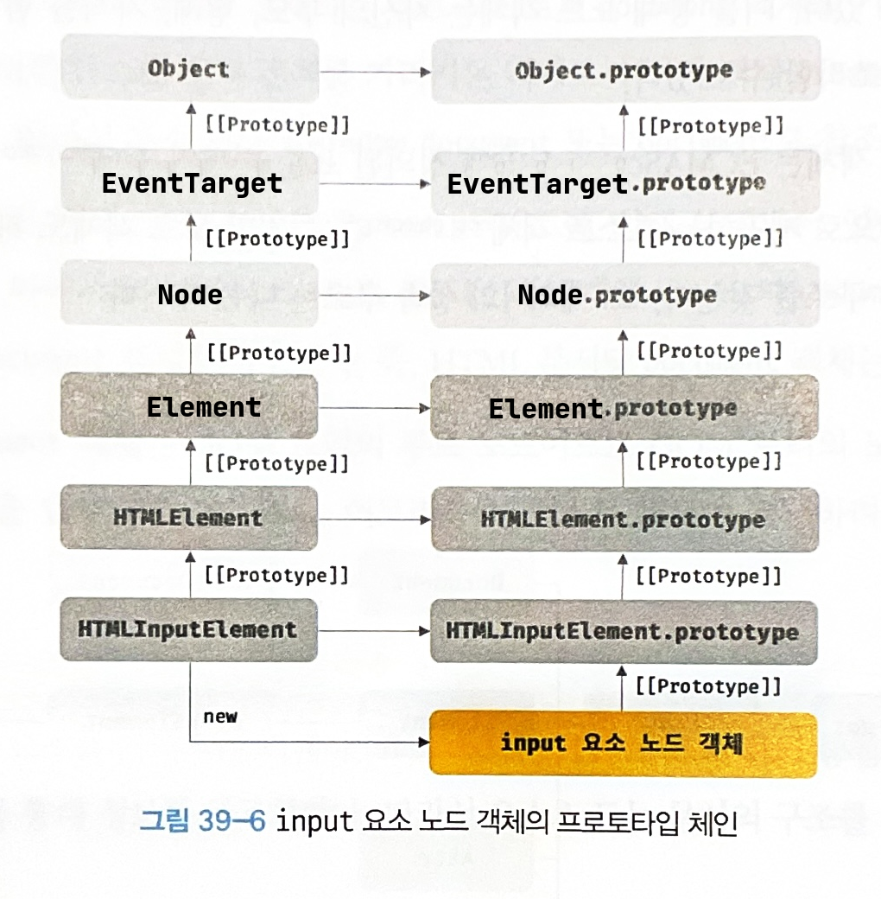
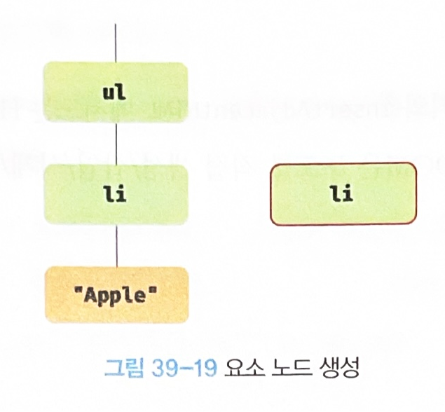

# chapter39 DOM

DOM은 HTML 문서의 계층적 구조와 정보를 표현하며 이를 제어할 수 있는 API, 즉 프로퍼티와 메서드를 제공하는 트리 자료구조다.

## 노드

### HTML 요소와 노드 객체

HTML 요소는 HTML 문서를 구성하는 개별적인 요소를 의미한다.


HTML 요소는 렌더링 엔진에 의해 파싱되어 DOM을 구성하는 요소 노드 객체로 변환된다. 이때 HTML 요소와 어트리뷰트는 어트리뷰트 노드로, HTML 요소의 텍스트 콘텐츠는 텍스트 노드로 변환된다.


HTML 문서는 HTML 요소들의 집합으로 이뤄지며, HTML 요소는 중첩 관계를 갖는다. 즉, HTML 요소의 콘텐츠 영역(시작 태그와 종료 태그 사이)에는 텍스트뿐만 아니라 다른 HTML 요소도 포함할 수 있다.

이때 HTML 요소 간에는 중첩 관계에 의해 계층적인 부자 관계가 형성된다. 이러한 HTML 요소 간의 부자 관계를 반영하여 HTML 문서의 구성 요소인 HTML 요소를 객체화한 모든 노드 객체들을 트리 자료 구조로 구성한다.

#### 트리 자료구조

트리 자료구조는 노드들의 계층 구조로 이뤄진다. 노드 객체들로 구성된 트리 자료구조를 DOM(Document Object Model)이라 한다. 


### 노드 객체의 타입

```html
<!-- 39-01 -->

<!DOCTYPE html>
<html>

<head>
    <meta charset="UTF-8">
    <link rel="stylesheet" href="style.css">
</head>

<body>
    <ul>
        <li id="apple">Apple</li>
        <li id="banana">Banana</li>
        <li id="orange">Orange</li>
    </ul>
    <script src="app.js"></script>
</body>

</html>
```


노드 객체는 총 12개의 종류(노드 타입)가 있다.

#### 문서 노드(document node)

DOM 트리의 최상위에 존재하는 루트 노드로서 `document` 객체를 가리킨다. `document` 객체는 브라우저가 렌더링한 HTML 문서 전체를 가리키는 객체로서 전역 객체 `window`의 `document` 프로퍼티에 바인딩되어 있다. 따라서 문서 노드는 `window.document` 또는 `document`로 참조할 수 있다.

브라우저 환경의 모든 자바스크립트 코드는 `script` 태그에 의해 분리되어 있어도 하나의 전역 객체 `window`를 공유한다. 따라서 모든 자바스크립트 코드는 전역 객체 `window`의 `document` 프로퍼티에 바인딩되어 있는 하나의 `document` 객체를 바라본다. 즉, HTML 문서당 `document` 객체는 유일하다.

#### 요소 노드(element node)
요소 노드는 HTML 요소를 가리키는 객체다. 요소 노드는 HTML 요소 간의 중첩에 의해 부자 고나계를 가지며, 이 부자 관계를 통해 정보를 구조화한다. 따라서 요소 노드는 문서의 구조를 표현한다고 할 수 있다.

#### 어트리뷰트 노드(attribute node)
어트리뷰트 노드는 HTML 요소의 어트리뷰트를 가리키는 객체다. 어트리뷰트 노드는 어트리뷰트가 지정된 HTML 요소의 요소 노드와 연결되어 있다. 단, 요소 노드는 부모 노드와 연결되어 있지만 어트리뷰트 노드는 부모 노드와 연결되어 있지 않고 요소 노드에만 연결되어 있다. 즉, 어트리뷰트 노드는 부모 노드가 없으므로 요소 노드의 형제(sibling)노드는 아니다. 따라서 어트리뷰트 노드에 접근하여 어트리뷰트를 참조하거나 변경하려면 먼저 요소 노드에 접근해야 한다.

#### 텍스트 노드(text node)
텍스트 노드는 HTML 요소의 텍스트를 가리키는 객체다. 요소 노드가 문서의 구조를 표현한다면 텍스트 노드는 문서의 정보를 표현한다고 할 수 있다. 텍스트 노드는 요소 노드의 자식 노드이며, 자식 노드를 가질 수 없는 리프 노드(leaf node)다. 즉, 텍스트 노드는 DOM 트리의 최종단이다. 따라서 텍스트 노드에 접근하려면 먼저 부모 노드인 요소 노드에 접근해야 한다.

### 노드 객체의 상속 구조

DOM을 구성하는 노드 객체는 자신의 구조와 정보를 제어할 수 있는 DOM API를 사용할 수 있다. 이를 통해 노드 객체는 자신의 부모, 형제, 자식을 탐색할 수 있으며, 자신의 어트리뷰트와 텍스트를 조작할 수도 있다.

DOM을 구성하는 노드 객체는 ECMAScript 사양에 정의된 표준 빌트인 객체가 아니라 브라우저 환경에서 추가적으로 제공하는 호스트 객체다. 하지만 노드 객체도 자바스크립트 객체이므로 프로토타입에 의한 상속 구조를 갖는다. 노드 객체의 상속 구조는 다음과 같다.


이를 프로토타입 체인 관점에서 살펴보자. 예를 들어, `input` 요소를 파싱하여 객체화한 `input` 요소 노드 객체는 `HTMLInputElement`, `HTMLElement`, `Element`, `Node`, `EvenTarget`, `Object`의 `prototype`에 바인딩되어 있는 프로토타입 객체를 상속받는다. 즉, `input` 요소 노드 객체는 프로토타입 체인에 있는 모든 프로토타입의 프로퍼티나 메서드를 상속받아 사용할 수 있다.



```html
<!-- 39-02 -->

<!DOCTYPE html>
<html>

<body>
    <input type="text">
    <script>
        // input 요소 노드 객체를 선택
        const $input = document.querySelector('input');

        // input 요소 노드 객체의 프로토타입 체인
        console.log(
            Object.getPrototypeOf($input) === HTMLInputElement.prototype,
            Object.getPrototypeOf(HTMLInputElement.prototype) === HTMLElement.prototype,
            Object.getPrototypeOf(HTMLElement.prototype) === Element.prototype,
            Object.getPrototypeOf(Element.prototype) === Node.prototype,
            Object.getPrototypeOf(Node.prototype) === EventTarget.prototype,
            Object.getPrototypeOf(EventTarget.prototype) === Object.prototype
        ); // 모두 true
    </script>
</body>

</html>
```

`input` 요소 노드 객체는 다음과 같이 다양한 특성을 나타내는 기능들을 상속을 통해 제공받는다.

* `Object` : 객체
* `EventTarget` : 이벤트를 발생시키는 수 있는 객체
* `Node` : 트리자료구조의 노드 객체
* `Element` : 브라우저가 렌더링 할 수 있는 웹 문서 요소(HTML, XML, SVG)를 표현하는 객체
* `HTMLElement` : 웹 문서의 요소 중에서 HTML 요소를 표현하는 객체
* `HTMLInputElement` : HTML 요소 중에서 `input` 요소를 표현하는 객체

## 요소 노드 취득

### `id`를 이용한 요소 노드 취득

`Document.prototype.getElementById` 메서드는 인수로 전달한 `id` 어트리뷰트 값을 갖는 하나의 요소 노드를 탐색하여 반환한다.

* `id`
  * `id` 값은 HTML 문서 내에서 유일한 값이어야 한다.
  * `class` 어트리뷰트와는 달리 공백 문자로 구분한다.
  * 여러 개의 값을 가질 수 없다.
* `Document.prototype.getElementById`
  * 중복된 `id` 값을 갖는 요소가 여러 개 존재하더라도 어떠한 에러도 발생하지 않으며 이 경우 첫 번째 요소 노드만 반환한다.
  * 전달된 `id` 값을 갖는 HTML 요소가 존재하지 않는 경우 `null`을 반환한다.
* HTML
  * HTML 요소에 `id` 어트리뷰트를 부여하면 `id` 값과 동일한 이름의 전역 변수가 암묵적으로 선언되고 해당 노드 객체가 할당되는 부수 효과가 있다.
  * `id` 값과 동일한 이름의 전역 변수가 이미 선언되어 있으면 이 전역 변수에 노드가 재할당되지 않는다.

```html
<!-- 39-03 -->

<!DOCTYPE html>
<html>

<body>
    <ul>
        <li id="apple">Apple</li>
        <li id="banana">Banana</li>
        <li id="orange">Orange</li>
    </ul>
    <script>
        // id 값이 'banana'인 요소 노드를 탐색하여 반환한다.
        // 두 번째 li 요소가 파싱되어 생성된 요소 노드가 반환된다.
        const $elem = document.getElementById('banana');

        // 취득한 요소 노드의 style.color 프로퍼티 값을 변경한다.
        $elem.style.color = 'red';
    </script>
</body>

</html>
```

### 태그 이름을 이용한 요소 노드 취득

`Document.prototype/Element.prototype.getElementsByTagName` 메서드는 인수로 전달한 태그 이름을 갖는 모든 요소들을 탐색하여 반환한다.

`getElementsByTagName` 메서드는 여러 개의 요소 노드 객체를 갖는 DOM 컬렉션 객체인 `HTMLCollection` 객체를 반환한다. `HTMLCollection` 객체는 유사 배열 객체이면서 이터러블이다.

```html
<!-- 39-08 -->

<!DOCTYPE html>
<html>

<body>
    <ul>
        <li id="apple">Apple</li>
        <li id="banana">Banana</li>
        <li id="orange">Orange</li>
    </ul>
    <script>
        // 태그 이름이 li인 요소 노드를 모두 탐색하여 반환한다.
        // 탐색된 요소 노드들은 HTMLCollection 객체에 담겨 반환된다.
        // HTMLCollection 객체는 유사 배열 객체이면서 이터러블이다.
        const $elems = document.getElementsByTagName('li');

        // 취득한 모든 요소 노드의 style.color 프로퍼티 값을 변경한다.
        // HTMLCollection 객체를 배열로 변환하여 순회하며 color 프로퍼티 값을 변경한다.
        [...$elems].forEach(elem => { elem.style.color = 'red'; });
    </script>
</body>

</html>
```

HTML 문서의 모든 요소를 취득하려면 `getElementByTagName` 메서드에 인수로로 `*`를 전달한다.

```html
<script>
    // 모든 요소 노드를 탐색하여 반환한다.
    const $all = document.getElementsByTagName('*');
    // -> HTMLCollection(8) [html, head, body, ul, li#apple, li#banana, li#orange, script, apple: li#apple, banana: li#banana, orange: li#orange]
</script>
```

* `Document.prototype.getElementsByTagName`
  * DOM의 루트 노드인 문서 노드, 즉 `document`를 통해 호출하며 DOM 전체에서 요소 노드를 탐색하여 반환한다.
* `Element.prototype.getElementsByTagName`
  * 특정 요소 노드를 통해 호출하며, 특정 요소 노드의 자손 노드 중에서 요소 노드를 탐색하여 반환한다.

전달된 태그 이름을 갖는 요소 노드가 존재하지 않는 경우 빈 `HTMLCollection` 객체를 반환한다.

### `class`를 이용한 노드 취득

`Document.prototype/Element.prototype.getElementsByClassName` 메서드는 인수로 전달한 `class` 어트리뷰트 값을 갖는 모든 요소들을 탐색하여 반환한다.

인수로 전달할 `class` 값은 공백으로 구분하여 여러 개의 `class`를 지정할 수 있다. `HTMLCollection` 객체를 반환한다.

* `Document.prototype.getElementsByClassName`
  * DOM의 루트 노드인 문서 노드, 즉 `document`를 통해 호출하며 DOM 전체에서 요소 노드를 탐색하여 반환한다.
* `Element.prototype.getElementsByClassName`
  * 특정 요소 노드를 통해 호출하며, 특정 요소 노드의 자손 노드 중에서 요소 노드를 탐색하여 반환한다.

전달된 `class` 값을 갖는 요소 노드가 존재하지 않는 경우 빈 `HTMLCollection` 객체를 반환한다.

```html
<!-- 39-11 -->

<!DOCTYPE html>
<html>

<body>
    <ul>
        <li class="fruit apple">Apple</li>
        <li class="fruit banana">Banana</li>
        <li class="fruit orange">Orange</li>
    </ul>
    <script>
        // class 값이 'fruit'인 요소 노드를 모두 탐색하여 HTMLCollection 객체에 담아 반환한다.
        const $elems = document.getElementsByClassName('fruit');

        // 취득한 모든 요소의 CSS color 프로퍼티 값을 변경한다.
        [...$elems].forEach(elem => { elem.style.color = 'red'; });

        // class 값이 'fruit apple'인 요소 노드를 모두 탐색하여 HTMLCollection 객체에 담아 반환한다.
        const $apples = document.getElementsByClassName('fruit apple');

        // 취득한 모든 요소 노드의 style.color 프로퍼티 값을 변경한다.
        [...$apples].forEach(elem => { elem.style.color = 'blue'; });
    </script>
</body>

</html>
```

### CSS 선택자를 이용한 요소 노드 취득

CSS 선택자는 스타일을 적용하고자 하는 HTML 요소를 특정할 때 사용하는 문법이다.

`Document.prototype/Element.prototype.querySelector` 메서드는 인수로 전달한 CSS 선택자를 만족시키는 하나의 요소 노드를 탐색하여 반환한다.

* 인수로 전달한 CSS 선택자를 만족시키는 요소 노드가 여러 개인 경우 첫 번째 요소 노드만 반환한다.
* 인수로 전달된 CSS 선택자를 만족시키는 요소 노드가 존재하지 않는 경우 `null`을 반환한다.
* 인수로 전달한 CSS 선택자가 문법에 맞지 않는 경우 DOMException 에러가 발생한다.

```css
/* 전체 선택자: 모든 요소를 선택 */
* { ... }
/* 태그 선택자: 모든 p 태그 요소를 모두 선택 */
p { ... }
/* id 선택자: id 값이 'foo'인 요소를 모두 선택 */
#foo { ... }
/* class 선택자: class 값이 'foo'인 요소를 모두 선택 */
.foo { ... }
/* 어트리뷰트 선택자: input 요소 중에 type 어트리뷰트 값이 'text'인 요소를 모두 선택 */
input[type=text] { ... }
/* 후손 선택자: div 요소의 후손 요소 중 p 요소를 모두 선택 */
div p { ... }
/* 자식 선택자: div 요소의 자식 요소 중 p 요소를 모두 선택 */
div > p { ... }
/* 인접 형제 선택자: p 요소의 형제 요소 중에 p 요소 바로 뒤에 위치하는 ul 요소를 선택 */
p + ul { ... }
/* 일반 형제 선택자: p 요소의 형제 요소 중에 p 요소 뒤에 위치하는 ul 요소를 모두 선택 */
p ~ ul { ... }
/* 가상 클래스 선택자: hover 상태인 a 요소를 모두 선택 */
a:hover { ... }
/* 가상 요소 선택자: p 요소의 콘텐츠의 앞에 위치하는 공간을 선택
   일반적으로 content 프로퍼티와 함께 사용된다. */
p::before { ... }
```

```html
<!-- 39-14 -->

<!DOCTYPE html>
<html>

<body>
    <ul>
        <li class="apple">Apple</li>
        <li class="banana">Banana</li>
        <li class="orange">Orange</li>
    </ul>
    <script>
        // class 어트리뷰트 값이 'banana'인 첫 번째 요소 노드를 탐색하여 반환한다.
        const $elem = document.querySelector('.banana');

        // 취득한 요소 노드의 style.color 프로퍼티 값을 변경한다.
        $elem.style.color = 'red';
    </script>
</body>

</html>
```

`Document.prototype/Element.prototype.querySelectorAll` 메서드는 인수로 전달한 CSS 선택자를 만족시키는 모든 요소 노드를 탐색하여 반환한다.

`querySelectorAll` 메서드는 여러 개의 요소 노드 객체를 갖는 DOM 컬레션 객체인 `NodeList` 객체를 반환한다. `NodeList` 객체는 유사 배열 객체이면서 이터러블이다.

* 인수로 전달된 CSS 선택자를 만족시키는 요소가 존재하지 않는 경우 빈 `NodeList` 객체를 반환한다.
* 인수로 전달한 CSS 선택자가 문법에 맞지 않는 경우 DOMException 에러가 발생한다.
* HTML 문서의 모든 요소 노드를 취득하려면 `querySelectorAll` 메서드에 인수로 전체 선택자 `*`를 전달한다.

* `Document.prototype.querySelectorAll`
  * DOM의 루트 노드인 문서 노드, 즉 `document`를 통해 호출하며 DOM 전체에서 요소 노드를 탐색하여 반환한다.
* `Element.prototype.querySelectorAll`
  * 특정 요소 노드를 통해 호출하며, 특정 요소 노드의 자손 노드 중에서 요소 노드를 탐색하여 반환한다.

```html
<!-- 39-15 -->

<!DOCTYPE html>
<html>

<body>
    <ul>
        <li class="apple">Apple</li>
        <li class="banana">Banana</li>
        <li class="orange">Orange</li>
    </ul>
    <script>
        // ul 요소의 자식 요소인 li 요소를 모두 탐색하여 반환한다.
        const $elems = document.querySelectorAll('ul > li');
        // 취득한 요소 노드들은 NodeList 객체에 담겨 반환된다.
        console.log($elems); // NodeList(3) [li.apple, li.banana, li.orange]

        // 취득한 모든 요소 노드의 style.color 프로퍼티 값을 변경한다.
        // NodeList는 forEach 메서드를 제공한다.
        $elems.forEach(elem => { elem.style.color = 'red'; });
    </script>
</body>

</html>
```

CSS 선택자 문법을 사용하는 `querySelector`, `querySelectorAll` 메서드는 `getElementById`, `getElementBy***` 메서드보다 느린 것으로 알려져 있다.

### 특정 요소 노드를 취득할 수 있는지 확인

`Element.prototype.matches` 메서드는 인수로 전달한 CSS 선택자를 통해 특정 요소 노드를 취득할 수 있는지 확인한다.

```html
<!-- 39-17 -->

<!DOCTYPE html>
<html>

<body>
    <ul id="fruits">
        <li class="apple">Apple</li>
        <li class="banana">Banana</li>
        <li class="orange">Orange</li>
    </ul>
</body>
<script>
    const $apple = document.querySelector('.apple');

    // $apple 노드는 '#fruits > li.apple'로 취득할 수 있다.
    console.log($apple.matches('#fruits > li.apple'));  // true

    // $apple 노드는 '#fruits > li.banana'로 취득할 수 없다.
    console.log($apple.matches('#fruits > li.banana')); // false
</script>

</html>
```

### `HTMLCollection`과 `NodeList`

#### `HTMLCollection`

* DOM API가 여러 개의 결과값을 반환하기 위한 DOM 컬렉션 객체
* 유사 배열 객체이면서 이터러블이다.
* `for ... of` 문으로 순회할 수 있으며 스프레드 문법을 사용하여 간단히 배열로 전환할 수 있다.
* **노드 객체의 상태 변화를 실시간으로 반영하는 살아있는 객체다.**
  * `HTMLCollection`은 언제나 live 객체로 동작한다.
  * `NodeList`는 대부분의 경우 노드 객체의 상태 변화를 실시간으로 반영하지 않고 과거의 정적 상태를 유지하는 non-live 객체로 동작하지만 경우에 따라 live 객체로 동작할 때가 있다.

```html
<!-- 39-18 -->

<!DOCTYPE html>

<head>
    <style>
        .red {
            color: red;
        }

        .blue {
            color: blue;
        }
    </style>
</head>
<html>

<body>
    <ul id="fruits">
        <li class="red">Apple</li>
        <li class="red">Banana</li>
        <li class="red">Orange</li>
    </ul>
    <script>
        // class 값이 'red'인 요소 노드를 모두 탐색하여 HTMLCollection 객체에 담아 반환한다.
        const $elems = document.getElementsByClassName('red');
        // 이 시점에 HTMLCollection 객체에는 3개의 요소 노드가 담겨 있다.
        console.log($elems); // HTMLCollection(3) [li.red, li.red, li.red]

        // HTMLCollection 객체의 모든 요소의 class 값을 'blue'로 변경한다.
        for (let i = 0; i < $elems.length; i++) {
            $elems[i].className = 'blue';
        }

        // HTMLCollection 객체의 요소가 3개에서 1개로 변경되었다.
        console.log($elems); // HTMLCollection(1) [li.red]
    </script>
</body>

</html>
```

첫번째 반복에서 `Apple`을 `'blue'`로 바꾸고 두번째 반복에서는 `[Banana, Orange]`가 되어 i = 1은 `Orange`이므로 `Orange`가 `'blue'`가 된다. 이후 `$elems.length`는 1이 되어 `i(1) < 1`가 아니므로 반복문은 종료된다.

이런 것들은 역방향으로 순회하거나 `while` 문을 사용하여 해결할 수 있다.

더 간단한 해결책은 `HTMLCollection` 객체를 사용하지 않는 것이다. 유사 배열 객체이면서 이터러블인 `HTMLCollection` 객체를 배열로 변환하면 부작용을 발생시키는 `HTMLCollection` 객체를 사용할 필요가 없고 유용한 배열의 고차 함수(`forEach`, `map`, `filter`, `reduce` 등)을 사용할 수 있다.

#### `NodeList`

`NodeList`는 실시간으로 노드 객체의 상태 변경을 반영하지 않는(non-live) 객체다.

```html
<!-- 39-22 -->

<script>
    // querySelectorAll은 DOM 컬렉션 객체인 NodeList를 반환한다.
    const $elems = document.querySelectorAll('.red');

    // NodeList 객체는 NodeList.prototype.forEach 메서드를 상속받아 사용할 수 있다.
    $elems.forEach(elem => elem.className = 'blue');
</script>
```

`NodeList.prototype.forEach` 메서드는 `Array.prototype.forEach` 메서드와 사용방법이 동일하다.이외에도 `NodeList.prototype`은 `item`, `entries`, `keys`, `values` 메서드를 제공한다.

`childNodes` 프로퍼티가 반환하는 `NodeList` 객체는 실시간으로 노드 객체의 상태 변경을 반영하는 live객체로 동작하므로 주의가 필요하다.

```html
<!-- 39-23 -->

<!DOCTYPE html>
<html>

<body>
    <ul id="fruits">
        <li>Apple</li>
        <li>Banana</li>
    </ul>
</body>
<script>
    const $fruits = document.getElementById('fruits');

    // childNodes 프로퍼티는 NodeList 객체(live)를 반환한다.
    const { childNodes } = $fruits;
    console.log(childNodes instanceof NodeList); // true

    // $fruits 요소의 자식 노드는 공백 텍스트 노드(39.3.1절 "공백 텍스트 노드" 참고)를 포함해 모두 5개다.
    console.log(childNodes); // NodeList(5) [text, li, text, li, text]

    for (let i = 0; i < childNodes.length; i++) {
        // removeChild 메서드는 $fruits 요소의 자식 노드를 DOM에서 삭제한다.
        // (39.6.9절 "노드 삭제" 참고)
        // removeChild 메서드가 호출될 때마다 NodeList 객체인 childNodes가 실시간으로 변경된다.
        // 따라서 첫 번째, 세 번째 다섯 번째 요소만 삭제된다.
        $fruits.removeChild(childNodes[i]);
    }

    // 예상과 다르게 $fruits 요소의 모든 자식 노드가 삭제되지 않는다.
    console.log(childNodes); // NodeList(2) [li, li]
</script>

</html>
```

노드 객체의 상태 변경과 상관없이 안전하게 DOM 컬렉션을 사용하려면 `HTMLCollection`이나 `NodeList` 객체를 배열로 변환하여 사용하는 것을 권장한다.

`HTMLCollection`과 `NodeList` 객체는 모두 유사 배열 객체이면서 이터러블이므로 스프레드 문법이나 `Array.from` 메서드를 사용하여 간단히 배열로 변환할 수 있다.

```html
<!-- 39-24 -->

<!DOCTYPE html>
<html>

<body>
    <ul id="fruits">
        <li>Apple</li>
        <li>Banana</li>
    </ul>
</body>
<script>
    const $fruits = document.getElementById('fruits');

    // childNodes 프로퍼티는 NodeList 객체(live)를 반환한다.
    const { childNodes } = $fruits;

    // 스프레드 문법을 사용하여 NodeList 객체를 배열로 변환한다.
    [...childNodes].forEach(childNode => {
        $fruits.removeChild(childNode);
    });

    // $fruits 요소의 모든 자식 노드가 모두 삭제되었다.
    console.log(childNodes); // NodeList []
</script>

</html>
```

## 노드 탐색

요소 노드를 취득한 다음 취득한 요소 노드를 기점으로 DOM 트리의 노드를 옮겨 다니며 부모, 형제, 자식 노드 등을 탐색해야 할 때가 있다.

DOM 트리 상의 노드를 탐색할 수 있도록 `Node`, `Element` 인터페이스는 트리 탐색 프로퍼티를 제공한다.


* `Node.prototype`이 제공
  * `parentNode`, `previousSibling`, `firstChild`, `childNodes`
* `Element.prototype`이 제공
  * `previousElementSibling`, `nextElementSibling`, `children`

노드 탐색 프로퍼티는 모두 접근자 프로퍼티다. 단, 노드 탐색 프로퍼티는 setter 없이 getter만 존재하여 참조만 가능한 읽기 전용 접근자 프로퍼티다. 읽기 전용 접근자 프로퍼티에 값을 할당하면 아무런 에러 없이 무시된다.

### 공백 텍스트 노드

HTML 요소 사이의 스페이스, 탭, 줄바꿈(개행) 등의 공백 문자는 텍스트 노드를 생성한다. 이를 공백 텍스트 노드라 한다.

텍스트 에디터에서 HTML 문서에 스페이스 키, 탭 키, 엔터 키 등을 입력하면 공백 문자가 추가된다.

```html
<!-- 39-26 -->

<!DOCTYPE html>
<html>

<body>
    <ul id="fruits">
        <li class="apple">Apple</li>
        <li class="banana">Banana</li>
        <li class="orange">Orange</li>
    </ul>
</body>

</html>
```


이처럼 HTML 문서의 공백 문자는 공백 텍스트 노드를 생성한다. 따라서 노드를 탐색할 때는 공백 문자가 생성한 공백 텍스트 노드에 주의해야 한다. 

### 자식 노드 탐색

| 프로퍼티 | 설명 |
| - | - |
|`None.prototype.childNodes`| 자식 노드를 모두 탐색하여 DOM 컬렉션 객체인 `NodeList`에 담아 반환한다. 텍스트노드도 포함되어 있을 수 있다. |
|`Element.prototype.children` | 자식 노드 중에서 요소 노드만 모두 탐색하여 DOM 컬렉션 객체인 HTMLCollection에 담아 반환한다. 텍스트 노드가 포함되지 않는다. |
| `Node.prototype.firstChild` | 첫 번째 자식 노드를 반환한다. 텍스트 노드이거나 요소 노드다. |
| `Node.prototype.lastChild` | 마지막 자식 노드를 반환한다. 텍스트 노드이거나 요소 노드다. |
| `Element.prototype.firstElementChild` | 첫 번째 자식 요소 노드를 반환한다. 요소 노드만 반환한다.|
| `Element.prototype.lastElementChild` | 마지막 자식 요소 노드를 반환한다. 요소 노드만 반환한다. |

```html
<!-- 39-28 -->

<!DOCTYPE html>
<html>

<body>
    <ul id="fruits">
        <li class="apple">Apple</li>
        <li class="banana">Banana</li>
        <li class="orange">Orange</li>
    </ul>
</body>
<script>
    // 노드 탐색의 기점이 되는 #fruits 요소 노드를 취득한다.
    const $fruits = document.getElementById('fruits');

    // #fruits 요소의 모든 자식 노드를 탐색한다.
    // childNodes 프로퍼티가 반환한 NodeList에는 요소 노드뿐만 아니라 텍스트 노드도 포함되어 있다.
    console.log($fruits.childNodes);
    // NodeList(7) [text, li.apple, text, li.banana, text, li.orange, text]

    // #fruits 요소의 모든 자식 노드를 탐색한다.
    // children 프로퍼티가 반환한 HTMLCollection에는 요소 노드만 포함되어 있다.
    console.log($fruits.children);
    // HTMLCollection(3) [li.apple, li.banana, li.orange]

    // #fruits 요소의 첫 번째 자식 노드를 탐색한다.
    // firstChild 프로퍼티는 텍스트 노드를 반환할 수도 있다.
    console.log($fruits.firstChild); // #text

    // #fruits 요소의 마지막 자식 노드를 탐색한다.
    // lastChild 프로퍼티는 텍스트 노드를 반환할 수도 있다.
    console.log($fruits.lastChild); // #text

    // #fruits 요소의 첫 번째 자식 노드를 탐색한다.
    // firstElementChild 프로퍼티는 요소 노드만 반환한다.
    console.log($fruits.firstElementChild); // li.apple

    // #fruits 요소의 마지막 자식 노드를 탐색한다.
    // lastElementChild 프로퍼티는 요소 노드만 반환한다.
    console.log($fruits.lastElementChild); // li.orange
</script>

</html>
```

### 자식 노드 존재 확인

`Node.prototype.hasChildNodes` 메서드는 자식 노드가 존재하는지 확인한다. 자식 노드가 존재하면 `true`, 자식 노드가 존재하지 않으면 `false`를 반환한다. 텍스트 노드를 포함하여 자식 노드의 존재를 확인한다.

```html
<!-- 39-29 -->

<!DOCTYPE html>
<html>

<body>
    <ul id="fruits">
    </ul>
</body>
<script>
    // 노드 탐색의 기점이 되는 #fruits 요소 노드를 취득한다.
    const $fruits = document.getElementById('fruits');

    // #fruits 요소에 자식 노드가 존재하는지 확인한다.
    // hasChildNodes 메서드는 텍스트 노드를 포함하여 자식 노드의 존재를 확인한다.
    console.log($fruits.hasChildNodes()); // true
</script>

</html>
```

자식 노드 중에 텍스트 노드가 아닌 요소 노드가 존재하는지를 확인하려면 `hasChildNodes` 메서드 대신 `children.length` 또는 `Element` 인터페이스의 `childElementCount` 프로퍼티를 사용한다.

```html
<!-- 39-30 -->

<!DOCTYPE html>
<html>

<body>
    <ul id="fruits">
    </ul>
</body>
<script>
    // 노드 탐색의 기점이 되는 #fruits 요소 노드를 취득한다.
    const $fruits = document.getElementById('fruits');

    // hasChildNodes 메서드는 텍스트 노드를 포함하여 자식 노드의 존재를 확인한다.
    console.log($fruits.hasChildNodes()); // true

    // 자식 노드 중에 텍스트 노드가 아닌 요소 노드가 존재하는지는 확인한다.
    console.log(!!$fruits.children.length); // 0 -> false
    // 자식 노드 중에 텍스트 노드가 아닌 요소 노드가 존재하는지는 확인한다.
    console.log(!!$fruits.childElementCount); // 0 -> false
</script>

</html>
```

### 요소 노드의 텍스트 노드 탐색

요소 노드의 텍스트 노드는 요소 노드의 자식 노드다. 따라서 요소 노드의 텍스트 노드는 `firstChild` 프로퍼티로 접근할 수 있다. `firstChild` 프로퍼티는 첫 번째 자식 노드를 반환한다. `firstChild` 프로퍼티가 반환한 노드는 텍스트 노드이거나 요소 노드다.

```html
<!-- 39-31 -->

<!DOCTYPE html>
<html>

<body>
    <div id="foo">Hello</div>
    <script>
        // 요소 노드의 텍스트 노드는 firstChild 프로퍼티로 접근할 수 있다.
        console.log(document.getElementById('foo').firstChild); // #text
    </script>
</body>

</html>
```

### 부모 노드 탐색

부모 노드를 탐색하려면 `Node.prototype.parentNode` 프로퍼티를 사용한다. 텍스트 노드는 리프 노드이므로 부모 노드가 텍스트 노드인 경우는 없다.

```html
<!-- 39-32 -->

<!DOCTYPE html>
<html>

<body>
    <ul id="fruits">
        <li class="apple">Apple</li>
        <li class="banana">Banana</li>
        <li class="orange">Orange</li>
    </ul>
</body>
<script>
    // 노드 탐색의 기점이 되는 .banana 요소 노드를 취득한다.
    const $banana = document.querySelector('.banana');

    // .banana 요소 노드의 부모 노드를 탐색한다.
    console.log($banana.parentNode); // ul#fruits
</script>

</html>
```

### 형제 노드 탐색

부모 노드가 같은 형제 노드를 탐색하려면 다음과 같은 노드 탐색 프로퍼티를 사용한다. 단, 어트리뷰트 노드는 요소 노드와 연결되어 있지만 부모 노드가 같은 형제 노드가 아니기 때문에 반환되지 않는다. 즉, 아래 프로퍼티는 텍스트 노드 또는 요소 노드만 반환한다.

| 프로퍼티 | 설명 |
| - | - |
| `Node.prototype.previousSibling` | 이전 형제 노드를 반환한다, 텍스트 노드를 반환할 수도 있다. |
| `Node.prototype.nextSibling` | 다음 형제 노드를 반환한다. 텍스트 노드를 반환할 수도 있다. |
| `Element.prototype.previousElementSibling` | 이전 형제 요소 노드를 반환한다. 요소 노드만 반환한다. |
| `Element.prototype.nextElementSibling` | 다음 형제 요소 노드를 반환한다. 요소 노드만 반환한다. |

```html
<!-- 39-33 -->

<!DOCTYPE html>
<html>

<body>
    <ul id="fruits">
        <li class="apple">Apple</li>
        <li class="banana">Banana</li>
        <li class="orange">Orange</li>
    </ul>
</body>
<script>
    // 노드 탐색의 기점이 되는 #fruits 요소 노드를 취득한다.
    const $fruits = document.getElementById('fruits');

    // #fruits 요소의 첫 번째 자식 노드를 탐색한다.
    // firstChild 프로퍼티는 요소 노드뿐만 아니라 텍스트 노드를 반환할 수도 있다.
    const { firstChild } = $fruits;
    console.log(firstChild); // #text

    // #fruits 요소의 첫 번째 자식 노드(텍스트 노드)의 다음 형제 노드를 탐색한다.
    // nextSibling 프로퍼티는 요소 노드뿐만 아니라 텍스트 노드를 반환할 수도 있다.
    const { nextSibling } = firstChild;
    console.log(nextSibling); // li.apple

    // li.apple 요소의 이전 형제 노드를 탐색한다.
    // previousSibling 프로퍼티는 요소 노드뿐만 아니라 텍스트 노드를 반환할 수도 있다.
    const { previousSibling } = nextSibling;
    console.log(previousSibling); // #text

    // #fruits 요소의 첫 번째 자식 요소 노드를 탐색한다.
    // firstElementChild 프로퍼티는 요소 노드만 반환한다.
    const { firstElementChild } = $fruits;
    console.log(firstElementChild); // li.apple

    // #fruits 요소의 첫 번째 자식 요소 노드(li.apple)의 다음 형제 노드를 탐색한다.
    // nextElementSibling 프로퍼티는 요소 노드만 반환한다.
    const { nextElementSibling } = firstElementChild;
    console.log(nextElementSibling); // li.banana

    // li.banana 요소의 이전 형제 요소 노드를 탐색한다.
    // previousElementSibling 프로퍼티는 요소 노드만 반환한다.
    const { previousElementSibling } = nextElementSibling;
    console.log(previousElementSibling); // li.apple
</script>

</html>
```

## 노드 정보 취득

* `Node.prototype.nodeType`
  * 노드 객체의 종류, 즉 노드 타입을 나타내는 상수를 반환한다. 노드 타입 상수는 `Node`에 정의되어 있다.
  * `Node.ELEMENT_NODE` : 요소 노드 타입을 나타내는 상수 1을 반환
  * `Node.TEXT_NODE` : 텍스트 노드 타입을 나타내는 상수 3을 반환
  * `Node.DOCUMENT_NODE` : 문서 노드 타입을 나타내는 상수 9를 반환
* `Node.prototype.nodeName`
  * 노드 이름을 문자열로 반환한다.
  * 요소 노드 : 대문자 문자열로 태그 이름("UL", "LI" 등)을 반환
  * 텍스트 노드 : 문자열 "#text"를 반환
  * 문서 노드 : 문자열 "#document"를 반환

```html
<!-- 39-34 -->

<!DOCTYPE html>
<html>

<body>
    <div id="foo">Hello</div>
</body>
<script>
    // 문서 노드의 노드 정보를 취득한다.
    console.log(document.nodeType); // 9
    console.log(document.nodeName); // #document

    // 요소 노드의 노드 정보를 취득한다.
    const $foo = document.getElementById('foo');
    console.log($foo.nodeType); // 1
    console.log($foo.nodeName); // DIV

    // 텍스트 노드의 노드 정보를 취득한다.
    const $textNode = $foo.firstChild;
    console.log($textNode.nodeType); // 3
    console.log($textNode.nodeName); // #text
</script>

</html>
```

## 요소 노드의 텍스트 조작

### `nodeValue`

`Node.prototype.nodeValue` 프로퍼티는 setter, getter 모두 존재하는 접근자 프로퍼티이므로 참조와 할당 모두 가능하다.

노드 객체의 `nodeValue` 프로퍼티를 참조하면 노드 객체의 값을 반환한다. 노드 객체의 값이란 텍스트 노드의 텍스트다. 따라서 텍스트 노드가 아닌 노드, 즉 문서 노드나 요소 노드의 `nodeValue` 프로퍼티를 참조하면 `null`을 반환한다.

```html
<!-- 39-35 -->

<!DOCTYPE html>
<html>

<body>
    <div id="foo">Hello</div>
</body>
<script>
    // 문서 노드의 nodeValue 프로퍼티를 참조한다.
    console.log(document.nodeValue); // null

    // 요소 노드의 nodeValue 프로퍼티를 참조한다.
    const $foo = document.getElementById('foo');
    console.log($foo.nodeValue); // null

    // 텍스트 노드의 nodeValue 프로퍼티를 참조한다.
    const $textNode = $foo.firstChild;
    console.log($textNode.nodeValue); // Hello
</script>

</html>
```

텍스트 노드의 `nodeValue` 프로퍼티에 값을 할당하면 텍스트를 변경할 수 있다. 따라서 요소 노드의 텍스트를 변경하려면 다음과 같은 순서의 처리가 필요하다.

1. 텍스트를 변경할 요소 노드를 취득한 다음 요소 노드의 텍스트 노드를 탐색한다. 텍스트 노드는 요소 노드의 자식 노드이므로 `firstChild` 프로퍼티를 사용하여 탐색한다.
2. 탐색한 텍스트 노드의 `nodeValue` 프로퍼티를 사용하여 텍스트 노드의 값을 변경한다.

```html
<!-- 39-36 -->

<!DOCTYPE html>
<html>

<body>
    <div id="foo">Hello</div>
</body>
<script>
    // 1. #foo 요소 노드의 자식 노드인 텍스트 노드를 취득한다.
    const $textNode = document.getElementById('foo').firstChild;

    // 2. nodeValue 프로퍼티를 사용하여 텍스트 노드의 값을 변경한다.
    $textNode.nodeValue = 'World';

    console.log($textNode.nodeValue); // World
</script>

</html>
```

### `textContent`

`Node.prototype.textContent` 프로퍼티는 setter, getter 모두 존재하는 접근자 프로퍼티로서 요소 노드의 텍스트와 모든 자손 노드의 텍스트를 모두 취득하거나 변경한다.

요소 노드의 `textContent` 프로퍼티를 참조하면 요소 노드의 콘텐츠 영역 내의 텍스트를 모두 반환한다. 이때 HTML 마크업은 무시된다.

```html
<!-- 39-37 -->

<!DOCTYPE html>
<html>

<body>
    <div id="foo">Hello <span>world!</span></div>
</body>
<script>
    // #foo 요소 노드의 텍스트를 모두 취득한다. 이때 HTML 마크업은 무시된다.
    console.log(document.getElementById('foo').textContent); // Hello world!
</script>

</html>
```


요소 노드의 `textContent` 프로퍼티에 값을 할당하면 요소 노드의 모든 자식 노드가 제거되고 할당한 문자열이 텍스트로 추가된다. 이때 할당한 문자열이 HTML 마크업에 포함되어 있더라도 문자열 그대로 인식되어 텍스트로 취급된다. 즉, HTML 마크업이 파싱되지 않는다.

```html
<!-- 39-40 -->

<!DOCTYPE html>
<html>

<body>
    <div id="foo">Hello <span>world!</span></div>
</body>
<script>
    // #foo 요소 노드의 모든 자식 노드가 제거되고 할당한 문자열이 텍스트로 추가된다.
    // 이때 HTML 마크업이 파싱되지 않는다.
    document.getElementById('foo').textContent = 'Hi <span>there!</span>';
</script>

</html>
```


`innerText` 프로퍼티는 다음과 같은 이유로 사용하지 않는 것이 좋다
* CSS에 순종적이다. 예를 들어 CSS에 의해 비표시(`visibility: hidden;`)로 지정된 요소 노드의 텍스트를 반환하지 않는다.
* CSS를 고려해야 하므로 `textContent` 프로퍼티보다 느리다

## DOM 조작

DOM 조작은 새롱누 노드를 생성하여 DOM에 추가하거나 기존 노드를 삭제 또는 교체하는 것을 말한다. DOM 조작에 의해 DOM에 새로운 노드가 추가되거나 삭제되면 리플로우와 리페인트가 발생하는 원인이 되므로 성능에 영양을 준다. 그러므로 주의해서 다루어야 한다.

### `innerHTML`

`Element.prototype.innerHTML` 프로퍼티는 setter, getter 모두 존재하는 접근자 프로퍼티로서 요소 노드의 HTML 마크업을 취득하거나 변경한다. 요소 노드의 `innerHTML` 프로퍼티를 참조하면 요소 노드의 콘텐츠 영역(시작 태그와 종료 태그 사이) 내에 포함된 모든 HTML 마크업을 문자열로 반환한다.

```html
<!-- 39-41 -->

<!DOCTYPE html>
<html>

<body>
    <div id="foo">Hello <span>world!</span></div>
</body>
<script>
    // #foo 요소의 콘텐츠 영역 내의 HTML 마크업을 문자열로 취득한다.
    console.log(document.getElementById('foo').innerHTML);
    // "Hello <span>world!</span>"
</script>

</html>
```


요소 노드의 `innerHTML` 프로퍼티에 문자열을 할당하면 요소 노드의 모든 자식 노드가 제거되고 할당한 문자열에 포함되어 있는 HTML 마크업이 파싱되어 요소 노드의 자식 노드로 DOM에 반영된다.

```html
<!-- 39-42 -->

<!DOCTYPE html>
<html>

<body>
    <div id="foo">Hello <span>world!</span></div>
</body>
<script>
    // HTML 마크업이 파싱되어 요소 노드의 자식 노드로 DOM에 반영된다.
    document.getElementById('foo').innerHTML = 'Hi <span>there!</span>';
</script>

</html>
```


이처럼 `innerHTML` 프로퍼티를 사용하면 HTML 마크업 문자열로 간단히 DOM 조작이 가능하다.

```html
<!-- 39-43 -->

<!DOCTYPE html>
<html>

<body>
    <ul id="fruits">
        <li class="apple">Apple</li>
    </ul>
</body>
<script>
    const $fruits = document.getElementById('fruits');

    // 노드 추가
    $fruits.innerHTML += '<li class="banana">Banana</li>';

    // 노드 교체
    $fruits.innerHTML = '<li class="orange">Orange</li>';

    // 노드 삭제
    $fruits.innerHTML = '';
</script>

</html>
```

사용자로부터 입력받은 데이터를 그대로 `innerHTML` 프로퍼티에 할당하는 것은 크로스 사이트 스크립팅 공격에 취약하므로 위험하다.

`innerHTML` 프로퍼티의 또 다른 단점은 요소 노드의 `innerHTML` 프로퍼티에 HTML 마크업 문자열을 할당하는 경우 요소 노드의 모든 자식을 제거하고 할당한 HTML 마크업 문자열을 파싱하여 DOM을 변경한다는 것이다. 

```html
<!-- 39-46 -->

<!DOCTYPE html>
<html>

<body>
    <ul id="fruits">
        <li class="apple">Apple</li>
    </ul>
</body>
<script>
    const $fruits = document.getElementById('fruits');

    // 노드 추가
    $fruits.innerHTML += '<li class="banana">Banana</li>';
</script>

</html>
```

위 예제는 `#fruit` 요소의 모든 자식 노드(`li.apple`)을 제거하고 새롭게 요소 노드 `li.apple`과 `li.banana`를 생성하여 `#fruit` 요소의 자식 요소로 추가한다. 이는 효율적이지 않다.

또한 `innerHTML` 프로퍼티는 새로운 요소를 삽입할 때 삽입될 위치를 지정할 수 없다는 단점도 있다.

### `insertAdjacentHTML`

`Element.prototype.insertAdjacentHTML(position, DOMString)` 메서드는 기존 요소를 제거하지 않으면서 위치를 지정해 새로운 요소를 삽입한다.

두 번째 인수로 전달한 HTML 마크업 문자열(`DOMString`)을 파싱하고 그 결과로 생성된 노드를 첫 번째 인수로 전달한 위치(`position`)에 삽입하여 DOM에 반영한다.

첫 번쨰 인수로 전달할 수 있는 문자열은 `beforebegin`, `afterbegin`, `beforeend`, `afterend`이다.

`insertAdjacentHTML` 메서드는 새롭게 삽입될 요소만을 파싱하여 자식 요소로 추가하므로 `innerHTML` 프로퍼티보다 효율적이다.

단, HTML 마크업 문자열을 파싱하므로 크로스 사이트 스크립팅 공격에 취약하다는 점은 동일하다.


```html
<!-- 39-50 -->

<!DOCTYPE html>
<html>

<body>
    <!-- beforebegin -->
    <div id="foo">
        <!-- afterbegin -->
        text
        <!-- beforeend -->
    </div>
    <!-- afterend -->
</body>
<script>
    const $foo = document.getElementById('foo');

    $foo.insertAdjacentHTML('beforebegin', '<p>beforebegin</p>');
    $foo.insertAdjacentHTML('afterbegin', '<p>afterbegin</p>');
    $foo.insertAdjacentHTML('beforeend', '<p>beforeend</p>');
    $foo.insertAdjacentHTML('afterend', '<p>afterend</p>');
</script>

</html>
```

### 노드 생성과 추가

`innerHTML` 프로퍼티와 `insertAdjacent` 메서드는 HTML 마크업 문자열을 파싱하여 노드를 생성하고 DOM에 반영한다. DOM은 노드를 생성/삽입/삭제/치환하는 메서드도 제공한다.

```html
<!-- 39-51 -->

<!DOCTYPE html>
<html>

<body>
    <ul id="fruits">
        <li>Apple</li>
    </ul>
</body>
<script>
    const $fruits = document.getElementById('fruits');

    // 1. 요소 노드 생성
    const $li = document.createElement('li');

    // 2. 텍스트 노드 생성
    const textNode = document.createTextNode('Banana');

    // 3. 텍스트 노드를 $li 요소 노드의 자식 노드로 추가
    $li.appendChild(textNode);

    // 4. $li 요소 노드를 #fruits 요소 노드의 마지막 자식 노드로 추가
    $fruits.appendChild($li);
</script>

</html>
```

#### 요소 노드 생성

`Docuemnt.prototype.createElement(tagName)` 메서드는 요소 노드를 생성하여 반환한다. 

```html
<!-- 39-52 -->

<script>
    // 1. 요소 노드 생성
    const $li = document.createElement('li');
</script>
```



`createElement` 메서드로 생성한 요소 노드는 기존 DOM에 추가되지 않고 홀로 존재하는 상태다. 즉, `createElement` 메서드는 요소 메서드를 생성할 뿐 DOM에 추가하지는 않는다. 따라서 생성된 요소 노드를 DOM에 추가하는 처리가 별도로 필요하다.

그리고 `createElement` 메서드로 생성한 요소 노드는 아무런 자식 노드를 가지고 있지 않다. 따라서 요소 노드의 자식 노드인 텍스트 노드도 없는 상태이다.

```html
<!-- 39-53 -->

<script>
    // 1. 요소 노드 생성
    const $li = document.createElement('li');
    // 생성된 요소 노드는 아무런 자식 노드가 없다.
    console.log($li.childNodes); // NodeList []
</script>
```

#### 텍스트 노드 생성

`Document.prototype.createTextNode(data)` 메서드는 텍스트 노드를 생성하여 반환한다.

```html
<!-- 39-54 -->

<script>
    // 2. 텍스트 노드 생성
    const textNode = document.createTextNode('Banana');
</script>
```


텍스트 노드는 요소 노드의 자식 노드다. 하지만 `createTextNode` 메서드로 생성한 텍스트 노드는 요소 노드의 자식 노드로 추가되지 않고 홀로 존재하는 상태다. 즉, `createElement` 메서드와 마찬가지로 `createTextNode` 메서드는 텍스트 노드를 생성할 뿐 요소 노드에 추가하지는 않는다. 따라서 이후에 생성된 텍스트 노드를 요소 노드에 추가하는 처리가 별도로 필요하다

#### 텍스트 노드를 요소 노드의 자식 노드로 추가

`Node.prototype.appendChild(childNode)` 메서드는 매개변수 `childNode` 에게 인수로 전달할 노드를 `appendChild` 메서드를 호출한 노드의 마지막 자식 노드로 추가한다.

```html
<!-- 39-54 -->

<script>
    // 3. 텍스트 노드를 $li 요소 노드의 자식 노드로 추가
    $li.appendChild(textNode);
</script>
```


위 그림처럼 `appendChild` 메서드를 통해 요소 노드와 텍스트 노드는 부자 관계로 연결되었지만 아직 기존 DOM에는 추가되지 않은 상태다.

위 예제처럼 요소 노드에 자식 노드가 하나도 없는 경우에는 텍스트 노드를 생성하여 요소 노드의 자식 노드로 텍스트 노드를 추가하는 것보다 `textContent` 프로퍼티를 사용하는 편이 더욱 간편하다.

```html
<!-- 39-56 -->

<script>
    // 텍스트 노드를 생성하여 요소 노드의 자식 노드로 추가
    $li.appendChild(document.createTextNode('Banana'));

    // $li 요소 노드에 자식 노드가 하나도 없는 위 코드와 동일하게 동작한다.
    $li.textContent = 'Banana';
</script>
```

단, 요소 노드에 자식 노드가 있는 경우 요소 노드의 `textContnet` 프로퍼티에 문자열을 할당하면 요소 노드의 모든 자식 노드가 제거되고 할당한 문자열이 텍스트 노드로 추가되므로 주의해야 한다.

#### 요소 노드를 DOM에 추가

`Node.prototype.appendChild(childNode)` 메서드는 매개변수 `childNode` 에게 인수로 전달할 노드를 `appendChild` 메서드를 호출한 노드의 마지막 자식 노드로 추가한다.

```html
<!-- 39-57 -->

<script>
    // 4. $li 요소 노드를 #fruits 요소 노드의 마지막 자식 노드로 추가
    $fruits.appendChild($li);
</script>
```


### 복수의 노드 생성과 추가

```html
<!-- 39-58 -->

<!DOCTYPE html>
<html>

<body>
    <ul id="fruits"></ul>
</body>
<script>
    const $fruits = document.getElementById('fruits');

    ['Apple', 'Banana', 'Orange'].forEach(text => {
        // 1. 요소 노드 생성
        const $li = document.createElement('li');

        // 2. 텍스트 노드 생성
        const textNode = document.createTextNode(text);

        // 3. 텍스트 노드를 $li 요소 노드의 자식 노드로 추가
        $li.appendChild(textNode);

        // 4. $li 요소 노드를 #fruits 요소 노드의 마지막 자식 노드로 추가
        $fruits.appendChild($li);
    });
</script>

</html>
```

위 예제는 3개의 요소 노드를 생성하여 DOM에 3번 추가하므로 DOM이 3번 변경되는데 이는 리플로우와 리페인트가 3번 실행된다. DOM을 ㅂ녀경하는 것은 높은 비용이 드는 처리이므로 가급적 횟수를 줄이는 편이 성능에 유리하다.

컨테이너 요소를 미리 생성한 다음 DOM에 추가해야 할 3개의 요소 노드를 컨테이너 요소에 자식 노드로 추가하고, 컨테이너 요소를 `#fruits` 요소에 자식으로 추가한다면 DOM은 한 번만 변경된다.

```html
<!-- 39-59 -->

<!DOCTYPE html>
<html>

<body>
    <ul id="fruits"></ul>
</body>
<script>
    const $fruits = document.getElementById('fruits');

    // 컨테이너 요소 노드 생성
    const $container = document.createElement('div');

    ['Apple', 'Banana', 'Orange'].forEach(text => {
        // 1. 요소 노드 생성
        const $li = document.createElement('li');

        // 2. 텍스트 노드 생성
        const textNode = document.createTextNode(text);

        // 3. 텍스트 노드를 $li 요소 노드의 자식 노드로 추가
        $li.appendChild(textNode);

        // 4. $li 요소 노드를 컨테이너 요소의 마지막 자식 노드로 추가
        $container.appendChild($li);
    });

    // 5. 컨테이너 요소 노드를 #fruits 요소 노드의 마지막 자식 노드로 추가
    $fruits.appendChild($container);
</script>

</html>
```

위 예제는 DOM을 한 번만 변경하므로 성능에 유리하기는 하지만 `div`같은 불필요한 컨테이너 요소가 DOM에 추가되는 부작용이 있다. 이는 바람직하지 않다.

```html
<!-- 39-60 -->

<ul id="fruits">
    <div>
        <li>apple</li>
        <li>banana</li>
        <li>orange</li>
    </div>
</ul>
```

이러한 문제는 `DocumentFragment` 인터페이스를 사용하여 해결할 수 있다. `DocumentFragment` 노드는 문서, 요소, 어트리뷰트, 텍스트 노드와 같은 노드 객체의 일종으로, 부모 노드가 없어서 기존 DOM과는 별도로 존재한다는 특징이 있다. `DocumentFragment` 노드는 위 예제의 컨테이너 요소와 같이 자식 노드들의 부모 노드로서 별도의 서브 DOM을 구성하여 기존 DOM에 추가하기 위한 용도로 사용한다.

`DocumentFragment` 노드는 기존 DOM과는 별도로 존재하므로 `DocumentFragment` 노드에 자식 노드를 추가하여도 기존 DOM에는 어떠한 변경도 발생하지 않는다. 또한 `DocumentFragment` 노드를 DOM에 추가하면 자신은 제거되고 자신의 자식 노드만 DOM에 추가된다.


`Document.prototype.createDocumentFragment()` 메서드는 비어 있는 `DocumentFragment` 노드를 생성하여 반환한다.

```html
<!-- 39-61 -->

<!DOCTYPE html>
<html>

<body>
    <ul id="fruits"></ul>
</body>
<script>
    const $fruits = document.getElementById('fruits');

    // DocumentFragment 노드 생성
    const $fragment = document.createDocumentFragment();

    ['Apple', 'Banana', 'Orange'].forEach(text => {
        // 1. 요소 노드 생성
        const $li = document.createElement('li');

        // 2. 텍스트 노드 생성
        const textNode = document.createTextNode(text);

        // 3. 텍스트 노드를 $li 요소 노드의 자식 노드로 추가
        $li.appendChild(textNode);

        // 4. $li 요소 노드를 DocumentFragment 노드의 마지막 자식 노드로 추가
        $fragment.appendChild($li);
    });

    // 5. DocumentFragment 노드를 #fruits 요소 노드의 마지막 자식 노드로 추가
    $fruits.appendChild($fragment);
</script>

</html>
```

1. `DocumentFragment` 노드 생성
2. DOM에 추가할 요소 노드를 생성하여 `DocumentFragment` 노드에 자식 노드로 추가
3. `DocumentFragment` 노드를 DOM에 추가

이때 실제로 DOM 변경이 발생하는 것은 한 번뿐이며 리플로우와 리페인트도 한 번만 실행된다. 따라서 여러 개의 요소 노드를 DOM에 추가하는 경우 `DocumentFragment` 노드를 사용하는 것이 더 효율적이다.

### 노드 삽입

#### 마지막 노드로 추가

`Node.prototype.appendChild` 메서드는 인수로 전달받은 노드를 자신을 호출한 노드의 마지막 자식 노드로 DOM에 추가한다.

```html
<!-- 39-62 -->

<!DOCTYPE html>
<html>

<body>
    <ul id="fruits">
        <li>Apple</li>
        <li>Banana</li>
    </ul>
</body>
<script>
    // 요소 노드 생성
    const $li = document.createElement('li');

    // 텍스트 노드를 $li 요소 노드의 마지막 자식 노드로 추가
    $li.appendChild(document.createTextNode('Orange'));

    // $li 요소 노드를 #fruits 요소 노드의 마지막 자식 노드로 추가
    document.getElementById('fruits').appendChild($li);
</script>

</html>
```

---
* Apple
* Banana
* Orange
---

#### 지정한 위치에 노드 삽입

`Node.prototype.insertBefore(newNode, childNode)` 메서드는 첫 번쨰 인수로 전달받은 노드를 두 번쨰 인수로 전달받은 노드 앞에 삽입한다.

```html
<!-- 39-63 -->

<!DOCTYPE html>
<html>

<body>
    <ul id="fruits">
        <li>Apple</li>
        <li>Banana</li>
    </ul>
</body>
<script>
    const $fruits = document.getElementById('fruits');

    // 요소 노드 생성
    const $li = document.createElement('li');

    // 텍스트 노드를 $li 요소 노드의 마지막 자식 노드로 추가
    $li.appendChild(document.createTextNode('Orange'));

    // $li 요소 노드를 #fruits 요소 노드의 마지막 자식 요소 앞에 삽입
    $fruits.insertBefore($li, $fruits.lastElementChild);
    // Apple - Orange - Banana
</script>

</html>
```

---
* Apple
* Orange
* Banana
---


`Node.prototype.insertBefore(newNode, childNode)`


두 번째 인수로 전달받은 노드는 반드시 `insertBefore` 메서드를 호출한 노드의 자식 노드여야 한다. 그렇지 않으면 `DOMException` 에러가 발생한다.

```html
<!-- 39-64 -->

<!DOCTYPE html>
<html>

<body>
    <div>test</div>
    <ul id="fruits">
        <li>Apple</li>
        <li>Banana</li>
    </ul>
</body>
<script>
    const $fruits = document.getElementById('fruits');

    // 요소 노드 생성
    const $li = document.createElement('li');

    // 텍스트 노드를 $li 요소 노드의 마지막 자식 노드로 추가
    $li.appendChild(document.createTextNode('Orange'));

    // 두 번째 인수로 전달받은 노드는 반드시 #fruits 요소 노드의 자식 노드이어야 한다.
    $fruits.insertBefore($li, document.querySelector('div'));
    // DOMException
</script>

</html>
```

두 번째 인수로 전달받은 노드가 `null`이면 첫 번째 인수로 전달받은 노드를 `insertBefore` 메서드를 호출한 노드의 마지막 자식 노드로 추가된다. 즉, `appendChild` 메서드처럼 동작한다.

```html
<!-- 39-65 -->

<!DOCTYPE html>
<html>

<body>
    <ul id="fruits">
        <li>Apple</li>
        <li>Banana</li>
    </ul>
</body>
<script>
    const $fruits = document.getElementById('fruits');

    // 요소 노드 생성
    const $li = document.createElement('li');

    // 텍스트 노드를 $li 요소 노드의 마지막 자식 노드로 추가
    $li.appendChild(document.createTextNode('Orange'));

    // 두 번째 인수로 전달받은 노드가 null이면 $li 요소 노드를 #fruits 요소 노드의 마지막 자식 노드로 추가
    $fruits.insertBefore($li, null);
</script>

</html>
```

---
* Apple
* Banana
* Orange
---

### 노드 이동

DOM에 이미 존재하는 노드를 `appendChild` 또는 `insertBefore` 메서드를 사용하여 DOM에 다시 추가하면 현재 위치에서 노드를 제거하고 새로운 위치에 노드를 추가한다. 즉, 노드가 이동한다.

```html
<!-- 39-66 -->

<!DOCTYPE html>
<html>

<body>
    <ul id="fruits">
        <li>Apple</li>
        <li>Banana</li>
        <li>Orange</li>
    </ul>
</body>
<script>
    const $fruits = document.getElementById('fruits');

    // 이미 존재하는 요소 노드를 취득
    const [$apple, $banana,] = $fruits.children;

    // 이미 존재하는 $apple 요소 노드를 #fruits 요소 노드의 마지막 노드로 이동
    $fruits.appendChild($apple); // Banana - Orange - Apple

    // 이미 존재하는 $banana 요소 노드를 #fruits 요소의 마지막 자식 노드 앞으로 이동
    $fruits.insertBefore($banana, $fruits.lastElementChild);
    // Orange - Banana - Apple
</script>

</html>
```

---
* Orange
* Banana
* Apple
---

### 노드 복사

`Node.prototype.cloneNode([deep: true | false])` 메서드는 호출한 노드를 복사하여 반환한다.

* `deep`
  * `true` : 노드를 깊은 복사 하여 모든 자손 노드가 포함된 사본을 생성
  * `false` / 생략 : 노드를 얕은 복사하여 노드 자신만의 사본을 생성한다. 얕은 복사로 생성된 요소 노드는 자손 노드를 복사하지 않으므로 텍스트 노드도 없다.

```html
<!-- 39-67 -->

<!DOCTYPE html>
<html>

<body>
    <ul id="fruits">
        <li>Apple</li>
    </ul>
</body>
<script>
    const $fruits = document.getElementById('fruits');
    const $apple = $fruits.firstElementChild;

    // $apple 요소를 얕은 복사하여 사본을 생성. 텍스트 노드가 없는 사본이 생성된다.
    const $shallowClone = $apple.cloneNode();
    // 사본 요소 노드에 텍스트 추가
    $shallowClone.textContent = 'Banana';
    // 사본 요소 노드를 #fruits 요소 노드의 마지막 노드로 추가
    $fruits.appendChild($shallowClone);

    // #fruits 요소를 깊은 복사하여 모든 자손 노드가 포함된 사본을 생성
    const $deepClone = $fruits.cloneNode(true);
    // 사본 요소 노드를 #fruits 요소 노드의 마지막 노드로 추가
    $fruits.appendChild($deepClone);
</script>

</html>
```

---
* Apple
* Banana
  * Apple
  * Banana
---

### 노드 교체

`Node.prototype.replaceChild(newChild, oldChild)` 메서드는 자신을 호출한 노드의 자식 노드를 다른 노드로 교체한다. 
* `newChild` : 교체할 새로운 노드를 인수로 전달.
* `oldChild` : 이미 존재하는 교체될 노드를 인수로 전달
  * `replaceChild` 메서드를 호출한 노드의 자식 노드이어야 한다.

즉 `replaceChild` 메서드는 자신을 호출한 노드의 자식 노드인 `oldChild` 노드를 `newChild` 노드로 교체한다. 이때 `oldChild` 노드는 DOM에서 제거된다.

```html
<!-- 39-68 -->

<!DOCTYPE html>
<html>

<body>
    <ul id="fruits">
        <li>Apple</li>
    </ul>
</body>
<script>
    const $fruits = document.getElementById('fruits');

    // 기존 노드와 교체할 요소 노드를 생성
    const $newChild = document.createElement('li');
    $newChild.textContent = 'Banana';

    // #fruits 요소 노드의 첫 번째 자식 요소 노드를 $newChild 요소 노드로 교체
    $fruits.replaceChild($newChild, $fruits.firstElementChild);
</script>

</html>
```

---
* Banana
---

### 노드 삭제

`Node.prototype.removeChild(child)` 메서드는 `child` 매개변수에 인수로 전달한 노드를 DOM에서 삭제한다. 인수로 전달한 노드는 `removeChild` 메서드를 호출한 노드의 자식 노드이어야 한다.

```html
<!-- 39-69 -->

<!DOCTYPE html>
<html>

<body>
    <ul id="fruits">
        <li>Apple</li>
        <li>Banana</li>
    </ul>
</body>
<script>
    const $fruits = document.getElementById('fruits');

    // #fruits 요소 노드의 마지막 요소를 DOM에서 삭제
    $fruits.removeChild($fruits.lastElementChild);
</script>

</html>
```

---
* Apple
---

## 어트리뷰트

### 어트리뷰트 노드와 `attributes` 프로퍼티

HTML 문서의 구성 요소인 HTML 요소는 여러 개의 어트리뷰트(속성)를 가질 수 있다. HTML 요소의 동작을 제어하기 위한 추가적인 정보를 제공하는 HTML 어트리뷰트는 HTML요소의 시작 태그에 `어트리뷰트 이름="어트리뷰트 값"` 형식으로 정의한다.

```html
<input id="user" type="text" value="ungmo2">
```

글로벌 어트리뷰트와 이벤트 핸들러 어트리뷰트는 모든 HTML 요소에서 공통적으로 사용할 수 있지만 특정 HTML 요소에만 한정적으로 사용 가능한 어트리뷰트도 있다.

HTML 문서가 파싱될 때 HTML 요소의 어트리뷰트는 어트리뷰트 노드로 변환되어 요소 노드와 연결된다. 이떄 HTML 어트리뷰트당 하나의 어트리뷰트 노드가 생성된다. 즉, 위 `input` 요소는 3개의 어트리뷰트가 있으므로 3개의 어트리뷰트 노드가 생성된다.

이때 모든 어트리뷰트 노드의 참조는 유사 배열 객체이자 이터러블인 `NamedNodeMap` 객체에 담겨서 요소 노드의 `attributes` 프로퍼티에 저장된다.

따라서 요소 노드의 모든 어트리뷰트 노드는 요소 노드의 `Element.prototype.attributes` 프로퍼티로 취득할 수 있다.

`attributes` 프로퍼티는 getter만 존재하는 읽기 전용 접근자 프로퍼티이며, 요소 노드의 모든 어트리뷰트 노드의 참조가 담긴 `NamedNodeMap` 객체를 반환한다.

```html
<!-- 39-71 -->

<!DOCTYPE html>
<html>

<body>
    <input id="user" type="text" value="ungmo2">
    <script>
        // 요소 노드의 attribute 프로퍼티는 요소 노드의 모든 어트리뷰트 노드의 참조가 담긴 NamedNodeMap 객체를 반환한다.
        const { attributes } = document.getElementById('user');
        console.log(attributes);
        // NamedNodeMap {0: id, 1: type, 2: value, id: id, type: type, value: value, length: 3}

        // 어트리뷰트 값 취득
        console.log(attributes.id.value); // user
        console.log(attributes.type.value); // text
        console.log(attributes.value.value); // ungmo2
    </script>
</body>

</html>
```

### HTML 어트리뷰트 조작

`Eleemnt.prototype.getAttribute/setAttribute` 메서드를 사용하면 `attributes` 프로퍼티를 통하지 않고 요소 노드의 메서드를 통해 직접 HTML 어트리뷰트 값을 취득하거나 변경할 수 있어서 편리하다.

```html
<!-- 39-72 -->

<!DOCTYPE html>
<html>

<body>
    <input id="user" type="text" value="ungmo2">
    <script>
        const $input = document.getElementById('user');

        // value 어트리뷰트 값을 취득
        const inputValue = $input.getAttribute('value');
        console.log(inputValue); // ungmo2

        // value 어트리뷰트 값을 변경
        $input.setAttribute('value', 'foo');
        console.log($input.getAttribute('value')); // foo
    </script>
</body>

</html>
```

특정 HTML 어트리뷰트가 존재하는지 확인하려면 `Element.prototype.hasAttribute` 메서드를 사용하고 특정 HTML 어트리뷰트를 제거하려면 `Element.prototype.removeAttribute` 메서드를 사용한다.

```html
<!-- 39-73 -->

<!DOCTYPE html>
<html>

<body>
    <input id="user" type="text" value="ungmo2">
    <script>
        const $input = document.getElementById('user');

        // value 어트리뷰트의 존재 확인
        if ($input.hasAttribute('value')) {
            // value 어트리뷰트 삭제
            $input.removeAttribute('value');
        }

        // value 어트리뷰트가 삭제되었다.
        console.log($input.hasAttribute('value')); // false
    </script>
</body>

</html>
```

### HTML 어트리뷰트 vs DOM 프로퍼티

요소 노드 객체에는 HTML 어트리뷰트에 대응하는 프로퍼티가 존재한다. 이 DOM 프로퍼티들은 HTML 어트리뷰트 값을 초기값으로 가지고 있다.

```html
<input id="user" type="text" value="ungmo2">
```

예를 들어 위 요소가 파싱되어 생성된 요소 노드 객체에는 id, type, value 어트리뷰트에 대응하는 `id`, `type`, `value` 프로퍼티가 존재하며, 이 DOM 프로퍼티들은 HTML 어트리뷰트의 값을 초기값으로 가지고 있다.

DOM 프로퍼티는 setter, getter 모두 존재하는 접근자 프로퍼티다. 따라서 DOM 프로퍼티는 참조와 변경이 가능하다. 

```html
<!-- 39-74 -->

<!DOCTYPE html>
<html>

<body>
    <input id="user" type="text" value="ungmo2">
    <script>
        const $input = document.getElementById('user');

        // 요소 노드의 value 프로퍼티 값을 변경
        $input.value = 'foo';

        // 요소 노드의 value 프로퍼티 값을 참조
        console.log($input.value); // foo
    </script>
</body>

</html>
```

1. 요소 노드의 `attributes` 프로퍼티에서 관리하는 어트리뷰트 노드
2. HTML 어트리뷰트에 대응하는 요소 노드의 프로퍼티(DOM 프로퍼티)

HTML 어트리뷰트는 위와 같이 DOM에서 중복관리되고 있는 것처럼 보이지만 그렇지 않다. HTML 어트리뷰트의 역할은 HTML 요소의 초기 상태를 지정하는 것이다. 즉, HTML 어트리뷰트 값은 HTML 요소의 초기 상태를 의미하며 이는 변하지 ㅇ낳는다.

```html
<input id="user" type="text" value="ungmo2">
```

위 예시에서 `value` 어트리뷰트는 `input` 요소가 렌더링될 때 입력 필드에 표시할 초기값을 지정한다. 즉, `input` 요소가 렌더링되면 입력 필드에 초기값으로 지정한 `value` 어트리뷰트 값 `"ungmo2"`가 표시된다.

이때 `input` 요소의 `value` 어트리뷰트는 어트리뷰트 노드로 변환되어 요소 노드의 `attributes` 프로퍼티에 저장된다. 이와는 별도로 `value` 어트리뷰트의 값은 요소 노드의 `value` 프로퍼티에 할당된다. 따라서 `input` 요소의 요소 노드가 생성되어 첫 렌더링이 끝난 시점까지 어트리뷰트 노드의 어트리뷰트 값과 요소 노드의 `value` 프로퍼티에 할당된 값은 HTML 어트리뷰트 값과 동일하다.

```html
<!-- 39-75 -->

<!DOCTYPE html>
<html>

<body>
    <input id="user" type="text" value="ungmo2">
    <script>
        const $input = document.getElementById('user');

        // attributes 프로퍼티에 저장된 value 어트리뷰트 값
        console.log($input.getAttribute('value')); // ungmo2

        // 요소 노드의 value 프로퍼티에 저장된 value 어트리뷰트 값
        console.log($input.value); // ungmo2
    </script>
</body>

</html>
```

첫 렌더링 후 사용자가 `input` 요소에 무언가를 입력하기 시작하면 상황이 달라진다.

요소 노드는 상태를 가지고 있다. 상태는 사용자의 입력에 의해 변화하는, 살아있는 것이다. 

사용자가 `input` 요소의 입력 필드에 "foo"라는 값을 입력한 경우 `input` 요소 노드는 사용자의 입력에 의해 변경된 최신 상태("foo")를 관리해야 하는 것은 물론, HTML 어트리뷰트로 지정한 초기상태("ungmo2")도 관리해야 한다. 초기 상태 값을 관리하지 않으면 웹 페이지를 처음 표시하거나 새로고침할 때 초기 상태를 표시할 수 없다.

이처럼 요소 노드는 2개의 상태, 즉 초기 상태와 최신 상태를 관리해야 한다. 요소 노드의 초기 상태는 어트리뷰트 노드가 관리하며, 요소 노드의 최신 상태는 DOM 프로퍼티가 관리한다.

#### 어트리뷰트 노드

HTML 어트리뷰트로 지정한 HTML 요소의 초기 상태는 어트리뷰트 노드에서 관리한다. 어트리뷰트 노드에서 관리하는 어트리뷰트 값은 사용자의 입력에 의해 상태가 변경되어도 변하지 않고 HTML 어트리뷰트로 지정한 HTML 요소의 초기 상태를 그대로 유지한다.

어트리뷰트 노드가 관리하는 초기 상태 값을 취득하거나 변경하려면 `getAttribute/setAttribute` 메서드를 사용한다. `getAttribute` 메서드로 취급한 값은 어트리뷰트 노드에서 관리하는 HTML 요소에 지정한 어트리뷰트 값, 즉 초기 상태 값이다. HTML 요소에 지정한 어트리뷰트 값은 사용자의 입력에 의해 변하지 않으므로 결과는 언제나 동일하다.

`setAttribute` 메서드는 어트리뷰트 노드에서 관리하는 HTML 요소에 지정한 어트리뷰트 값, 즉 초기 상태값을 변경한다.

```html
<!-- 39-77 -->

<!DOCTYPE html>
<html>

<body>
    <input id="user" type="text" value="ungmo2">
    <script>
        // HTML 요소에 지정한 어트리뷰트 값, 즉 초기 상태 값을 변경한다.
        document.getElementById('user').setAttribute('value', 'foo');
    </script>
</body>

</html>
```

#### DOM 프로퍼티

사용자가 입력한 최신 상태는 HTML 어트리뷰트에 대응하는 요소 노드의 DOM 프로퍼티가 관리한다. DOM 프로퍼티는 사용자의 입력에 의한 상태 변화에 반응하여 언제나 최신 상태를 유지한다.

DOM 프로퍼티로 췯그한 값은 HTML 요소의 최신 값을 의미한다.

```html
<!-- 39-78 -->

<!DOCTYPE html>
<html>

<body>
    <input id="user" type="text" value="ungmo2">
    <script>
        const $input = document.getElementById('user');

        // 사용자가 input 요소의 입력 필드에 값을 입력할 때마다 input 요소 노드의
        // value 프로퍼티 값, 즉 최신 상태 값을 취득한다. value 프로퍼티 값은 사용자의 입력에
        // 의해 동적으로 변경된다.
        $input.oninput = () => {
            console.log('value 프로퍼티 값', $input.value);
        };

        // getAttribute 메서드로 취득한 HTML 어트리뷰트 값, 즉 초기 상태 값은 변하지 않고 유지된다.
        console.log('value 어트리뷰트 값', $input.getAttribute('value'));
    </script>
</body>

</html>
```

DOM 프로퍼티에 값을 할당하는 것은 HTML 어트리뷰트 값을 변경하는 것이 아니다. DOM 프로퍼티에 값을 할당하면 HTML 어트리뷰트 값은 변하지 않고 유지된다.

```html
<!-- 39-79 -->

<!DOCTYPE html>
<html>

<body>
    <input id="user" type="text" value="ungmo2">
    <script>
        const $input = document.getElementById('user');

        // DOM 프로퍼티에 값을 할당하여 HTML 요소의 최신 상태를 변경한다.
        $input.value = 'foo';
        console.log($input.value); // foo

        // getAttribute 메서드로 취득한 HTML 어트리뷰트 값, 즉 초기 상태 값은 변하지 않고 유지된다.
        console.log($input.getAttribute('value')); // ungmo2
    </script>
</body>

</html>
```

단 모든 DOM 프로퍼티가 사용자의 입력에 의해 변경된 최신 상태를 관리하는 것은 아니다.

예를 들어 `input` 요소의 사용자 입력에 의한 상태 변화는 `value` 프로퍼티가 관리하고 `checkbox` 요소의 사용자 입력에 의한 상태 변화는 `checked` 프로퍼티가 관리한다. 하지만 `id` 어트리뷰트에 대응하는 `id` 프로퍼티는 사용자의 입력과 아무 관계가 없다.

따라서 사용자 입력에 의한 상태 변화와 관계 없는 `id` 어트리뷰트, 프로퍼티는 사용자 입력과 관계없이 항상 동일한 값을 유지한다. 즉, `id` 어트리뷰트 값이 변하면 `id` 프로퍼티 값도 변하고 그 반대도 마찬가지다.

```html
<!-- 39-80 -->

<!DOCTYPE html>
<html>

<body>
    <input id="user" type="text" value="ungmo2">
    <script>
        const $input = document.getElementById('user');

        // id 어트리뷰트와 id 프로퍼티는 사용자 입력과 관계없이 항상 동일한 값으로 연동한다.
        $input.id = 'foo';

        console.log($input.id); // foo
        console.log($input.getAttribute('id')); // foo
    </script>
</body>

</html>
```

#### HTML 어트리뷰트와 DOM 프로퍼티의 대응 관계

* `id` 어트리뷰트와 `id` 프로퍼티는 1:1 대응하며, 동일한 값으로 연동한다.
* `input` 요소의 `value` 어트리뷰트는 `value` 프로퍼티와 1:1 대응한다. 하지만 `value` 어트리뷰트는 초기 상태를, `value` 프로퍼티는 최신 상태를 갖는다.
* `class` 어트리뷰트는 `className`, `classList` 프로퍼티와 대응한다.
* `for` 어트리뷰트는 `htmlFor` 프로퍼티와 1:1 대응한다.
* `td` 요소의 `colspan` 어트리뷰트는 대응하는 프로퍼티가 존재하지 않는다.
* `textContent` 프로퍼티는 대응하는 어트리뷰트가 존재하지 않는다.
* 어트리뷰트 일므은 대소문자를 구별하지 않지만 대응하는 프로퍼티 키는 카멜 케이스를 따른다(`maxlength` -> maxLength)

#### DOM 프로퍼티 값의 타입

`getAttribute` 메서드로 취득한 어트리뷰트 값은 언제나 문자열이다. 하지만 DOM 프로퍼티로 취득한 최신 상태 값은 문자열이 아닐 수도 있다.

```html
<!-- 39-81 -->

<!DOCTYPE html>
<html>

<body>
    <input type="checkbox" checked>
    <script>
        const $checkbox = document.querySelector('input[type=checkbox]');

        // getAttribute 메서드로 취득한 어트리뷰트 값은 언제나 문자열이다.
        console.log($checkbox.getAttribute('checked')); // ''

        // DOM 프로퍼티로 취득한 최신 상태 값은 문자열이 아닐 수도 있다.
        console.log($checkbox.checked); // true
    </script>
</body>

</html>
```

### `data` 어트리뷰트와 `dataset` 프로퍼티

`data` 어트리뷰트와 `dataset` 프로퍼티를 사용하면 HTML 요소에 정의한 사용자 정의 어트리뷰트와 자바스크립트 간에 데이터를 교환할 수 있다. `data` 어트리뷰트는 `data-user-id`, `data-role`과 같이 `data-` 접두사 다음에 임의의 이름을 붙여 사용한다.

```html
<!-- 39-82 -->

<!DOCTYPE html>
<html>

<body>
    <ul class="users">
        <li id="1" data-user-id="7621" data-role="admin">Lee</li>
        <li id="2" data-user-id="9524" data-role="subscriber">Kim</li>
    </ul>
</body>

</html>
```

`data` 어트리뷰트의 값은 `HTMLElement.dataset` 프로퍼티로 취득할 수 있다. `dataset` 프로퍼티는 HTML 요소의 모든 data 어트리뷰트의 정보를 제공하는 `DOMStringMap` 객체를 반환한다. `DOMStringMap` 객체는 `data` 어트리뷰트의 `data-` 접두사 다음에 붙인 임의의 이름을 카멜 케이스로 변환한 프로퍼티를 가지고 있다. 이 프로퍼티로 `data` 어트리뷰트의 값을 취득하거나 변경할 수 있다.

```html
<!-- 39-83 -->

<!DOCTYPE html>
<html>

<body>
    <ul class="users">
        <li id="1" data-user-id="7621" data-role="admin">Lee</li>
        <li id="2" data-user-id="9524" data-role="subscriber">Kim</li>
    </ul>
    <script>
        const users = [...document.querySelector('.users').children];

        // user-id가 '7621'인 요소 노드를 취득한다.
        const user = users.find(user => user.dataset.userId === '7621');
        // user-id가 '7621'인 요소 노드에서 data-role의 값을 취득한다.
        console.log(user.dataset.role); // "admin"

        // user-id가 '7621'인 요소 노드의 data-role 값을 변경한다.
        user.dataset.role = 'subscriber';
        // dataset 프로퍼티는 DOMStringMap 객체를 반환한다.
        console.log(user.dataset); // DOMStringMap {userId: "7621", role: "subscriber"}
    </script>
</body>

</html>
```

`data` 어트리뷰트의 `data-` 접두사 다음에 존재하지 않는 이름을 키로 사용하여 `dataset` 프로퍼티에 값을 할당하면 HTML 요소에 `data` 어트리뷰트가 추가된다. 이때 `dataset` 프로퍼티에 추가한 카멜 케이스(`fooBar`)의 프로퍼티 키는 `data` 어트리뷰트의 `data-` 접두사 다음에 케밥 케이스(`data-foo-bar`)로 자동 변경되어 추가된다.

```html
<!-- 39-84 -->

<!DOCTYPE html>
<html>

<body>
    <ul class="users">
        <li id="1" data-user-id="7621">Lee</li>
        <li id="2" data-user-id="9524">Kim</li>
    </ul>
    <script>
        const users = [...document.querySelector('.users').children];

        // user-id가 '7621'인 요소 노드를 취득한다.
        const user = users.find(user => user.dataset.userId === '7621');

        // user-id가 '7621'인 요소 노드에 새로운 data 어트리뷰트를 추가한다.
        user.dataset.role = 'admin';
        console.log(user.dataset);
        /*
        DOMStringMap {userId: "7621", role: "admin"}
        -> <li id="1" data-user-id="7621" data-role="admin">Lee</li>
        */
    </script>
</body>

</html>
```

## 스타일

### 인라인 스타일 조작

`HTMLElement.prototype.style` 프로퍼티는 setter, getter 모두 존재하는 접근자 프로퍼티로서 요소 노드의 인라인 스타일을 췯그하거나 추가 또는 변경한다.

```html
<!-- 39-85 -->

<!DOCTYPE html>
<html>

<body>
    <div style="color: red">Hello World</div>
    <script>
        const $div = document.querySelector('div');

        // 인라인 스타일 취득
        console.log($div.style); // CSSStyleDeclaration { 0: "color", ... }

        // 인라인 스타일 변경
        $div.style.color = 'blue';

        // 인라인 스타일 추가
        $div.style.width = '100px';
        $div.style.height = '100px';
        $div.style.backgroundColor = 'yellow';
    </script>
</body>

</html>
```

`style` 프로퍼티를 참조하면 `CSSStyleDeclaration` 객체가 반환된다. `CSSStyleDeclaration` 객체는 다양한 CSS 프로퍼티에 대응하는 프로퍼티를 가지고 있으며, 이 프로퍼티에 값을 할당하면 해당 CSS 프로퍼티가 인라인 스타일로 HTML 요소에 추가되거나 변경된다.

CSS 프로퍼티는 케밥 케이스를 따른다. 이에 대응하는 `CSSStyleDeclaration` 객체의 프로퍼티는 카멜 케이스를 따른다. 예를 들어, CSS 프로퍼티 `background-color`에 대응하는 `CSSStyleDeclaration` 객체의 프로퍼티는 `backgroundColor`이다.

```html
<style>
  $div.style.backgroundColor = 'yellow';
</style>
```

케밥 케이스의 CSS 프로퍼티를 그대로 사용하려면 객체의 마침표 표기법 대신 대괄호 표기법을 사용한다.

```html
<style>
  $div.style['background-color'] = 'yellow';
</style>
```

단위 지정이 필요한 CSS 프로퍼티의 값은 반드시 단위를 지정해야 한다. 단위를 생략하면 해당 CSS 프로퍼티는 적용되지 않는다.

```html
<style>
  $div.style.width = '100px';
</style>
```

### 클래스 조작

`.`으로 싲가하는 클래스 선택자를 사용하여 CSS class를 미리 정의한 다음 HTML 요소의 `class` 어트리뷰트 값을 변경하여 HTML 요소의 스타일을 변경할 수도 있다. 이떄 HTML 요소의 `class` 어트리뷰트를 조작하려면 `class` 어트리뷰트에 대응하는 요소 노드의 DOM 프로퍼티를 사용한다. 

단, `class` 어트리뷰트에 대응하는 DOM 프로퍼티는 `class`가 아니라 `className`과 `classList`다. 자바스크립트에서 `class`는 예약어기 때문이다.

#### `className`

`Element.prototype.className` 프로퍼티는 setter, getter 모두 존재하는 접근자 프로퍼티로서 HTML 요소의 `class` 어트리뷰트 값을 취득하거나 변경한다.

요소 노드의 `className` 프로퍼티를 참조하면 `class` 어트리뷰트 값을 문자열로 반환하고, 요소 노드의 `className` 프로퍼티에 문자열을 할당하면 `class` 어트리뷰트 값을 할당한 문자열로 변경한다.

```html
<!-- 39-89 -->

<!DOCTYPE html>
<html>

<head>
    <style>
        .box {
            width: 100px;
            height: 100px;
            background-color: antiquewhite;
        }

        .red {
            color: red;
        }

        .blue {
            color: blue;
        }
    </style>
</head>

<body>
    <div class="box red">Hello World</div>
    <script>
        const $box = document.querySelector('.box');

        // .box 요소의 class 어트리뷰트 값을 취득
        console.log($box.className); // 'box red'

        // .box 요소의 class 어트리뷰트 값 중에서 'red'만 'blue'로 변경
        $box.className = $box.className.replace('red', 'blue');
    </script>
</body>

</html>
```

`className` 프로퍼티는 문자열을 반환하므로 공백으로 구분된 여러 개의 클래스를 반환하는 경우 다루기가 불편하다.

`classList`

`Element.prototype.classList` 프로퍼티는 `class` 어트리뷰트의 정보를 담은 `DOMTokenList` 객체를 반환한다.

```html
<!-- 39-90 -->

<!DOCTYPE html>
<html>

<head>
    <style>
        .box {
            width: 100px;
            height: 100px;
            background-color: antiquewhite;
        }

        .red {
            color: red;
        }

        .blue {
            color: blue;
        }
    </style>
</head>

<body>
    <div class="box red">Hello World</div>
    <script>
        const $box = document.querySelector('.box');

        // .box 요소의 class 어트리뷰트 정보를 담은 DOMTokenList 객체를 취득
        // classList가 반환하는 DOMTokenList 객체는 HTMLCollection과 NodeList와 같이
        // 노드 객체의 상태 변화를 실시간으로 반영하는 살아 있는(live) 객체다.
        console.log($box.classList);
        // DOMTokenList(2) [length: 2, value: "box blue", 0: "box", 1: "blue"]

        // .box 요소의 class 어트리뷰트 값 중에서 'red'만 'blue'로 변경
        $box.classList.replace('red', 'blue');
    </script>
</body>

</html>
```

`DOMTokenList` 객체는 `class` 어트리뷰트 정보를 나타내는 컬레션 객체로서 유사 배열 객체이면서 이터러블이다. `DOMTokenList` 객체는 다음과 같이 유용한 메서드들을 제공한다.

* `add(...className)` : 인수로 전달한 1개 이상의 문자열을 `class` 어트리뷰트 값으로 추가한다.
* `remove(...className)` : 인수로 전달한 1개 이상의 문자열과 일치하는 클래스를 `class` 어트리뷰트에서 삭제한다. 인수로 전달한 문자열과 일치하는 클래스가 `class` 어트리뷰트에 없으면 에러 없이 무시된다.
* `item(index)` : `item` 메서드는 인수로 전달한 `index` 에 해당하는 클래스를 `class` 어트리뷰트에서 반환한다.
* `contains(className)` : 인수로 전달한 문자열과 일치하는 클래스가 `class` 어트리뷰트에 존재하면 `true`, 그렇지 않으면 `false`를 반환한다.
* `replace(oldClassName, newClassName)` : `class` 어트리뷰트에서 첫 번째 인수로 전달한 문자열을 두 번쨰 인수로 전달한 문자열로 변경한다.
* `toggle(className)` : 인수로 전달한 문자열과 일치하는 클래스가 `class` 어트리뷰트에 존재하면 삭제하고, 존재하지 않으면 추가한다. 두 번째 인수로 전달한 `true` 또는 `false` 값에 따라 클래스를 추가하거나 삭제한다.

### 요소에 적용되어 있는 CSS 스타일 참조

`style` 프로퍼티는 인라인 스타일만 반환한다. 따라서 클래스를 적용한 스타일이나 상속을 통해 암묵적으로 적용된 스탕리은 `style` 프로퍼티로 참조할 수 없다. HTML 요소에 적용되어 있는 모든 CSS 스타일을 참조해야 할 경우 `getComputedStyle` 메서드를 사용한다.

`window.getComputedStyle(element[, pseudo])` 첫 번쨰 인수(element)로 전달한 요소 노드에 적용되어 있는 평가된 스타일을 `CSSStyleDeclaration` 객체에 담아 반환한다. 평가된 스타일(computed style)이란 요소 노드에 적용되어 있는 모든 스타일, 즉 링크 스타일, 임베딩 스타일, 인라인 스탕리, 자바스크립트에서 적용한 스탕리, 기본 스타일 등 모든 스타일이 조합되어 최종적으로 적용된 스타일을 말한다.

```html
<!-- 39-98 -->

<!DOCTYPE html>
<html>

<head>
    <style>
        body {
            color: red;
        }

        .box {
            width: 100px;
            height: 50px;
            background-color: cornsilk;
            border: 1px solid black;
        }
    </style>
</head>

<body>
    <div class="box">Box</div>
    <script>
        const $box = document.querySelector('.box');

        // .box 요소에 적용된 모든 CSS 스타일을 담고 있는 CSSStyleDeclaration 객체를 취득
        const computedStyle = window.getComputedStyle($box);
        console.log(computedStyle); // CSSStyleDeclaration

        // 임베딩 스타일
        console.log(computedStyle.width); // 100px
        console.log(computedStyle.height); // 50px
        console.log(computedStyle.backgroundColor); // rgb(255, 248, 220)
        console.log(computedStyle.border); // 1px solid rgb(0, 0, 0)

        // 상속 스타일(body -> .box)
        console.log(computedStyle.color); // rgb(255, 0, 0)

        // 기본 스타일
        console.log(computedStyle.display); // block
    </script>
</body>

</html>
```

`getComputedStyle` 메서드의 두 번째 인수(`pseudo`)로 `:after`, `:before`와 같은 의사 요소를 지정하는 문자열을 전달할 수 있다. 의사 요소가 아닌 일반 요소의 경우 두 번째 인수는 생략한다.

```html
<!-- 39-99 -->

<!DOCTYPE html>
<html>

<head>
    <style>
        .box:before {
            content: 'Hello';
        }
    </style>
</head>

<body>
    <div class="box">Box</div>
    <script>
        const $box = document.querySelector('.box');

        // 의사 요소 :before의 스타일을 취득한다.
        const computedStyle = window.getComputedStyle($box, ':before');
        console.log(computedStyle.content); // "Hello"
    </script>
</body>

</html>
```