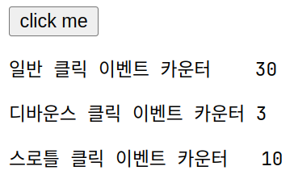
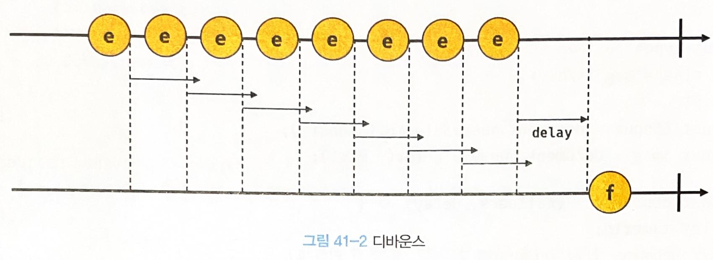

# chapter41 타이머

## 호출 스케줄링

호출 스케줄링 : 함수를 명시적으로 호출하지 않고 일정 시간이 경과된 이후에 호출하도록 함수 호출을 예약할 때 타이머 함수를 사용한다.

자바스크립트는 타이머를 생성할 수 있는 타이머 함수 `setTimeout`과 `setInterval`, 타이머를 제거할 수 있는 타이머 함수 `clearTimeout`과 `clearInterval`을 제공한다. 타이머 함수는 ECMAScript 사양에 정의된 빌트인 함수가 아니다. 하지만 브라우저 환경과 Node.js 환경에서 모두 전역 객체의 메서드로서 타이머 함수를 제공한다. 즉, 타이머 함수는 호스트 객체다.

`setTimeout`, `setInterval`이 생성한 타이머가 만료되면 콜백 함수가 호출된다.

* `setTimeout`
  * 타이머 : 단 한 번 동작
  * 콜백 함수 : 타이머가 만료되면 단 한 번 호출
* `setInterval`
  * 타이머 : 반복 동작
  * 타이머가 만료될 때마다 반복 호출

자바스크립트 엔진은 단 하나의 실행 컨텍스트 스택을 갖기 때문에 두 가지 이상의 태스크를 동시에 실행할 수 없다. 즉, 자바스크립트 엔진은 싱글 스레드로 동작한다. 이런 이유로 타이머 함수 `setTimeout`, `setInterval`은 비동기 처리방식으로 동작한다.

## 타이머 함수

### `setTimeout/clearTimeout`

```javascript
const timeoutId = setTimeout(func|code[, delay, param1, param2, ...]);
```

| 매개변수 | 설명 |
| --- | --- |
| `func` | 타이머가 만료된 뒤 호출될 콜백 함수 <br> * 콜백 함수 대신 코드 문자열로 전달할 수 있다. 이때 코드 문자열은 타이머가 만료된 뒤 해석되고 실행된다. 이는 흡사 eval 함수와 유사하며 권장하지는 않는다.|
| `delay` | 타이머 만료 시간(ms). `setTimeout` 함수는 `delay` 시간으로 단 한 번 동작하는 타이머를 생성한다. 인수 전달을 생략한 경우 기본값 0이 지정된다. <br> * `delay` 시간이 설정된 타이머가 만료되면 콜백 함수가 즉시 호출되는 거싱 보장되지는 않는다. `delay` 시간은 태스크 큐에 콜백 함수를 등록하는 시간을 지연할 뿐이다.  <br> * delay가 4ms 이하인 경우 최소 지연 시간 4ms가 지정된다.
| `param1`, `param2`, ... | 호출 스케줄링된 콜백 함수에 전달해야 할 인수가 존재하는 경우 세 번째 이후의 인수로 전달할 수 있다. <br> * IE9 이하에서는 콜백 함수에 인수를 전달할 수 없다. |

```js
// 41-01

// 1초(1000ms) 후 타이머가 만료되면 콜백 함수가 호출된다.
setTimeout(() => console.log('Hi!'), 1000);

// 1초(1000ms) 후 타이머가 만료되면 콜백 함수가 호출된다.
// 이때 콜백 함수에 'Lee'가 인수로 전달된다.
setTimeout(name => console.log(`Hi! ${name}.`), 1000, 'Lee');

// 두 번째 인수(delay)를 생략하면 기본값 0이 지정된다.
setTimeout(() => console.log('Hello!'));
```

`setTimeout` 함수는 생성된 타이머를 식별할 수 있는 고유한 타이머 `id`를 반환한다. `setTimeout` 함수가 반환한 타이머 `id`는 브라우저 환경인 경우 숫자이며, Node.js 환경인 경우 객체다.

`setINterval` 함수가 반환한 타이머 `id`를 `clearInterval` 함수의 인수로 전달하여 타이머를 취소할 수 있다. 즉, `clearInterval` 함수는 호출 스케줄링을 취소한다.

```js
// 41-03

let count = 1;

// 1초(1000ms) 후 타이머가 만료될 때마다 콜백 함수가 호출된다.
// setInterval 함수는 생성된 타이머를 식별할 수 있는 고유한 타이머 id를 반환한다.
const timeoutId = setInterval(() => {
  console.log(count); // 1 2 3 4 5
  // count가 5이면 setInterval 함수가 반환한 타이머 id를 clearInterval 함수의
  // 인수로 전달하여 타이머를 취소한다. 타이머가 취소되면 setInterval 함수의 콜백 함수가
  // 실행되지 않는다.
  if (count++ === 5) clearInterval(timeoutId);
}, 1000);
```

## 디바운스와 스로틀

디바운스와 스로틀은 짧은 시간 간격으로 연속해서 발생하는 이벤트를 그룹화해서 과도한 이벤트 핸들러의 호출을 방지하는 프로그래밍 기법이다.

```js
<!-- 41-04 -->

<!DOCTYPE html>
<html>
<body>
  <button>click me</button>
  <pre>일반 클릭 이벤트 카운터    <span class="normal-msg">0</span></pre>
  <pre>디바운스 클릭 이벤트 카운터 <span class="debounce-msg">0</span></pre>
  <pre>스로틀 클릭 이벤트 카운터   <span class="throttle-msg">0</span></pre>
  <script>
    const $button = document.querySelector('button');
    const $normalMsg = document.querySelector('.normal-msg');
    const $debounceMsg = document.querySelector('.debounce-msg');
    const $throttleMsg = document.querySelector('.throttle-msg');

    const debounce = (callback, delay) => {
      let timerId;
      return (...args) => {
        if (timerId) clearTimeout(timerId);
        timerId = setTimeout(callback, delay, ...args);
      };
    };

    const throttle = (callback, delay) => {
      let timerId;
      return (...args) => {
        if (timerId) return;
        timerId = setTimeout(() => {
          callback(...args);
          timerId = null;
        }, delay);
      };
    };

    $button.addEventListener('click', () => {
      $normalMsg.textContent = +$normalMsg.textContent + 1;
    });

    $button.addEventListener('click', debounce(() => {
      $debounceMsg.textContent = +$debounceMsg.textContent + 1;
    }, 500));

    $button.addEventListener('click', throttle(() => {
      $throttleMsg.textContent = +$throttleMsg.textContent + 1;
    }, 500));
  </script>
</body>
</html>
```



디바운스와 스로틀은 이벤트를 처리할 때 매우 유용하다. 디바운스와 스로틀 구현에는 타이머 함수가 사용된다. 

### 디바운스

짧은 시간 간격으로 이벤트가 연속해서 발생하면 이벤트 핸들러를 호출하지 않다가 일정 시간이 경과한 이후에 이벤트 핸들러가 한 번만 호출되도록 한다.

```js
<!DOCTYPE html>
<html>
<body>
  <input type="text">
  <div class="msg"></div>
  <script>
    const $input = document.querySelector('input');
    const $msg = document.querySelector('.msg');

    const debounce = (callback, delay) => {
      let timerId;
      // debounce 함수는 timerId를 기억하는 클로저를 반환한다.
      return (...args) => {
        // delay가 경과하기 이전에 이벤트가 발생하면 이전 타이머를 취소하고
        // 새로운 타이머를 재설정한다.
        // 따라서 delay보다 짧은 간격으로 이벤트가 발생하면 callback은 호출되지 않는다.
        if (timerId) clearTimeout(timerId);
        timerId = setTimeout(callback, delay, ...args);
      };
    };

    // debounce 함수가 반환하는 클로저가 이벤트 핸들러로 등록된다.
    // 300ms보다 짧은 간격으로 input 이벤트가 발생하면 debounce 함수의 콜백 함수는
    // 호출되지 않다가 300ms 동안 input 이벤트가 더 이상 발생하면 한 번만 호출된다.
    $input.oninput = debounce(e => {
      $msg.textContent = e.target.value;
    }, 300);
  </script>
</body>
</html>
```

`input` 이벤트는 사용자가 텍스트 입력 필드에 값을 입력할 때마다. 연속해서 발생한다. 만약 `input`의 이벤트 핸들러에서 사용자가 입력 필드에 입력한 값으로 Ajax 요청과 같은 무거운 처리를 수행한다면 사용자가 아직 입력을 완료하지 않았어도 Ajax 요청이 전송될 것이다. 이는 서버에도 부담을 주는 불필요한 처리이므로 사용자가 입력을 완료했을 때 한 번만 Ajax 요청을 전송하는 것이 바람직하다.

사용자가 입력을 완료했는지 여부는 정확히 알 수 없으므로 일정 시간동안 텍스트 입력 필드에 값을 입력하지 않으면 입력이 완료된 것으로 간주한다. 이를 위해 `debounce` 함수가 반환한 함수는 `debounce` 함수에 두 번째 인수로 전달한 시간(`delay`) 보다 짧은 간격으로 이벤트가 발생하면 이전 타이머를 취소하고 새로운 타이머를 재설정한다. 따라서 `delay`보다 짧은 간격으로 이벤트가 연속해서 발생하면 `debounce` 함수의 첫 번째 인수로 전달한 콜백 함수는 호출되지 않다가 `delay` 동안 `input` 이벤트가 더 이상 발생하지 않으면 한 번만 호출된다.



이처럼 짧은 시간 간격으로 이벤트가 연속해서 발생하면 이벤트 핸들러를 호출하지 않다가 일정 시간 동안 이벤트가 더 이상 발생하지 않으면 이벤트 핸들러가 한 번만 호출되도록 하는 디바운스는 `resize` 이벤트처리나 `input` 요소에 입력된 값으로 `ajax` 요청하는 입력 필드 자동완성(autocomplete) UI 구현, 버튼 중복 클릭 방지 처리 등에 유용하게 사용된다.

위 예제의 `debounce`는 이해를 위해 간략하게 구현하여 완전하지 않으므로 실무에서는 Underscore의 `debounce` 함수나 Lodash의 `debounce` 함수를 사용하는 것을 권장한다.

### 스로틀

**스로틀** : 짧은 시간 간격으로 연속해서 발생하는 이벤트를 그룹화해서 일정 시간 단위로 이벤트 핸들러가 호출되도록 호출 주기를 만든다.

```html
<!-- 41-06 -->

<!DOCTYPE html>
<html>
<head>
  <style>
    .container {
      width: 300px;
      height: 300px;
      background-color: rebeccapurple;
      overflow: scroll;
    }

    .content {
      width: 300px;
      height: 1000vh;
    }
  </style>
</head>
<body>
  <div class="container">
    <div class="content"></div>
  </div>
  <div>
    일반 이벤트 핸들러가 scroll 이벤트를 처리한 횟수:
    <span class="normal-count">0</span>
  </div>
  <div>
    스로틀 이벤트 핸들러가 scroll 이벤트를 처리한 횟수:
    <span class="throttle-count">0</span>
  </div>

  <script>
    const $container = document.querySelector('.container');
    const $normalCount = document.querySelector('.normal-count');
    const $throttleCount = document.querySelector('.throttle-count');

    const throttle = (callback, delay) => {
      let timerId;
      // throttle 함수는 timerId를 기억하는 클로저를 반환한다.
      return (...args) => {
        // delay가 경과하기 이전에 이벤트가 발생하면 아무것도 하지 않다가
        // delay가 경과했을 때 이벤트가 발생하면 새로운 타이머를 재설정한다.
        // 따라서 delay 간격으로 callback이 호출된다.
        if (timerId) return;
        timerId = setTimeout(() => {
          callback(...args);
          timerId = null;
        }, delay);
      };
    };

    let normalCount = 0;
    $container.addEventListener('scroll', () => {
      $normalCount.textContent = ++normalCount;
    });

    let throttleCount = 0;
    // throttle 함수가 반환하는 클로저가 이벤트 핸들러로 등록된다.
    $container.addEventListener('scroll', throttle(() => {
      $throttleCount.textContent = ++throttleCount;
    }, 100));
  </script>
</body>
</html>
```

`scroll` 이벤트는 사용자가 스크롤할 때 짧은 시간 간격으로 연속해서 발생한다. 이처럼 짧은 시간 간격으로 연속해서 발생하는 이벤트의 과도한 이벤트 핸들러의 호출을 방지하기 위해 `throttle` 함수는 이벤트를 그룹화해서 일정 시간 단위로 이벤트 핸들러가 호출되도록 호출 주기를 만든다.

`throttle` 함수가 반환한 함수는 `throttle` 함수에 두 번째 인수로 전달한 시간(`delay`)이 경과하기 이전에 이벤트가 발생하면 아무것도 하지 않다가 `delay` 시간이 경과했을 때 이벤트가 발생하면 콜백 함수를 호출하고 새로운 타이머를 재설정한다. 따라서 `delay` 시간 간격으로 콜백 함수가 호출된다.


위 예제의 `throttle`는 이해를 위해 간략하게 구현하여 완전하지 않으므로 실무에서는 Underscore의 `throttle` 함수나 Lodash의 `throttle` 함수를 사용하는 것을 권장한다.