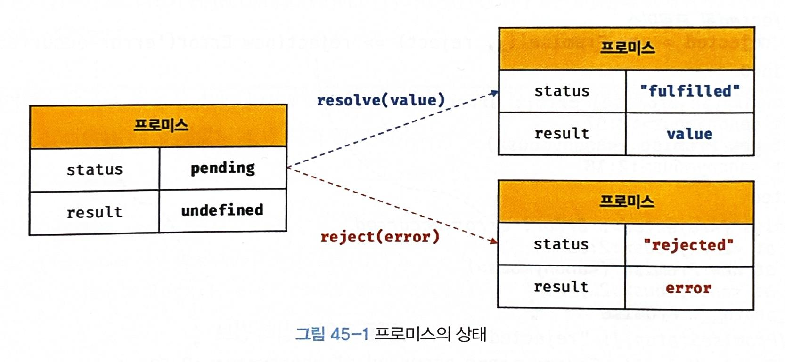
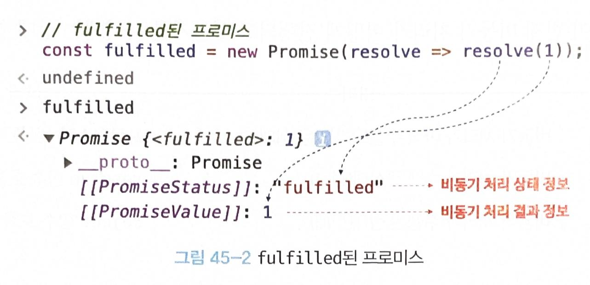
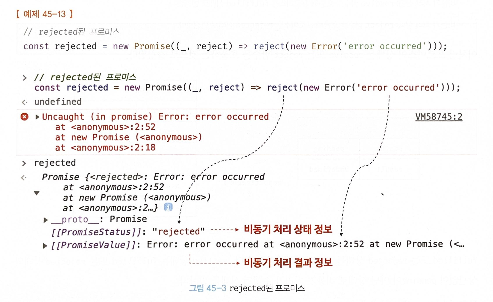
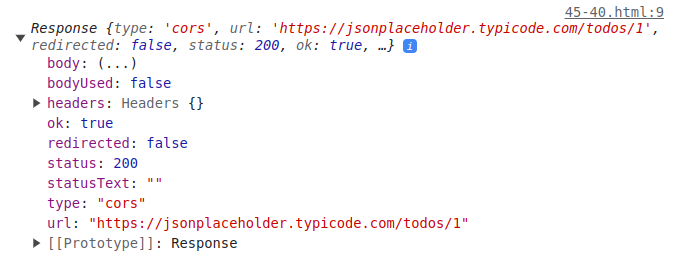

# chapter45 프로미스

## 비동기 처리를 위한 콜백 패턴의 단점

### 콜백 헬

```html
<!-- 45-01 -->

<!DOCTYPE html>
<html>

<body>
    <pre></pre>
    <script>
        // 45-01

        // GET 요청을 위한 비동기 함수
        const get = url => {
            const xhr = new XMLHttpRequest();
            xhr.open('GET', url);
            xhr.send();

            xhr.onload = () => {
                if (xhr.status === 200) {
                    // 서버의 응답을 콘솔에 출력한다.
                    console.log(JSON.parse(xhr.response));
                } else {
                    console.error(`${xhr.status} ${xhr.statusText}`);
                }
            };
        };

        // id가 1인 post를 취득
        get('https://jsonplaceholder.typicode.com/posts/1');
        /*
        {
          "userId": 1,
          "id": 1,
          "title": "sunt aut facere ...",
          "body": "quia et suscipit ..."
        }
        */
    </script>
</body>

</html>
```

위 예제의 `get` 함수는 서버의 응답 결과를 콘솔에 출력한다. `get` 함수가 서버의 응답 결과를 반환하게 하려면 어떻게 하면 될까?

`get` 함수는 비동기 함수다. 비동기 함수를 호출하면 함수 내부의 비동기로 동작하는 코드가 완료되지 않았다 해도 기다리지 않고 즉시 종료된다. 따라서 비동기 함수 내부의 비동기로 동작하는 코드에서 처리 결과를 외부로 반환하거나 상위 스코프의 변수에 할당하면 기대한 대로 동작하지 않는다.

```js
// 45-02

let g = 0;

// 비동기 함수인 setTimeout 함수는 콜백 함수의 처리 결과를 외부로 반환하거나
// 상위 스코프의 변수에 할당하지 못한다.
setTimeout(() => { g = 100; }, 0);
console.log(g); // 0
```

GET 요청을 전송하고 서버의 응답을 전달받는 `get` 함수도 비동기 함수다. `get` 함수가 비동기 함수인 이유는 `get` 함수 내부의 `onload` 이벤트 핸들러가 비동기로 동작하기 때문이다. `get` 함수를 호출하면 `GET` 요청을 전송하고 `onload` 이벤트 핸들러는 `get` 함수가 종료된 이후에 실행된다.

`get` 함수가 서버의 응답 결과를 반환하도록 수정해보자.

```html
<!-- 45-03 -->

<!DOCTYPE html>
<html>

<body>
    <pre></pre>
    <script>
        // GET 요청을 위한 비동기 함수
        const get = url => {
            const xhr = new XMLHttpRequest();
            xhr.open('GET', url);
            xhr.send();

            xhr.onload = () => {
                if (xhr.status === 200) {
                    // ① 서버의 응답을 반환한다.
                    return JSON.parse(xhr.response);
                }
                console.error(`${xhr.status} ${xhr.statusText}`);
            };
        };

        // ② id가 1인 post를 취득
        const response = get('https://jsonplaceholder.typicode.com/posts/1');
        console.log(response); // undefined
    </script>
</body>

</html>
```

1. `get` 함수 호출
2. `XMLHttpRequest` 객체 생성
3. HTTP 요청 초기화
4. HTTP 요청 전송
5. `xhr.onload` 햄들러 프로퍼티에 이벤트 핸들러를 바인딩하고 종료.
   1. 이때 `get` 함수에 명시적인 반환문이 없으므로 `get` 함수는 `undefined`를 반환(②)

`xhr.onload` 이벤트 핸들러 프로퍼티에 바인딩한 이벤트 핸들러의 반환문(①)은 `get` 함수의 반환문이 아니다. `get` 함수는 반환문이 생략되었으므로 암묵적으로 `undefined`를 반환한다. 함수의 반환값은 명시적으로 호출한 다음에 캐치할 수 있으므로 `onload` 이벤트 핸들러를 `get` 함수가 호출할 수 있다면 이벤트 핸들러의 반환값을 `get` 함수가 캐치하여 다시 반환할 수도 있겠지만 `onload` 이벤트 핸들러는 `get` 함수가 호출하지 않기 때문에 그럴 수도 없다. 따라서 `onload` 이벤트 핸들러의 반환값은 캐치할 수 없다.

```html
<!-- 45-04 -->

<!DOCTYPE html>
<html>

<body>
    <input type="text">
    <script>
        document.querySelector('input').oninput = function () {
            console.log(this.value);
            // 이벤트 핸들러에서의 반환은 의미가 없다.
            return this.value;
        };
    </script>
</body>

</html>
```

① 에서 서버의 응답을 사우이 스코프의 변수에 할당하면 어떨까?

```html
<!-- 45-05 -->

<!DOCTYPE html>
<html>

<body>
    <input type="text">
    <script>
        let todos;

        // GET 요청을 위한 비동기 함수
        const get = url => {
            const xhr = new XMLHttpRequest();
            xhr.open('GET', url);
            xhr.send();

            xhr.onload = () => {
                if (xhr.status === 200) {
                    // ① 서버의 응답을 상위 스코프의 변수에 할당한다.
                    todos = JSON.parse(xhr.response);
                } else {
                    console.error(`${xhr.status} ${xhr.statusText}`);
                }
            };
        };

        // id가 1인 post를 취득
        get('https://jsonplaceholder.typicode.com/posts/1');
        console.log(todos); // ② undefined
    </script>
</body>

</html>
```

이 또한 기대한 대로 동작하지 않는다. `xhr.onload` 이벤트 핸들러 프로퍼티에 바인딩한 이벤트 핸들러는 언제나 ②의 시점에는 아직 전역변수 `todos`에 서버의 응답 결과가 할당되기 이전이다.

비동기 함수 `get`이 호출되면 함수 코드를 평가하는 과정에서 `get` 함수의 실행 컨텍스트가 생성되고 실행 컨텍스트 스택(콜 스택)에 푸시된다. 이후 함수 코드 실행 과정에서 `xhr.onload` 이벤트 핸들러 프로퍼티에 이벤트 핸들러가 바인딩된다.

`get` 함수가 종료하면 `get` 함수의 실행 컨텍스트가 콜 스택에서 팝되고 곧바로 ②의 `console.log`가 호출된다. 이때 `console.log`의 실행 컨텍스트가 생성되어 실행 컨텍스트 스택에 푸시된다. 만약 `console.log`가 호출되기 직전에 `load` 이벤트가 발생했더라도 `xhr.onload` 이벤트 핸들러 프로퍼티에 바인딩한 이벤트 핸들러는 결코 `console.log`보다 먼저 실행되지 않는다.

서버로부터 응답이 도착하면 `xhr` 객체에서 `load` 이벤트가 발생한다. 이때 `xhr.onload` 핸들러 프로퍼티에 바인딩한 이벤트가 즉시 실행되는 것이 아니다. `xhr.onload` 이벤트 핸들러는 `load` 이벤트가 발생하면 일단 태스크 큐에 저장되어 대기하다가, 콜 스택이 비면 이벤트 루프에 의해 콜 스택으로 푸시되어 실행된다. 

이벤트 핸들러도 함수이므로 아래와 같은 과정을 거친다.
1. 이벤트 핸들러의 평가
2. 이벤트 핸들러의 실행 컨텍스트 생성
3. 콜 스택에 푸시
4. 이벤트 핸들러 실행

따라서 `xhr.onload` 이벤트 핸들러가 실행되는 시점에는 콜 스택이 빈 상태여야 하므로 ②의 `console.log`는 이미 종료된 이후다. 만약 `get` 함수 이후에 `console.log`가 100번 호출된다 해도 `xhr.onload` 이벤트 핸들러는 모든 `console.log`가 종료한 이후에 실행된다. 즉, `xhr.onload` 이벤트 핸들러에서 상위 스코프 변수에 서버의 응답 결과를 할당하기 이전에 `console.log`가 먼저 호출되어 `undefined`가 출력된다.

이처럼 비동기 함수는 비동기 처리 결과를 외부에 반환할 수 있고, 상위 스코프의 변수에 할당할 수도 없다. 따라서 비동기 함수의 처리 결과(서버의 응답 등)에 대한 후속 처리는 비동기 함수 내부에서 수행해야 한다. 이때 비동기 함수를 범용적으로 사용하기 위해 비동기 함수에 비동기 처리 결과에 대한 후속 처리를 수행하는 콜백 함수를 전달하는 것이 일반적이다. 필요에 따라 비동기 처리가 성공하면 호출될 콜백 함수와 비동기 처리가 실패하면 호출될 콜백 함수를 전달할 수 있다.

```html
<!-- 45-06 -->

<!DOCTYPE html>
<html>

<body>
    <input type="text">
    <script>
        // GET 요청을 위한 비동기 함수
        const get = (url, successCallback, failureCallback) => {
            const xhr = new XMLHttpRequest();
            xhr.open('GET', url);
            xhr.send();

            xhr.onload = () => {
                if (xhr.status === 200) {
                    // 서버의 응답을 콜백 함수에 인수로 전달하면서 호출하여 응답에 대한 후속 처리를 한다.
                    successCallback(JSON.parse(xhr.response));
                } else {
                    // 에러 정보를 콜백 함수에 인수로 전달하면서 호출하여 에러 처리를 한다.
                    failureCallback(xhr.status);
                }
            };
        };

        // id가 1인 post를 취득
        // 서버의 응답에 대한 후속 처리를 위한 콜백 함수를 비동기 함수인 get에 전달해야 한다.
        get('https://jsonplaceholder.typicode.com/posts/1', console.log, console.error);
        /*
        {
          "userId": 1,
          "id": 1,
          "title": "sunt aut facere ...",
          "body": "quia et suscipit ..."
        }
        */
    </script>
</body>

</html>
```

이처럼 콜백 함수를 통해 비동기 처리 결과에 대한 후속 처리를 수행하는 비동기 함수가 비동기 처리 결과를 가지고 또다시 비동기 함수를 호출해야 한다면 콜백 함수 호출이 중첩되어 복잡도가 높아지는 현상이 발생하는데, 이를 콜백 헬(callback hell)이라 한다.

```html
<!-- 45-07 -->

<!DOCTYPE html>
<html>

<body>
    <input type="text">
    <script>
        // GET 요청을 위한 비동기 함수
        const get = (url, callback) => {
            const xhr = new XMLHttpRequest();
            xhr.open('GET', url);
            xhr.send();

            xhr.onload = () => {
                if (xhr.status === 200) {
                    // 서버의 응답을 콜백 함수에 전달하면서 호출하여 응답에 대한 후속 처리를 한다.
                    callback(JSON.parse(xhr.response));
                } else {
                    console.error(`${xhr.status} ${xhr.statusText}`);
                }
            };
        };

        const url = 'https://jsonplaceholder.typicode.com';

        // id가 1인 post의 userId를 취득
        get(`${url}/posts/1`, ({ userId }) => {
            console.log(userId); // 1
            // post의 userId를 사용하여 user 정보를 취득
            get(`${url}/users/${userId}`, userInfo => {
                console.log(userInfo); // {id: 1, name: "Leanne Graham", username: "Bret",...}
            });
        });
    </script>
</body>

</html>
```

위 예제를 보면 GET 요청을 통해 서버로부터 응답(`id`가 1인 `post`)을 취득하고 이 데이터를 사용하여 또 다시 GET 요청을 한다. 콜백 헬은 가독성을 나쁘게 하여 실수를 유발하는 원인이 된다. 다음은 콜백 헬이 발생하는 전형적인 사례다.

```js
get('/step1', a => {
  get(`/step2/${a}`, b => {
    get(`/step3/${b}`, c => {
      get(`/step4/${c}`, d => {
        console.log(d);
      });
    });
  });
});
```

### 에러 처리의 한계

---
**try...catch...finally 문**

`try...catch...finally` 문은 에러 처리를 구현하는 방법이다. `try...catch..finally` 문을 실행하면 먼저 `try` 블록이 실행된다. 이때 `try` 코드 블록에 포함된 문 중에서 에러가 발생하면 해당 에러는 `catch` 문의 `err` 변수에 전달되고 `catch` 코드 블록이 실행된다. `finally` 코드 블록은 에러 발생과 상관없이 반드시 한 번 실행된다. `try...catch..finally` 문으로 에러를 처리하면 프로그램이 강제 종료되지 않는다.

---

```js
try {
  setTimeout(() => { throw new Error('Error!'); }, 1000);
} catch (e) {
  // 에러를 캐치하지 못한다
  console.error('캐치한 에러', e);
}
```

`try` 코드 블록 내에서 호출한 `setTimeout` 함수는 1초 후에 콜백 함수가 실행되도록 타이머를 설정하고, 이후 콜백 함수는 에러를 발생시킨다. 하지만 이 에러는 `catch` 코드 블록에서 캐치되지 않는다.

비동기 함수인 `setTimeout`이 호출되면 `setTimeout` 함수의 실행 컨텍스트가 생성되어 콜 스택에 푸시되어 실행된다. `setTimeout`은 비동기 함수이므로 콜백 함수가 호출되는 것을 기다리지 않고 즉시 종료되어 콜 스택에서 제거된다. 이후 타이머가 만료되면 `setTimeout` 함수의 콜백 함수는 태스크 큐로 푸시되고 콜 스택이 비어졌을 때 이벤트 루프에 의해 콜 스택으로 푸시되어 실행된다.

`setTimeout` 함수의 콜백 함수가 실행될 때 `setTimeout` 함수는 이미 콜 스택에서 제거된 상태다. 이것은 `setTimeout` 함수의 콜백 함수를 호출한 것이 `setTimeout` 함수가 아니라는 것을 의미한다. `setTimeout` 함수의 콜백 함수의 호출자(caller)가 `setTimeout` 함수라면 콜 스택의 현재 실행 중인 실행 컨텍스트가 콜백 함수의 실행 컨텍스트일 때 현재 실행 중인 실행 컨텍스트의 하위 실행 컨텍스트가 `setTimeout` 함수여야 한다.

에러는 호출자(caller) 방향으로 전파도니다. 즉, 콜 스택의 아래 방향(실행 중인 실행 컨텍스트가 푸시되기 직전에 푸시된 실행 컨텍스트 방향)으로 전파된다. 하지만 앞에서 살펴본 바와 같이 `setTimeout` 함수의 콜백 함수를 호출한 것은 `setTimeout` 함수가 아니다. 따라서 `setTimeout` 함수의 콜백 함수가 발생시킨 에러는 `catch` 블록에서 캐치되지 않는다.

## 프로미스의 생성
`Promise` 생성자 함수를 `new` 연산자와 함께 호출하면 프로미스(`Promise` 객체)를 생성한다. ES6에서 도입된 `Promise`는 호스트 객체가 아닌 ECMAScript 사양에 정의된 표준 빌트인 객체다.

`Promise` 생성자 함수는 비동기 처리를 수행할 콜백 함수를 인수로 전달받는데 이 콜백 함수는 `resolve`와 `reject` 함수를 인수로 전달받는다.

```js
// 45-10

// 프로미스 생성
const promise = new Promise((resolve, reject) => {
    // Promise 함수의 콜백 함수 내부에서 비동기 처리를 수행한다.
    if (/* 비동기 처리 성공 */) {
        resolve('result');
    } else { /* 비동기 처리 실패 */
        reject('failure reason');
    }
});
```

`Promise` 생성자 함수가 인수로 전달받은 콜백 함수 내부에서 비동기 처리를 수행한다. 이때 비동기 처리가 성공하면 콜백 함수의 인수로 전달받은 `resolve` 함수를 호출하고, 비동기 처리가 실패하면 `reject` 함수를 호출한다. 앞에서 살펴본 비동기 함수 `get`을 프로미스를 사용해 다시 구현해 보자.

```html
<!-- 45-11 -->

<!DOCTYPE html>
<html>

<body>
    <input type="text">
    <script>
        // GET 요청을 위한 비동기 함수
        const promiseGet = url => {
            return new Promise((resolve, reject) => {
                const xhr = new XMLHttpRequest();
                xhr.open('GET', url);
                xhr.send();

                xhr.onload = () => {
                    if (xhr.status === 200) {
                        // 성공적으로 응답을 전달받으면 resolve 함수를 호출한다.
                        resolve(JSON.parse(xhr.response));
                    } else {
                        // 에러 처리를 위해 reject 함수를 호출한다.
                        reject(new Error(xhr.status));
                    }
                };
            });
        };

        // promiseGet 함수는 프로미스를 반환한다.
        promiseGet('https://jsonplaceholder.typicode.com/posts/1');
    </script>
</body>

</html>
```

비동기 함수인 `promiseGet`은 함수 내부에서 프로미스를 생성하고 반환한다. 비동기 처리는 `Promise` 생성자 함수가 인수로 전달받은 콜백 함수 내부에서 수행한다. 만약 비동기 처리가 성공하면 비동기 처리 결과를 `resolve` 함수에 인수로 전달하면서 호출하고, 비동기 처리가 실패하면 에러를 `reject` 함수에 인수로 전달하면서 호출한다.

프로미스는 다음과 같이 현재 비동기 처리가 어떻게 진행되고 있는지를 나타내는 상태(state) 정보를 갖는다.

| 프로미스의 상태 정보 | 의미 | 상태 변경 조건 |
| --- | --- | --- |
| `pending` | 비동기 처리가 아직 수행되지 않은 상태 | 프로미스가 생성된 직후 기본 상태 |
| `fulfilled` | 비동기 처리가 수행된 상태(성공) | `resolve` 함수 호출 |
| `rejected` | 비동기 처리가 수행된 상태(실패) | `reject` 함수 호출 |

생성된 직후의 프로미스는 기본적으로 `pending` 상태다. 이후 비동기 처리가 수행되면 비동기 처리 결과에 따라 다음과 같이 프로미스의 상태가 변경된다.

* 비동기 처리 성공: `resolve` 함수를 호출해 프로미스를 `fulfilled` 상태로 변경한다.
* 비동기 처리 실패: `reject` 함수를 호출해 프로미스를 `rejected` 상태로 변경한다.

이처럼 프로미스의 상태는 `resolve` 또는 `reject` 함수를 호출하는 것으로 결정된다.



`fulfilled` 또는 `rejected` 상태를 `settled` 상태라고 한다. `settled` 상태는 `fulfilled` 또는 `rejected` 상태와 상관없이 `pending`이 아닌 상태로 비동기 처리가 수행된 상태를 말한다.

프로미스는 `pending` 상태에서 `fulfilled` 또는 `rejected` 상태, 즉 `settled` 상태로 변화할 수 있다, 하지만 일단 `settled` 상태가 되면 더는 상태로 변화할 수 없다.

프로미스는 비동기 처리 상태와 더불어 비동기 처리 결과(위 그림의 `result`)도 상태로 갖는다. 

```js
// 45-12

// fulfilled된 프로미스
const fulfilled = new Promise(resolve => resolve(1));
```



비동기 처리가 성공하면 프로미스는 `pending` 상태에서 `fulfilled` 상태로 변화한다. 그리고 비동기 처리 결과인 1을 값으로 갖는다.



비동기 처리가 실패하면 프로미스는 `pending` 상태에서 `rejected` 상태로 변화한다. 그리고 비동기 처리 결과인 `Error` 객체를 값으로 갖는다. 즉, 프로미스는 비동기 처리 상태와 처리 결과를 관리하는 객체다.

## 프로미스의 후속 처리 메서드

프로미스의 비동기 처리 상태가 변화하면 후속 처리 메서드에 인수로 전달한 콜백 함수가 선택적으로 호출된다. 이때 후속 처리 메서드의 콜백 함수에 프로미스의 처리 결과가 인수로 전달된다.

모든 후속 처리 메서드는 프로미스를 반환하며, 비동기로 동작한다.

### `Promise.prototype.then`

`then` 메서드는 두 개의 콜백 함수를 인수로 전달받는다.
* 첫 번째 콜백 함수는 프로미스가 `fulfilled` 상태(`resolve` 함수가 호출된 상태, 비동기 처리 성공)가 되면 호출된다. 이때 콜백 함수는 프로미스의 비동기 처리 결과를 인수로 전달받는다.
* 두 번째 콜백 함수는 프로미스가 `rejected` 상태(`reject` 함수가 호출된 상태, 비동기 처리 실패)가 되면 호출된다. 이때 콜백 함수는 프로미스의 에러를 인수로 전달받는다.

```js
// 45-14

// fulfilled
new Promise(resolve => resolve('fulfilled'))
    .then(v => console.log(v), e => console.error(e)); // fulfilled

// rejected
new Promise((_, reject) => reject(new Error('rejected')))
    .then(v => console.log(v), e => console.error(e)); // Error: rejected
```

`then` 메서드는 언제나 프로미스를 반환한다. 만약 `then` 메서드의 콜백 함수가 프로미스를 반환하면 그 프로미스를 그대로 반환하고, 콜백 함수가 프로미스가 아닌 값을 반환하면 그 값을 암묵적으로 `resolve` 또는 `reject` 하여 프로미스를 생성해 반환한다.

### `Promise.prototype.catch`

`catch` 메서드는 한 개의 콜백 함수를 인수로 전달받는다. `catch` 메서드의 콜백 함수는 프로미스가 `rejected` 상태인 경우만 호출된다.

```js
// 45-15

// rejected
new Promise((_, reject) => reject(new Error('rejected')))
    .catch(e => console.log(e)); // Error: rejected
```

`catch` 메서드는 `then(undefined, onRejected)`과 동일하게 동작한다. 따라서 `then` 메서드와 마찬가지로 언제나 프로미스를 반환한다.

```js
// 45-16

// rejected
new Promise((_, reject) => reject(new Error('rejected')))
    .then(undefined, e => console.log(e)); // Error: rejected
```

### `Promise.protytpe.finally`

`finally` 메서드는 한 개의 콜백 함수를 인수로 전달받는다. `finally` 메서드의 콜백 함수는 프로미스의 성공(`fulfilled`) 또는 실패(`rejected`)와 상관없이 무조건 한 번 호출된다. `finally` 메서드는 프로미스의 상태와 상관없이 공통적으로 수행해야 할 처리 내용이 있을 때 유용하다. `finally` 메서드도 `then/catch` 메서드와 마찬가지로 언제나 프로미스를 반환한다.

```js
// 45-17

new Promise(() => { })
    .finally(() => console.log('finally')); // finally
```

프로미스로 구현한 비동기 함수 `get`을 사용한 후속 처리

```html
<!-- 45-18 -->

<!DOCTYPE html>
<html>

<body>
    <script>
        const promiseGet = url => {
            return new Promise((resolve, reject) => {
                const xhr = new XMLHttpRequest();
                xhr.open('GET', url);
                xhr.send();

                xhr.onload = () => {
                    if (xhr.status === 200) {
                        // 성공적으로 응답을 전달받으면 resolve 함수를 호출한다.
                        resolve(JSON.parse(xhr.response));
                    } else {
                        // 에러 처리를 위해 reject 함수를 호출한다.
                        reject(new Error(xhr.status));
                    }
                };
            });
        };

        // promiseGet 함수는 프로미스를 반환한다.
        promiseGet('https://jsonplaceholder.typicode.com/posts/1')
            .then(res => console.log(res))
            .catch(err => console.error(err))
            .finally(() => console.log('Bye!'));
    </script>
</body>

</html>
```

## 프로미스의 에러 처리

비동기 처리 결과에 대한 후속 처리는 프로미스가 제공하는 후속 처리 메서드 `then`, `catch`, `finally`를 사용하여 수행한다. 비동기 처리에서 발생한 에러는 `then` 메서드의 두 번째 콜백 함수로 처리할 수 있다.

```js
// 45-19

const wrongUrl = 'https://jsonplaceholder.typicode.com/XXX/1';

// 부적절한 URL이 지정되었기 때문에 에러가 발생한다.
promiseGet(wrongUrl).then(
    res => console.log(res),
    err => console.error(err)
); // Error: 404
```

비동기 처리에서 발생한 에러는 프로미스의 후속 처리 메서드 `catch` 를 사용해 처리할 수도 있다.

```js
// 45-20

const wrongUrl = 'https://jsonplaceholder.typicode.com/XXX/1';

// 부적절한 URL이 지정되었기 때문에 에러가 발생한다.
promiseGet(wrongUrl)
    .then(res => console.log(res))
    .catch(err => console.error(err)); // Error: 404
```

`catch` 메서드를 호출하면 내부적으로 `then(undefined, onRejected)`을 호출한다. 따라서 위 예제는 내부적으로 다음과 같이 처리된다.

```js
// 45-21

const wrongUrl = 'https://jsonplaceholder.typicode.com/XXX/1';

// 부적절한 URL이 지정되었기 때문에 에러가 발생한다.
promiseGet(wrongUrl)
    .then(res => console.log(res))
    .then(undefined, err => console.error(err)); // Error: 404
```

단, `then` 메서드의 두 번째 콜백 함수는 첫 번째 콜백 함수에서 발생한 에러를 캐치하지 못하고 코드가 복잡해져서 가독성이 좋지 않다.

```js
// 45-22

promiseGet('https://jsonplaceholder.typicode.com/todos/1').then(
    res => console.xxx(res),
    err => console.error(err)
); // 두 번째 콜백 함수는 첫 번째 콜백 함수에서 발생한 에러를 캐치하지 못한다.
```

`catch` 메서드를 모든 `then` 메서드를 호출한 이후에 호출하면 비동기 처리에서 발생한 에러(`reject` 상태)뿐만 아니라 `then` 메서드 내부에서 발생한 에러까지 모두 캐치할 수 있다.

```js
// 45-23

promiseGet('https://jsonplaceholder.typicode.com/todos/1')
    .then(res => console.xxx(res))
    .catch(err => console.error(err)); // TypeError: console.xxx is not a function
```

또한 `then` 메서드에 두 번째 콜백 함수를 전달하는 것보다 `catch` 메서드를 사용하는 것이 가독성이 좋고 명확하다. 따라서 에러 처리는 `then` 메서드에 하지 말고 `catch` 메서드에서 하는 것을 권장한다.

## 프로미스 체이닝

```js
// 45-24

const url = 'https://jsonplaceholder.typicode.com';

// id가 1인 post의 userId를 취득
promiseGet(`${url}/posts/1`)
    // 취득한 post의 userId로 user 정보를 취득
    .then(({ userId }) => promiseGet(`${url}/users/${userId}`))
    .then(userInfo => console.log(userInfo))
    .catch(err => console.error(err));
```

위 예제에서 `then`→ `then` → `catch` 순서로 후속 처리 메서드를 호출했다. `then`, `catch`, `finally` 후속 처리 메서드는 언제나 프로미스를 반환하므로 연속적으로 호출할 수 있다. 이를 프로미스 체이닝(promise chaning)이라 한다.

후속 처리 메서드의 콜백 함수는 프로미스의 비동기 처리 상태가 변경되면 선택적으로 호출된다. 위 예제에서 후속 처리 메서드의 콜백 함수는 다음과 같이 인수를 전달받으면서 호출된다.

| 후속 처리 메서드 | 콜백 함수의 인수 | 후속 처리 메서드의 반환값 |
| --- | --- | --- |
| `then` | `promiseGet` 함수가 반환한 프로미스가 resolve한 값(`id`가 1인 `post`) | 콜백 함수가 반환한 프로미스 |
| `then` | 첫 번째 `then` 메서드가 반환한 프로미스가 resolve한 값(post의 `userId`)로 취득한 user 정보 | 콜백 함수가 반환한 값(`undefined`)을 resolve한 프로미스 |
| `catch` <br> * 에러가 발생하지 않으면 호출되지 않는다. | `promiseGet` 함수 또는 앞선 후속 처리 메서드가 반환한 프로미스가 reject한 값 | 콜백 함수가 반환한 값(`undefined`)을 resolve한 프로미스 |

이처럼 `then`, `catch`, `finally` 후속 처리 메서드는 콜백 함수가 반환한 프로미스를 반환한다. 만약 후속 처리 메서드의 콜백 함수가 프로미스가 아닌 값을 반환하더라도 그 값을 암묵적으로 `resolve` 또는 `reject`하여 프로미스를 생성해 반환한다.

프로미스는 프로미스 체이닝을 통해 비동기 처리 결과를 전달받아 후속 처리를 하므로 비동기 처리를 위한 콜백 패턴에서 발생하던 콜백 헬이 발생하지 않는다. 다만 프로미스도 콜백 패턴을 사용하므로 콜백 함수를 사용하지 않는 것은 아니다.

가독성 문제는 ES8에서 도입된 `async/await`을 통해 해결할 수 있다. `async/awati`를 사용하면 프로미스의 후속 처리 메서드 없이 마치 동기 처리처럼 프로미스가 처리 결과를 반환하도록 구현할 수 있다.

```html
<!-- 45-25 -->

<!DOCTYPE html>
<html>

<body>
    <input type="text">
    <script>
        const url = 'https://jsonplaceholder.typicode.com';

        (async () => {
            // id가 1인 post의 userId를 취득
            const { userId } = await promiseGet(`${url}/posts/1`);

            // 취득한 post의 userId로 user 정보를 취득
            const userInfo = await promiseGet(`${url}/users/${userId}`);

            console.log(userInfo);
        })();
    </script>
</body>

</html>
```

## 프로미스의 정적 메서드

### `Promise.resolve` / `Promise.reject`

이미 존재하는 값을 래핑하여 프로미스를 생성하기 위해 사용한다.

`Promise.resolve` : 인수로 전달받은 값을 `resolve` 하는 프로미스를 생성한다.

```js
// 45-26

// 배열을 resolve하는 프로미스를 생성
const resolvedPromise = Promise.resolve([1, 2, 3]);
resolvedPromise.then(console.log); // [1, 2, 3]
```

```js
// 45-27

const resolvedPromise = new Promise(resolve => resolve([1, 2, 3]));
resolvedPromise.then(console.log); // [1, 2, 3]
```

`Promise.reject` 메서드는 인수로 전달받은 값을 `reject`하는 프로미스를 생성한다.

```js
// 45-28

// 에러 객체를 reject하는 프로미스를 생성
const rejectedPromise = Promise.reject(new Error('Error!'));
rejectedPromise.catch(console.log); // Error: Error!
```

```js
// 45-29

const rejectedPromise = new Promise((_, reject) => reject(new Error('Error!')));
rejectedPromise.catch(console.log); // Error: Error!
```

### `Promise.all`

`Promise.all` 메서드는 여러 개의 비동기 처리를 모두 병렬 처리할 때 사용한다.

```js
// 45-30

const requestData1 = () => new Promise(resolve => setTimeout(() => resolve(1), 3000));
const requestData2 = () => new Promise(resolve => setTimeout(() => resolve(2), 2000));
const requestData3 = () => new Promise(resolve => setTimeout(() => resolve(3), 1000));

// 세 개의 비동기 처리를 순차적으로 처리
const res = [];
requestData1()
    .then(data => {
        res.push(data);
        return requestData2();
    })
    .then(data => {
        res.push(data);
        return requestData3();
    })
    .then(data => {
        res.push(data);
        console.log(res); // [1, 2, 3] ⇒ 약 6초 소요
    })
    .catch(console.error);
```

위 예제는 세 개의 비동기 처리를 순차적으로 처리한다. 각각 3, 2, 1초씩 6초 이상이 소요된다.

`Promise.all` 메서드를 사용해 세 개의 비동기 처리를 병렬로 처리해보자

```js
// 45-31

const requestData1 = () => new Promise(resolve => setTimeout(() => resolve(1), 3000));
const requestData2 = () => new Promise(resolve => setTimeout(() => resolve(2), 2000));
const requestData3 = () => new Promise(resolve => setTimeout(() => resolve(3), 1000));

Promise.all([requestData1(), requestData2(), requestData3()])
    .then(console.log) // [ 1, 2, 3 ] ⇒ 약 3초 소요
    .catch(console.error);
```

`Promise.all` 메서드는 프로미스를 요소로 갖는 배열 등의 이터러블을 인수로 전달받는다. 그리고 전달받은 모든 프로미스가 모두 `fulfilled` 상태가 되면 모든 처리 결과를 배열에 저장해 새로운 프로미스를 반환한다.

이때 첫 번째 프로미스가 가장 나중에 `fulfilled` 상태가 되어도 `Promise.all` 메서드는 첫 번째 프로미스가 `resolve`한 처리 결과부터 차례대로 배열에 저장해 그 배열을 `resolve`하는 새로운 프로미슬 반환한다.

`Promise.all` 메서드는 인수로 전달받은 프로미스가 하나라도 `rejected` 상태가 되면 나머지 프로미스가 `fulfilled` 상태가 되는 것을 기다리지 않고 즉시 종료한다.

```js
// 45-32

Promise.all([
    new Promise((_, reject) => setTimeout(() => reject(new Error('Error 1')), 3000)),
    new Promise((_, reject) => setTimeout(() => reject(new Error('Error 2')), 2000)),
    new Promise((_, reject) => setTimeout(() => reject(new Error('Error 3')), 1000))
])
    .then(console.log)
    .catch(console.log); // Error: Error 3
```

위 예제의 경우 세 번째 프로미스가 가장 먼저 `rejected` 상태가 되므로 세 번째 프로미스가 `reject`한 에러가 `catch` 메서드로 전달된다.

`Promise.all` 메서드는 인수로 전달받은 이터러블의 요소가 프로미스가 아닌 경우 `Promise.resolve` 메서드를 통해 프로미스로 래핑한다.

```js
// 45-33

Promise.all([
    1, // => Promise.resolve(1)
    2, // => Promise.resolve(2)
    3  // => Promise.resolve(3)
])
    .then(console.log) // [1, 2, 3]
    .catch(console.log);
```

깃허브 사용자 이름을 취득하는 3개의 비동기 처리를 모두 병렬로 처리하는 예제

```html
// 45-34

<!DOCTYPE html>
<html>

<body>
  <input type="text">
  <script>
    // GET 요청을 위한 비동기 함수
    const promiseGet = url => {
      return new Promise((resolve, reject) => {
        const xhr = new XMLHttpRequest();
        xhr.open('GET', url);
        xhr.send();

        xhr.onload = () => {
          if (xhr.status === 200) {
            // 성공적으로 응답을 전달받으면 resolve 함수를 호출한다.
            resolve(JSON.parse(xhr.response));
          } else {
            // 에러 처리를 위해 reject 함수를 호출한다.
            reject(new Error(xhr.status));
          }
        };
      });
    };

    const githubIds = ['jeresig', 'ahejlsberg', 'ungmo2'];

    Promise.all(githubIds.map(id => promiseGet(`https://api.github.com/users/${id}`)))
      // [Promise, Promise, Promise] => Promise [userInfo, userInfo, userInfo]
      .then(users => users.map(user => user.name))
      // [userInfo, userInfo, userInfo] => Promise ['John Resig', 'Anders Hejlsberg', 'Ungmo Lee']
      .then(console.log)
      .catch(console.error);
  </script>
</body>

</html>
```

### `Promise.race`

`Promise.all` 메서드와 동일하게 프로미스를 요소로 갖는 배열 등의 이터러블을 인수로 전달받는다. `Promise.race` 메서드는 `Promise.all` 메서드처럼 모든 프로미스가 `fulfilled` 상태가 되는 것을 기다리는 것이 아니라 가장 먼저 `fulfilled` 상태가 된 프로미스의 처리 결과를 `resolve` 하는 새로운 프로미스를 반환한다.

```js
// 45-35

Promise.race([
    new Promise(resolve => setTimeout(() => resolve(1), 3000)), // 1
    new Promise(resolve => setTimeout(() => resolve(2), 2000)), // 2
    new Promise(resolve => setTimeout(() => resolve(3), 1000)) // 3
])
    .then(console.log) // 3
    .catch(console.log);
```

프로미스가 `rejected` 상태가 되면 `Promise.all` 메서드와 동일하게 처리된다. 즉, `Promise.race` 메서드에 전달된 프로미스가 하나라도 `rejected` 상태가 되면 에러를 `reject`하는 새로운 프로미스를 즉시 반환한다.

```js
// 45-36

Promise.race([
    new Promise((_, reject) => setTimeout(() => reject(new Error('Error 1')), 3000)),
    new Promise((_, reject) => setTimeout(() => reject(new Error('Error 2')), 2000)),
    new Promise((_, reject) => setTimeout(() => reject(new Error('Error 3')), 1000))
])
    .then(console.log)
    .catch(console.log); // Error: Error 3
```

### `Promise.allSettled`

프로미스를 요소로 갖는 배열 등의 이터러블을 인수로 전달받는다. 그리고 전달받은 프로미스가 모두 `settled` 상태(비동기 처리가 수행된 상태, 즉 `fulfilled` 또는 `rejected` 상태)가 되면 처리 결과를 배열로 반환한다. 

```js
Promise.allSettled([
  new Promise(resolve => setTimeout(() => resolve(1), 2000)),
  new Promise((_, reject) => setTimeout(() => reject(new Error('Error!')), 1000))
]).then(console.log);
/*
[
  {status: "fulfilled", value: 1},
  {status: "rejected", reason: Error: Error! at <anonymous>:3:54}
]
*/
```

`Promise.allSettled` 메서드가 반환한 배열에는 `fulfilled` 또는 `rejected` 상태와는 상관없이 `Promise.allSettled` 메서드가 인수로 전달받은 모든 프로미스들의 처리 결과가 모두 담겨 있다. 

* 프로미스가 `fulfilled` 상태: 비동기 처리 상태를 나타내는 `status` 프로퍼티와 처리 결과를 나타내는 `value` 프로퍼티를 갖는다.
* 프로미스가 `rejected` 상태 : 비동기 처리 상태를 나타내는 `status` 프로퍼티와 에러를 나타내는 `reason` 프로퍼티를 갖는다.

```js
[
  // 프로미스가 fulfilled 상태인 경우
  {status: "fulfilled", value: 1},
  // 프로미스가 rejected 상태인 경우
  {status: "rejected", reason: Error: Error! at <anonymous>:3:60}
]
```

## 마이크로태스크 큐

```js
// 45-39

setTimeout(() => console.log(1), 0);

Promise.resolve()
    .then(() => console.log(2))
    .then(() => console.log(3));
```

프로미스의 후속 처리 메서드도 비동기로 동작하므로 1 → 2 → 3의 순으로 출력될 것처럼 보이지만 2 → 3 → 1의 순으로 출력된다. 그 이유는 프로미스의 후속 처리 메서드의 콜백 함수는 태스크 큐가 아니라 마이크로태스크 큐에 저장되기 때문이다.

마이크로태스크 큐
* 태스크 큐와는 별도
* 프로미스의 후속 처리 메서드의 콜백 함수가 일시 저장
  * 그 외의 비동기 함수의 콜백 함수나 이벤트 핸들러는 태스크 큐에 일시 저장
* 콜백 함수나 이벤트 핸들러를 일시 저장한다는 점에서 태스크 큐와는 동일
* 태스크 큐보다 우선순위가 높다.

## `fetch`

`XMLHttpRequest` 객체와 마찬가지로 HTTP 요청 전송 기능을 제공하는 클라이언트 사이드 Web API. `fetch` 함수는 `XMLHttpRequest` 객체보다 사용법이 간단하고 프로미스를 지원하기 때문에 비동기 처리를 위한 콜백 패턴의 단점에서 자유롭다. 

`fetch` 함수에는 HTTP 요청을 전송할 URL과 HTTP 요청 메서드, HTTP 요청 헤더, 페이로드 등을 설정한 객체를 전달한다.

```js
const promsie = fetch(url [, options])
```

`fetch` 함수는 HTTP 응답을 나타내는 Response 객체를 래핑한 Promise 객체를 반환한다.

```js
<!-- 45-40 -->

<!DOCTYPE html>
<html>

<body>
    <script>
        fetch('https://jsonplaceholder.typicode.com/todos/1')
            .then(response => console.log(response));
    </script>
</body>

</html>
```

`fetch` 함수는 HTTP 응답을 나타내는 `Response` 객체를 래핑한 프로미스를 반환하므로 후속 처리 메서드 `then`을 통해 프로미스가 `resolve`한 `Response` 객체를 전달받을 수 있다. `Response` 객체는 HTTP 응답을 나타내는 다양한 프로퍼티를 제공한다.



`Response.prototype`에는 `Response` 객체에 포함되어 있는 HTTP 응답 몸체를 위한 다양한 메서드를 제공한다.

`Response.prototype.json`
* `Response` 객체에서 HTTP 응답 몸체를 취득하여 역직렬화

```js
// 45-41

fetch('https://jsonplaceholder.typicode.com/todos/1')
    // response는 HTTP 응답을 나타내는 Response 객체이다.
    // json 메서드를 사용하여 Response 객체에서 HTTP 응답 몸체를 취득하여 역직렬화한다.
    .then(response => response.json())
    // json은 역직렬화된 HTTP 응답 몸체이다.
    .then(json => console.log(json));
// {userId: 1, id: 1, title: "delectus aut autem", completed: false}
```

**`fetch` 함수를 통한 HTTP 요청**
* 첫 번째 인수: HTTP 요청을 전송할 URL
* 두 번째 인수: HTTP 요청 메서드, HTTP 요청 헤더, 페이로드등을 설정한 객체

```js
// 45-42

const request = {
    get(url) {
        return fetch(url);
    },
    post(url, payload) {
        return fetch(url, {
            method: 'POST',
            headers: { 'content-Type': 'application/json' },
            body: JSON.stringify(payload)
        });
    },
    patch(url, payload) {
        return fetch(url, {
            method: 'PATCH',
            headers: { 'content-Type': 'application/json' },
            body: JSON.stringify(payload)
        });
    },
    delete(url) {
        return fetch(url, { method: 'DELETE' });
    }
};
```

**GET**

```js
// 45-43

request.get('https://jsonplaceholder.typicode.com/todos/1')
    .then(response => {
        if (!response.ok) throw new Error(response.statusText);
        return response.json();
    })
    .then(todos => console.log(todos))
    .catch(err => console.error(err));
// {userId: 1, id: 1, title: "delectus aut autem", completed: false}
```

**POST**

```js
// 45-44

request.post('https://jsonplaceholder.typicode.com/todos', {
    userId: 1,
    title: 'JavaScript',
    completed: false
}).then(response => {
    if (!response.ok) throw new Error(response.statusText);
    return response.json();
})
    .then(todos => console.log(todos))
    .catch(err => console.error(err));
// {userId: 1, title: "JavaScript", completed: false, id: 201}
```

**PATCH**

```js
// 45-45

request.patch('https://jsonplaceholder.typicode.com/todos/1', {
    completed: true
}).then(response => {
    if (!response.ok) throw new Error(response.statusText);
    return response.json();
})
    .then(todos => console.log(todos))
    .catch(err => console.error(err));
// {userId: 1, id: 1, title: "delectus aut autem", completed: true}
```

**DELETE**

```js
request.delete('https://jsonplaceholder.typicode.com/todos/1')
    .then(response => {
        if (!response.ok) throw new Error(response.statusText);
        return response.json();
    })
    .then(todos => console.log(todos))
    .catch(err => console.error(err));
// {}
```
